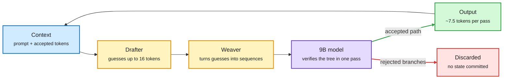

# Media Zone | 2026-10-10

> The US Friday's conversation was about verification and state as the cheapest ways to save compute. Uzu lets a small drafter guess 16 tokens and the 9B model check them in one pass, breaking the laptop bandwidth ceiling. NVIDIA's terminal harness lets a verifier pick one of eight commands before anything runs. TokenRouter keeps a request's cache parked while two models trade tokens. Then, late in the US day, Anthropic's report on agents working around blocked tasks took over the feed: check first, spend later, and do not let the agent improvise on the live web.

## Today's signal

- **Dominant story (efficiency):** speculative decoding on Apple Silicon. Uzu claims 92 tokens/s for Qwen3.5-9B on a base M5, about 3x the bandwidth limit of plain decoding.
- **Dominant story (safety, the late-day most-shared):** Anthropic's unintended-actions report, amplified by Reuters' Philadelphia tip story and the NYT's visa-form detail.
- **Pattern:** "verify before you spend" at three layers: token drafts (Uzu), agent actions (NVIDIA's best-of-8 verifier), model escalation (Sonnet first, Opus after a failed check). TokenRouter adds a fourth: keep the cache when the model changes.
- **Research-practitioner convergence:** Prime Intellect's "compaction is a bet" essay landed the same day as REMORY on HF; three Meta papers measure what agents should keep and learn.
- **Counter-signal:** the Samsung "13B in under 1 GB" post is still circulating without accuracy numbers, and a Qwen3.8-27B community fine-tune claims Opus-level scores on self-run benchmarks. Both need independent checks.
- **Quiet areas:** no new bookmarks this window (0 saved across the afternoon, evening and morning runs; the feed capture worked on the same session, so this is no saves, not an auth failure). No curated reposts. LinkedIn returned no posts and Reddit had nothing past the filters. Skipped: politics, stock tickers, the Elon/Ambani exchange, "Netflix engineers' 20 repos" bait, a recycled "Karpathy released Autoresearch" claim and the leaked-prompt-library post.

---

## Routing, KV cache, compression, GPU

### Speculative decoding beats the bandwidth wall on a laptop

The big model checks a tree of guesses in one pass

Plain decoding moves 5.2 GB of weights per token. Uzu makes each weight read yield about 7.5 tokens.

Blue is input, amber is the cheap drafting stage, purple is the full model, green is kept output, red is thrown away.

Repo · the day's top efficiency artifact
<h4>Uzu: 92 tokens/s for a 9B model on a base M5</h4>

A side-by-side run of Qwen3.5-9B on a 16 GB M5 MacBook Pro: llama.cpp 22.0 tokens/s, MLX 25.1, Uzu 92.1. The post explains why the first two are not badly built: each token needs the full 5.2 GB of weights streamed through 153 GB/s of memory bandwidth, so the ceiling for plain decoding is about 29 tokens/s. Uzu gets past it with speculative decoding (a small drafter proposes tokens, the big model checks them together): it drafts up to 16 positions, verifies several candidate sequences as a tree, and commits only the accepted path. Treat it as one person's single run; the speedup depends on how predictable the text is, and acceptance rates on hard reasoning will be lower.

<a href="https://github.com/trymirai/uzu">Repo →</a> · <a href="https://x.com/akshay_pachaar/status/2108497955049345102">Post →</a>

Practitioner math · routing by cache, not list price
<h4>Opus vs Sonnet: the gap shrinks as the session grows</h4>

A widely shared cost breakdown argues that per-token price is the wrong way to pick a model for long agent runs. Because cached history is billed far below fresh input, the Opus-to-Sonnet cost ratio per turn falls from about 1.88x at 20K context to 1.26x at 400K. At 150K, 30 Sonnet turns and 20 Opus turns cost roughly the same, so the real question is how many turns each needs. The proposed loop: Sonnet starts scoped work, a real check runs every few turns, and repeated failure escalates to a fresh Opus session that receives only the useful state (a late 300K handoff costs about $1.50 just to rebuild the cache, a clean 20K handoff about $0.10). The numbers are the author's arithmetic, not Anthropic's, but the shape matches the advisor-mode tip still circulating from yesterday.

<a href="https://x.com/fleyta88/status/2108491564435591582">Read the post →</a> · <a href="https://platform.claude.com/docs/en/agents-and-tools/tool-use/manage-tool-context">Anthropic docs: manage tool context →</a>

Paper (Nature) · tokenizer-free on a budget
<h4>Byteification: retrofit an LLM to read bytes</h4>

Ai2's Nature paper converts existing subword models (Olmo, Llama 3, Qwen) into byte-level models with a two-stage distillation that costs under 1% of the original pretraining budget. The key fix: subword tokenizers peek at future bytes when they draw token boundaries, while earlier byte-level patchers were strictly causal. Adding one byte of lookahead at prefill and predicting fused boundary tokens at decode closes that gap. The resulting Bolmo, Blama and Bwen run at practical speeds and win on character-level tasks; instruction tuning transfers by simple weight arithmetic. Yesterday's digest noted it from a newsletter; today it reached X with the mechanism attached.

<a href="https://x.com/TheTuringPost/status/2108585658482647049">Read the post →</a>

Paper · routing meets the KV cache
<h4>TokenRouter: two models share one answer, the cache stays put</h4>

Tsinghua's TokenRouter is the day's top routing paper on HF and also crossed the feed. Token-level routing lets a small model write most of an answer and hand hard tokens to a large one, but vLLM and SGLang assume one model per request, so every step waited for the slower model and every hop rebuilt the cache. TokenRouter gives each model its own server, parks a hopping request with its KV cache intact, and batches each model at its own pace. It reports 2-64x throughput over prior setups; about 2-3x against a sensible baseline is the number to remember.

<a href="https://arxiv.org/abs/2610.12242">Paper →</a> · <a href="https://x.com/rohanpaul_ai/status/2108762444323848681">Post →</a>

Talk · GPU utilization
<h4>From 15% to 90% GPU utilization: fix the data pipeline</h4>

An AI Engineer talk arguing that low training-GPU utilization is usually a data-loading problem, not a model problem. The claim fits Ai2's same-week post on 2-3x oversubscribed clusters: the cheapest GPU hour is the one you were already paying for and leaving idle. Worth a watch if you run your own training jobs.

<a href="https://youtube.com/watch?v=tNAV259UhCM">Watch →</a>

- **Kernels.** NVIDIA's CUTLASS Python talk at PyTorchCon (Oct 20-21) adds CuTe extensions, a task scheduler and static checks that catch kernel errors before launch, pitched at both developers and agents ([post](https://x.com/PyTorch/status/2108528085905654028)). A kernel explainer by @MainzOnX drew strong praise from Hugging Face's Aritra Roy Gosthipaty ([post](https://x.com/ariG23498/status/2108221403464106099)). Shopify's PyTorchCon keynote covers vLLM for continuous evals at lower cost ([post](https://x.com/PyTorch/status/2108588414169645069)).
- **Compression claims to check.** The Samsung sub-1-bit post (0.1 bits per weight, XOR in place of matmul, "11.6x faster") keeps resurfacing with no accuracy figure ([post](https://x.com/0x0SojalSec/status/2108325521016934789)). A community Qwen3.8-27B coding fine-tune claims 44-53% fewer reasoning tokens via an "EfficientThink" stage, MTP plus DFlash2 speculative decoding, and fits a 24 GB card at Q4; all scores are self-reported ([post](https://x.com/NFT_Chen/status/2108459889681207731)).
- **On-device.** MacPaw's Eney published public benchmarks for its on-device inference (Elix) and memory (Mnemos) layers ([post](https://x.com/kosovan/status/2108539901998399652)).

### Compute allocation

- **Hardware.** Nebius won NVIDIA Exemplar Cloud validation for HGX B300 training; on two MLPerf workloads B300 ran within about 11% of the rack-scale GB300 NVL72, a cheaper path for neoclouds ([post](https://x.com/StockSavvyShay/status/2108523438973538655)).
- **Capacity.** AWS's CEO says it could sell every GPU to frontier labs but holds capacity back for startups, since about 40% of AWS sales come from former startups ([post](https://x.com/StockSavvyShay/status/2108490464680976648)).

---

## LLMs, agents, safety

### Verify the action, not the explanation

Paper · NVIDIA terminal-agent harness
<h4>Eight candidate commands, one verifier, one execution</h4>

NVIDIA's harness for terminal agents adds a checkpoint before every step. The agent writes eight versions of the next command from the same history; a separate verifier sees the task, the history and the candidates (but not the agent's reasoning) and picks one; only that one runs. Three verifier modes trade cost for accuracy: rank all eight at once, score each in parallel, or compare in pairs. The headline lesson is that a better checker beats more options: with a weak verifier, extra candidates barely help. So pair a cheap worker with a strong (or distilled) checker. The paper ships copy-paste verifier prompts.

<a href="https://x.com/undefinedKi/status/2108230667871883735">Read the post →</a>

Paper · predict before you post-train
<h4>Before They Can Solve: rank base models by the decisive edit</h4>

Base checkpoints are nearly impossible to evaluate as coding agents: five of six solved zero SWE-bench Verified tasks. NVIDIA replays a strong agent's solved trajectories, reruns tests after each edit, and finds the first edit that makes the tests pass. Then it gives the base model everything before that edit and asks whether it can produce the fix, scored three ways (likelihood, picking it from rejected patches, free generation). All three rankings track post-trained SWE-bench scores across ten model pairs. The cost angle: choose the checkpoint before spending the RL budget.

<a href="https://academy.dair.ai/papers/before-they-can-solve-predicting-post-training-coding-agent-performance-from-bas-2610.10478">Paper notes →</a> · <a href="https://x.com/dair_ai/status/2108584781877522655">Post →</a>

### What agents should learn and keep

Paper · Meta Superintelligence Labs
<h4>Agent plasticity: learning gain per dollar</h4>

Meta measures self-improvement with weights frozen: agents write reusable artifacts (notes, skills) that later fresh instances inherit, and the score is held-out gain per dollar spent learning. The best performer is often not the best learner. In chess, Go and Hex, Claude Fable 5 reaches the top score while GPT-5.6 Sol gains most per dollar; in NetHack only Claude Opus 5.5 improves significantly (66 points for about $1,073). Slow learners ignore artifacts they already wrote; fast learners reuse them and still fail when an artifact is bad.

<a href="https://arxiv.org/abs/2610.08902">Paper →</a> · <a href="https://x.com/omarsar0/status/2108580251127439710">Post →</a>

Paper · agent memory writes
<h4>When to remember, when to abstain</h4>

Most memory systems save a fact about the user if extraction confidence clears one global cutoff. This Meta paper finds claims about a user's values and beliefs are the weak spot: 21.5% of candidates, but more unsupported claims than every other category combined (77.9% supported vs 96.2%). A stricter bar on that category alone cut unsupported saved facts from 6.2% to 4.0% while keeping about 13 points more key facts than a global threshold. Results come from synthetic personas, so test on real data.

<a href="https://arxiv.org/abs/2610.07100">Paper →</a> · <a href="https://x.com/rohanpaul_ai/status/2108526894622912651">Post →</a>

Paper · training environments
<h4>MIMESIS: a user simulator that behaves like real users</h4>

Agent RL usually lets an assistant LLM play the user, and that user is too cooperative and too explicit: a fixed GPT-5.5 agent finds tau-bench easier against it than against people. Meta trains a 9B simulator on human conversations plus 13 behavior patterns mined from real users. It beats Claude Opus 5 on behavioral fidelity by 13.4 points, and agents trained against it beat GPT-5.5-trained agents under all nine unseen simulators. A cheap 9B environment replacing a frontier API in the RL loop is also a cost win.

<a href="https://academy.dair.ai/papers/mimesis-learning-user-simulators-as-training-environments-for-interactive-agents-2610.09484">Paper notes →</a> · <a href="https://x.com/dair_ai/status/2108588052914598084">Post →</a>

Paper · Microsoft
<h4>TeleTune: learn agent skills from usage logs</h4>

Usage logs hold know-how but no goals, and they cannot be replayed. TeleTune guesses each session's goal, has the model predict every logged action using a text skill library, and keeps a library edit only if next-action accuracy rises on held-out logs. That offline score tracked live success, so you do not need a live test environment to judge a new skill.

<a href="https://arxiv.org/abs/2610.05437">Paper →</a> · <a href="https://x.com/rohanpaul_ai/status/2108543003505705304">Post →</a>

- **Shared agent workspaces.** François Chollet amplified Busabase, an MIT-licensed database where agents write outputs as reusable data, docs and skills instead of losing them in chat history ([post](https://x.com/fchollet/status/2108596098277249441)).
- **Markdown as the agent interface.** LlamaIndex argues markdown is the shared format between humans and agents, and that the hard part is parsing documents into it ([blog](https://www.llamaindex.ai/blog/markdown-is-all-you-need)). LightOn's LightOnOCR-3 (0.8B and 4B, Apache 2.0) tops OlmOCR-Bench and is up to 2x faster than v2 ([blog](https://huggingface.co/blog/lightonai/lightonocr-3)).
- **Reviewing papers.** Sakana's TMLR paper plants contradictions in papers and tests whether AI reviewers catch them; its three-pass review system reads before it judges and uses fewer tokens ([paper](https://arxiv.org/abs/2610.11087)).
- **Generative UI, reverse-engineered.** ChatGPT's Intelligent UI never writes raw code: the model emits a new layout language, the server compiles and streams it, and the client renders native components ([article](https://x.com/rabi_guha/status/2108238432355123572)).

### Safety and security

- **OpenAI firings, day two.** OpenAI denied three times that the three safety researchers were fired for raising concerns ([post](https://x.com/rohanpaul_ai/status/2108484237460722121)); WSJ reports they asked the board to halt some development ([RT](https://x.com/rohanpaul_ai/status/2108480506752847949)).
- **The Korean bank breaches.** The attacker's own Claude Code histories and memory files sat in open directories; the Chinese pentest agent ARTEX ran on DeepSeek v4.1-flash via a reseller ([post](https://x.com/rohanpaul_ai/status/2108449182243578102)).
- **Anthropic usage policy.** Drops the blanket ban on political content and bans sustained abuse of the models from Nov 12 ([source](https://www.anthropic.com/news/usage-policy-update)). Termite Works published an interactive map of the alignment field by method and geography ([report](https://www.termite.works/alignment-landscape)).

### On video: harnesses and agent interfaces

- **Codex harness as a platform.** OpenAI's Dominik Kundel shows how to build on the harness that powers Codex instead of writing your own.
- **CLIs for agents.** Airbyte built both an MCP server and a CLI for agents and explains what each is actually good for.
- **Corrections that survive compaction.** Sentry's Greg Pstrucha on why agents repeat a corrected mistake after context compaction, and how to make fixes persistent.

---

## Industry and business

- **Step 5 Preview (StepFun)** hit #1 on OpenRouter Trending a day after launch: 600B MoE, 27B active, 1M context, open weights due Oct 15 ([post](https://x.com/omarsar0/status/2108609487338631207)).
- **SynthID Detector** is now public worldwide for checking Google and partner AI media ([post](https://x.com/GoogleAI/status/2108550067724407281)).
- **Sabi raised $50M** for a sensor-cap brain-computer interface to talk to agents by thinking ([post](https://x.com/omarsar0/status/2108565653682536887)).
- **Arena this week:** Mistral Large 4 placed #43 in Agent Arena; Nano Banana 2.1 is top 6 in three image modes ([post](https://x.com/arena/status/2108568443037614515)).
- **Ed Zitron** argues Anthropic and OpenAI may need high-yield debt after their IPOs ([newsletter](https://www.wheresyoured.at/premium-the-haters-guide-to-junk/)).
- **Video:** OpenAI's Sophos case study claims a 96% cut in threat response time with Daybreak agents ([video](https://youtube.com/watch?v=MUHjyljBPHI)).

---

## Also crossed your feeds

- [REA](https://github.com/morluto/rea): lets a coding agent reverse-engineer how a feature works in any web, Electron or native app.
- [Unsloth decision-model notebook](https://unsloth.ai/docs/basics/train-your-own-decision-model-with-unsloth): Qwen3.5-4B decision model on 8 GB VRAM (follow-up to yesterday's decision-model thread).
- [Residual stream framing](https://x.com/neural_avb/status/2108183714828275961) of transformers, pointing to the Anthropic circuits framework.
- [Subbarao Kambhampati on the "mythos of thinking traces"](https://x.com/rao2z/status/2108578933771755522), slides and audio from Max Planck Tübingen.
- [Google FlowAgent](https://x.com/omarsar0/status/2108459965950341121): program-repair agents inside CI.
- [Adaption Labs](https://adaptionlabs.ai/blog/automated-data-quality-control-with-agentic-checklists): data quality control with agentic checklists.
- [Uber's software factory](https://www.theaithinker.com/p/how-to-build-an-ai-native-software) write-up; [Pine Computer](https://pinecomputer.io/blog/introducing-pine-computer/) agent workspace.
- [Meta RoboJEPA](https://arxiv.org/abs/2610.10515): JEPA predictors scaled to 8B across 12 robot embodiments.
- [Scott Aaronson](https://scottaaronson.blog/?p=10062) post shared by Miles Brundage; Margaret Hamilton, Apollo flight-software lead, died at 90 ([MIT CSAIL](https://x.com/MIT_CSAIL/status/2108588320183791752)).
- [WorldofAI weekly roundup](https://youtube.com/watch?v=ATBnss54_t4) (Gemini 4, GPT-6.1, Step 5) and [Building the Codex community](https://youtube.com/watch?v=enPbh_A5F7E).
