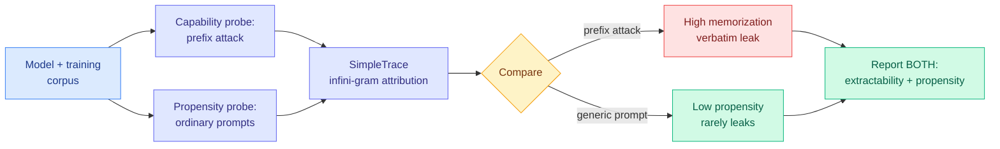

# LLMs Can Leak Training Data But Do They Want To? A Propensity-Aware Evaluation of Memorization (PropMe)

**TL;DR.** Most memorization audits measure whether a model *can* be forced to regurgitate training data, using prefix attacks that prime the model with the start of a memorized passage. That is a worst-case capability measure. PropMe argues it conflates two different things: capability (can it leak if attacked?) and **propensity** (does it leak under ordinary, non-adversarial use?). Across two fully-open models, the gap is large and consistent: prefix attacks elicit strong memorization, but generic prompts almost never do. The recommendation: memorization audits should report **both** worst-case extractability and ordinary leakage propensity, because they answer different questions.

**Source:** HuggingFace Daily Papers · arxiv [2606.06286](https://arxiv.org/abs/2606.06286)

## What it is

PropMe is a propensity-aware framework for evaluating memorization. It contrasts **prefix-based capability attacks** (feed the model the opening of a known training passage and see if it completes it verbatim) with **non-adversarial evaluations** (generic or dataset-style prompts that a normal user would write). It introduces a metric transformation that converts existing memorization functions into *propensity* metrics, and ships **SimpleTrace**, a lightweight tracing pipeline built on infini-gram (an efficient n-gram index over huge corpora) that deterministically attributes a model's generations back to its training data and computes verbatim, near-verbatim, and propensity-transformed scores.

## What problem it solves

"Can this model leak training data?" and "does this model leak training data in normal use?" are different questions, and the field has mostly answered the first while reporting it as if it were the second. A high prefix-attack extraction rate makes a model look dangerous, but if the model essentially never reproduces that data unless adversarially primed, the practical privacy risk is much lower. PropMe separates the two so audits stop overstating ordinary-use risk.

## Key results

- Evaluated two fully-open models (**Comma** and **DFM Decoder**) on two datasets (Common Pile, Dynaword) in two languages.
- **Consistent capability-propensity gap:** prefix attacks elicit substantially stronger memorization signals than generic or dataset-specific prompts; propensity scores stay low overall. Models *can* reveal training data when directly elicited but *rarely* do under ordinary prompting.
- **DFM Decoder, continually pre-trained from Comma, shows reduced memorization and propensity for Common Pile**, confirming that later training on partially different data can *decrease* memorization of the earlier corpus.
- Practical takeaway: report worst-case extractability and ordinary propensity together.

## How it relates to prior wiki knowledge

PropMe is a measurement-rigor paper, the same genus as the wiki's recurring "the metric you report determines the conclusion you reach" thread. It mirrors today's [SABER](../agentic-systems/2026-06-06-saber-coding-agent-operational-safety.md) (operational-safety benchmark showing refusal rate does not predict agent action safety): both argue the dominant evaluation measures the wrong thing for the deployment question that matters. SABER: refusal ≠ operational safety. PropMe: extractability ≠ ordinary leakage. Together they extend the [responsible-ai.md](responsible-ai.md) measurement-crisis pattern from capability benchmarks into safety and privacy audits.

The finding that continued pre-training *reduces* memorization of the earlier corpus also connects to the parametric-memory thread ([how LoRA remembers](../inference-efficiency/2026-05-29-how-lora-remembers-parametric-memory-law.md)): what a model retains is plastic and shaped by the most recent training emphasis, not fixed at pre-training.

## Gaps

Only two fully-open models on two datasets; whether the capability-propensity gap holds for frontier-scale models trained on web data (where the memorized content includes PII and copyrighted text, not curated open corpora) is the question that matters for policy and is untested here. Propensity is measured under the authors' choice of "ordinary" prompts; an adversary who crafts natural-looking prompts that still trigger leakage would sit between the two regimes and is not modeled. Infini-gram attribution catches verbatim and near-verbatim leakage but not paraphrased reproduction of training content.

## Industrial implication

For any team publishing a model card or facing a privacy/copyright audit, PropMe's two-number standard (worst-case extractability + ordinary-use propensity) is a more honest disclosure and a likely future regulatory expectation. It also suggests a concrete mitigation lever: a round of continued pre-training on different data measurably lowers memorization of the original corpus, a cheaper knob than full retraining for reducing leakage of a sensitive source.

## Related pages

- [responsible-ai.md](responsible-ai.md)
- [../agentic-systems/2026-06-06-saber-coding-agent-operational-safety.md](../agentic-systems/2026-06-06-saber-coding-agent-operational-safety.md)
- [../inference-efficiency/2026-05-29-how-lora-remembers-parametric-memory-law.md](../inference-efficiency/2026-05-29-how-lora-remembers-parametric-memory-law.md)

Raw source: `raw/huggingface/2026-06-06-llms-can-leak-training-data-but-do-they-want-to-a-propensity.md`
