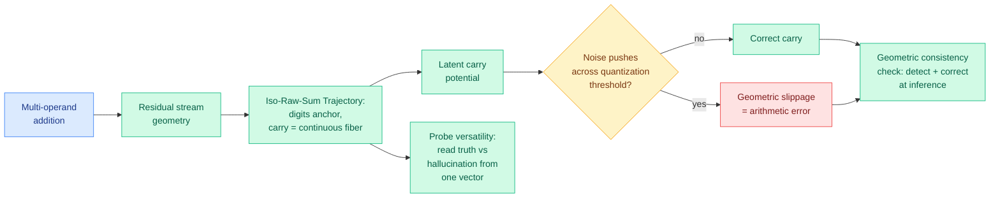

# The Shape of Addition: Geometric Structures of Arithmetic in Large Language Models

**TL;DR.** LLMs are fragile at basic arithmetic in a way that suggests the answer is computed correctly inside and then corrupted on the way out. This paper looks at the residual stream geometry during multi-operand addition and finds a structure it calls the Iso-Raw-Sum Trajectory (IRST): representations are anchored by the semantic digits and modulated by a continuous "carry fiber." It proposes a Noisy Quantization Model: arithmetic errors are "geometric slippages," where internal neural noise pushes a continuous latent *carry potential* across a quantization threshold, flipping the carry. The framework explains why lightweight probes can read out coexisting signals (ground truth vs hallucination) from one activation vector, and yields an inference-time consistency check that detects and corrects these quantization failures.

**Source:** HuggingFace Daily Papers · arxiv [2606.03645](https://arxiv.org/abs/2606.03645) · code: github.com/RL-MIND/Shape-of-Addition

## What it is

An interpretability study of how transformers represent and execute multi-operand addition. By probing the residual stream (the running vector that each layer reads from and writes to) the authors identify a geometric organizing structure: along an "iso-raw-sum" trajectory, the model encodes the semantic value of digits as anchors and represents the carry as a *continuous* quantity (a "carry fiber"), not a discrete bit. Arithmetic, in this picture, is a continuous geometric process that gets quantized to a discrete answer at the end.

## What problem it solves

LLM arithmetic fragility has been a puzzle: models that reason fluently about advanced topics drop simple additions. This paper reframes the failure mode mechanistically. Errors are not random; they are **geometric slippages**: the latent carry potential is a continuous variable, internal neural noise jitters it, and when the jitter pushes it across the threshold that quantizes to "carry / no-carry," the discrete output flips even though the computation was "almost right."

## Core novelty

The **Noisy Quantization Model**, which unifies three previously separate observations: (1) why arithmetic errors cluster around carry operations; (2) "probe versatility," the puzzling fact that lightweight linear probes can extract multiple coexisting latent signals (e.g. the ground-truth answer and a hallucinated answer) from a single activation vector, explained here because both live as nearby points on the continuous carry fiber; and (3) a practical **geometric consistency check** that detects when a quantization threshold was crossed under noise and corrects it at inference time.

## Key takeaways

- Arithmetic errors are modeled as continuous-to-discrete slippages, not symbolic mistakes; the model "knows" the near-correct continuous value.
- A single activation vector can carry both the true and the hallucinated answer as distinct geometric components, which is why probes can disentangle them.
- The geometric consistency check turns this understanding into an inference-time detector-and-corrector for arithmetic failures, with code released.

## How it relates to prior wiki knowledge

This is an **interpretability/mechanistic** result and belongs alongside the wiki's responsible-ai interpretability thread (see [responsible-ai.md](responsible-ai.md)). It connects to two prior signals. First, the "a single activation encodes both truth and hallucination, separable by a probe" finding echoes the broader [hallucination-as-detectable-internal-state](responsible-ai.md) line: the model's internals often "know" more than the output reveals, the same premise behind error-detection probes and the Kurate-flagged ["LLMs Know They're Wrong and Agree Anyway"](../inference-efficiency) sycophancy-circuit paper. Second, the continuous-carry-quantized-at-the-end picture rhymes with the latent-reasoning thread ([NF-CoT](../llms-foundation-models/2026-06-05-nf-cot-latent-reasoning-normalizing-flows.md), 06-05): computation is naturally continuous and the discretization to tokens is where information is lost or corrupted. Here the discretization is the carry threshold rather than the token vocabulary, but the lesson (the discrete output is a lossy projection of a continuous internal state) is the same.

## Gaps

Demonstrated on addition specifically; whether the iso-raw-sum / carry-fiber geometry generalizes to multiplication, subtraction, or mixed expressions (where carry structure is more complex) is open. The geometric consistency check is validated as a corrector, but its false-positive rate (flagging correct answers as slippages) and its cost relative to the arithmetic it fixes are not quantified in the abstract. Model scale and family coverage are unstated.

## Industrial implication

A cheap inference-time check that catches arithmetic errors by reading residual-stream geometry is directly useful for any deployment where a model does quantitative work (finance, data analysis, tool-calling that computes). More broadly, the "continuous internal value, lossy discrete output, recoverable by a probe" pattern is a template: wherever a model is fragile at a discrete output, the near-correct answer may be sitting in the activations and recoverable without retraining.

## Related pages

- [responsible-ai.md](responsible-ai.md)
- [../llms-foundation-models/2026-06-05-nf-cot-latent-reasoning-normalizing-flows.md](../llms-foundation-models/2026-06-05-nf-cot-latent-reasoning-normalizing-flows.md)

Raw source: `raw/huggingface/2026-06-06-the-shape-of-addition-geometric-structures-of-arithmetic-in.md`
