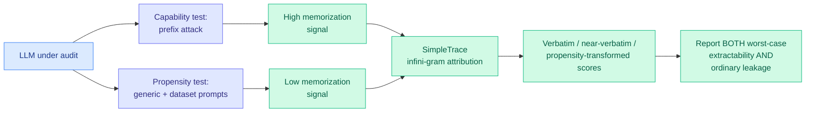

# PropMe: Memorization Propensity vs Capability in LLMs

**Source:** HuggingFace Daily Papers · [arXiv 2606.06286](https://arxiv.org/abs/2606.06286)
**Raw:** [raw/huggingface/2026-06-07-llms-can-leak-training-data-but-do-they-want-to-a-propensity.md](../../raw/huggingface/2026-06-07-llms-can-leak-training-data-but-do-they-want-to-a-propensity.md)

## TL;DR

Most memorization evaluations measure whether a model *can* be forced to reproduce training data (a prefix attack: feed the first half, see if it completes verbatim). PropMe argues that conflates capability with behavior, and introduces a propensity-aware framework that contrasts adversarial prefix attacks with ordinary, non-adversarial prompts. It ships a metric transformation that turns existing memorization functions into propensity metrics, plus SimpleTrace, an infini-gram-based pipeline that deterministically attributes a generation to a training corpus and computes verbatim, near-verbatim, and propensity-transformed scores. On two fully-open models (Comma, DFM Decoder) over two corpora (Common Pile, Dynaword) in two languages, there is a consistent gap: prefix attacks elicit strong memorization, but propensity stays low — models *can* reveal training data when directly elicited, yet *rarely do* under normal use.

## Key points

- **Capability ≠ propensity.** The headline distinction: extractability under adversarial elicitation is a worst-case bound; propensity under normal prompting is the expected behavior. Reporting only the former overstates real-world leakage; reporting only the latter understates the attack surface. PropMe argues audits should report both.
- **Continued pre-training reduces leakage.** DFM Decoder is continually pre-trained from Comma and shows reduced memorization and propensity for Common Pile, evidence that later training emphasizing different data dilutes earlier memorization.
- **Deterministic attribution.** SimpleTrace uses infini-gram (an n-gram index over the full training corpus) to attribute a generation to its source deterministically, rather than relying on probabilistic membership-inference heuristics.

## How this relates to prior wiki knowledge

- **The capability-vs-behavior split is becoming a measurement principle.** This mirrors the exact reframe the wiki tracked on the safety side: [SABER](2026-06-06-saber-operational-safety-coding-agents.md) (06-06) measured what a coding agent *does* to a workspace, not what it refuses; PropMe measures what a model *does* leak, not what it *can* be forced to leak. Both separate a worst-case adversarial probe from ordinary-use behavior, and both argue the ordinary-use number is the one practitioners actually need. It also rhymes with the [Value-Conflict Diagnostics](responsible-ai.md) and alignment-faking line on Kurate this week: the gap between elicited and spontaneous behavior is where the interesting risk lives.
- **A cleaner privacy audit primitive.** Deterministic infini-gram attribution is a sharper tool than membership inference for the data-governance questions the responsible-ai page tracks (copyright, PII, training-data provenance).

## Research angle

The propensity metric is only as meaningful as the distribution of "ordinary" prompts it samples; an audit that under-samples the prompts a real adversary or curious user would try will report falsely low propensity. Open: whether propensity stays low for frontier-scale closed models (tested here only on two fully-open models), and whether RLHF/instruction-tuning raises or lowers propensity relative to base models. The continued-pre-training dilution result hints at a controllable knob for privacy that deserves a scaling study.

→ Concept page: [responsible-ai](responsible-ai.md) · related: [SABER](2026-06-06-saber-operational-safety-coding-agents.md)
