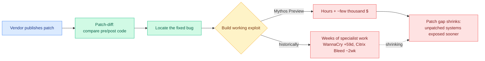

# Anthropic Red: Measuring LLMs' Impact on N-day Exploits

**TL;DR.** Anthropic's red-team blog (red.anthropic.com, "N-days," June 8 2026, surfaced by @logangraham) extends its cyber-capability work from zero-days to **N-days**: vulnerabilities that are publicly disclosed and patched on *some* devices, exploited on the many systems still inside the "patch gap." N-days can be more dangerous than zero-days because the patch itself is a roadmap: attackers **patch-diff** (compare pre- and post-patch code/binary) to locate the bug and reverse-engineer an exploit. Historically that was slow, specialized work that bought defenders weeks (WannaCry hit 59 days after the MS17-010 patch; Citrix Bleed's public exploit took ~2 weeks). Anthropic finds **Mythos Preview is meaningfully better at developing N-days**: converting patches into working exploits took the team "a couple thousand dollars and a few hours." They publish so defenders can prepare, noting that "in a year, Mythos will probably look trivial," and signaling a shift toward blue-team / defensive follow-up work.

## Key points

- **The patch gap is the attack surface.** N-day risk is about timing: the window between disclosure and universal patching. Anything that speeds patch-diff-to-exploit shrinks that window for defenders and widens it for attackers.
- **Mythos Preview compresses exploit development from weeks to hours** at trivial cost, on already-disclosed vulnerabilities. This is a capability measurement, published deliberately as an early warning.
- **Honest framing:** Anthropic expects today's result to look trivial within a year, and frames the publication as a prompt for the defensive community to start now.
- The author signals upcoming **blue-team / defensive** research, reframing the task from "measure offense" to "solve defense."

## How it relates to prior wiki knowledge

- **Direct continuation of [Anthropic Glasswing / Mythos vulnerabilities](../ai-industry/2026-05-23-anthropic-glasswing-mythos-vulnerabilities.md)** (05-23): same model family, now quantified on N-days specifically. Confirms the trajectory rather than introducing a new claim.
- **Sharpens the agent-security thread.** [SABER](2026-06-06-saber-operational-safety-coding-agents.md) (06-06, operational safety for coding agents) and the wiki's prompt-injection tracking (ChatGPT Lockdown Mode, 06-08) are about defending agents *using* tools; N-days is about LLMs *as offensive tooling*. Both point at the same gap: capability is outrunning the defensive benchmarks.
- Lands against the Kurate signal [Hodoscope: Unsupervised Monitoring for AI Misbehaviors](https://arxiv.org/abs/2604.11072) (cs.AI #12 this week) and [The Verification Tax](https://arxiv.org/abs/2604.12951) (cs.LG #14, fundamental limits of AI auditing in the rare-error regime) — the measurement-and-monitoring side of the same offense/defense race.

## Gaps

- "A couple thousand dollars and a few hours" is reported, not a controlled benchmark across a vulnerability distribution; selection of which patches were attempted matters.
- No comparison against a skilled human exploit developer's time/cost baseline, which would calibrate how much of the speedup is genuinely novel capability.

**Source:** Twitter/X (@logangraham, Anthropic) → [red.anthropic.com/2026/n-days](https://red.anthropic.com/2026/n-days/) · raw: `raw/twitter/2026-06-09-morning.json`

**Related:** [responsible-ai.md](responsible-ai.md) · [2026-06-06-saber-operational-safety-coding-agents.md](2026-06-06-saber-operational-safety-coding-agents.md) · [../ai-industry/2026-05-23-anthropic-glasswing-mythos-vulnerabilities.md](../ai-industry/2026-05-23-anthropic-glasswing-mythos-vulnerabilities.md)
