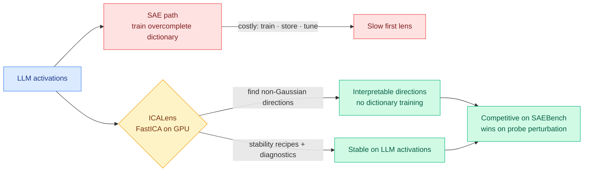

# ICA Lens: Interpreting Language Models Without Training Another Dictionary

**TL;DR.** Sparse autoencoders (SAEs) are the default tool for finding interpretable directions inside a model's activations, but using an SAE means training, storing, tuning, and evaluating a large overcomplete dictionary for every model/layer/site — an expensive first step before you learn anything. ICA Lens asks how much interpretable structure is already visible from the *geometry* of activations, before training any dictionary. The intuition: interpretable directions tend to be selective on tokens, and selective directions look less Gaussian than random ones. Independent Component Analysis (ICA), a classical method for finding non-Gaussian directions, recovers them directly. ICALens packages an optimized GPU-parallel FastICA pipeline with LLM-specific stability recipes and fitting diagnostics. Across GPT-2 Small, Gemma 2 2B, and Qwen 3.5 2B Base it recovers compact, human-interpretable directions with no per-layer gradient training, is competitive with public SAEs on SAEBench sparse probing, and beats them on targeted probe perturbation at small-to-medium budgets.

**Source:** HuggingFace Daily Papers · arxiv [2606.11722](https://arxiv.org/abs/2606.11722) (Liu & Han)

## Key findings

- **Geometry before dictionaries.** Much interpretable structure is recoverable from activation geometry alone. ICA finds non-Gaussian directions, which correlate with token-selective (interpretable) features, without the train-store-evaluate overhead of an SAE.
- **The contribution is engineering ICA into reliability.** Prior ICA-for-interpretability attempts used off-the-shelf implementations that are brittle on LLM activations. ICALens adds a GPU-parallel FastICA pipeline, LLM-specific stability recipes, and fitting diagnostics for stable, auditable, layer-wise analysis.
- **Competitive and sometimes better.** Competitive with public SAEs on SAEBench sparse probing; *outperforms* them on targeted probe perturbation under small-to-medium budgets.
- **Reframing the baseline.** The authors argue ICA should be treated as an efficient, complementary *first lens*, not the weak baseline it has been dismissed as.

## How this relates to prior wiki knowledge

This is an efficiency argument aimed at the [responsible-ai](responsible-ai.md) interpretability stack, and it intersects the wiki's Tier-1 compression instinct: the cheapest tool that recovers the structure should be the default first lens. It is a direct foil to the SAE-as-default orthodoxy that Kurate's board still ranks highly via "Scaling Monosemanticity: Extracting Interpretable Features from Claude 3 Sonnet" (cs.AI #19, ai_rating 9.0, the canonical SAE-at-scale result). ICA Lens does not claim to replace SAEs; it claims the *first* look should be cheap, and SAEs should be reserved for when geometry is not enough.

It complements rather than competes with the wiki's recent mechanistic-control work: yesterday's [Alignment Gating](2026-06-10-emergent-misalignment-sycophancy-alignment-gating.md) (06-10, learnable gates that locate and suppress the representations driving sycophancy-induced misalignment) needs to *find* the responsible directions; a cheap, auditable ICA lens is exactly the kind of fast first-pass tool that work depends on.

**Research angle.** The load-bearing assumption is "interpretable ⇒ non-Gaussian ⇒ ICA-recoverable." That holds for token-selective features but not obviously for features that are *distributed* or *conditional* (active only in a context), which is where SAEs' overcomplete capacity earns its cost. Worth tracking: does ICA Lens's probe-perturbation win survive at frontier scale and at the high feature counts where monosemanticity work operates, or is it a small-budget regime advantage? If it holds, the practical consequence is that interpretability tooling gets an order of magnitude cheaper to spin up on a new open model — a real democratization lever.

→ Raw: [`raw/huggingface/2026-06-11-ica-lens-interpreting-language-models-without-training-anoth.md`](../../raw/huggingface/2026-06-11-ica-lens-interpreting-language-models-without-training-anoth.md)
