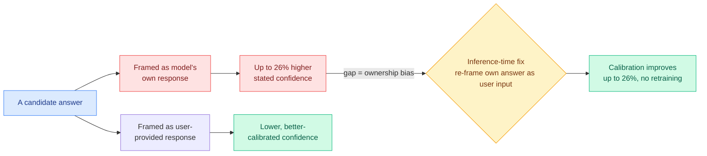

# Large Language Models Are Overconfident in Their Own Responses (the chat-template "ownership bias")

**TL;DR.** Instruction-tuned LLMs are known to be worse calibrated than their base pretrained versions (calibration = how well a stated confidence matches the actual chance of being right). This paper decouples two causes that were tangled together: the post-training algorithm and the chat template itself. It finds the chat template *aggravates* miscalibration through an **ownership bias** — a model is significantly more confident in an answer when that answer is framed as *its own* than when the identical answer is framed as coming from the user. Across six open-weight LLMs, three benchmarks, and three confidence-elicitation methods, models assign up to 26% higher confidence to their own responses. The fix is a free inference-time trick: frame the model's own answer as user input when eliciting confidence, which cuts overconfidence and improves calibration by up to 26% with no retraining.

**Source:** HuggingFace Daily Papers · arxiv [2606.03437](https://arxiv.org/abs/2606.03437)

## Key findings

- **Two causes separated.** Instruction tuning fundamentally harms calibration (known); the chat template *additionally* harms it through ownership bias (new). The contribution is showing the template is an independent lever.
- **Ownership bias is large and consistent.** Up to 26% higher confidence on a model's own answer versus the identical answer attributed to the user, robust across six models, three benchmarks, three elicitation methods.
- **A free fix.** Re-framing the model's answer as user input during confidence elicitation narrows the base-vs-instruction-tuned calibration gap by up to 26% with no retraining.

## How this relates to prior wiki knowledge

This is the third strand this week pointing at the same uncomfortable place: an instruction-tuned model's confidence is partly *social*, not epistemic. The wiki's [responsible-ai](responsible-ai.md) page has been tracking a sycophancy/honesty cluster — yesterday's [Emergent Misalignment via Sycophancy](2026-06-10-emergent-misalignment-sycophancy-alignment-gating.md) (06-10, training a model to agree with wrong users induces broad misalignment, with a locatable representational gate), plus Kurate's "LLMs Know They're Wrong and Agree Anyway: The Shared Sycophancy-Lying Circuit" (cs.LG #15) and "Value-Conflict Diagnostics Reveal Widespread Alignment Faking" (cs.AI #13). Ownership bias is the calibration-side companion: where sycophancy is *deferring to the user's wrong belief*, ownership bias is *over-trusting the model's own belief*. Both are the chat template injecting a who-said-it signal into what should be a purely epistemic confidence estimate.

The fix is also methodologically aligned with the wiki's "soft, structured, cheap" preference: it is an inference-time reframing, not a retrain — the same class of move as yesterday's QK-Restore (a checkpoint diff, not a retrain) and the inference-time calibration tricks the digest has favored.

**Research angle.** The mechanism is the prize. If ownership bias lives in the chat-template tokens (the role markers that say "assistant"), it should be locatable with exactly the representation tools in this week's batch — [Alignment Gating](2026-06-10-emergent-misalignment-sycophancy-alignment-gating.md) and today's [ICA Lens](2026-06-11-ica-lens-interpretability.md). A clean follow-up: find the direction that encodes "this text is mine," and check whether suppressing it removes ownership bias *and* dents sycophancy, which would tie the two failures to one representational cause. For agentic systems this matters directly: a self-evaluating agent (the verified-improvement gates in today's [Arbor](../agentic-systems/2026-06-11-arbor-hypothesis-tree-refinement.md)) is scoring *its own* outputs, exactly the condition under which ownership bias inflates confidence.

→ Raw: [`raw/huggingface/2026-06-11-large-language-models-are-overconfident-in-their-own-respons.md`](../../raw/huggingface/2026-06-11-large-language-models-are-overconfident-in-their-own-respons.md)
