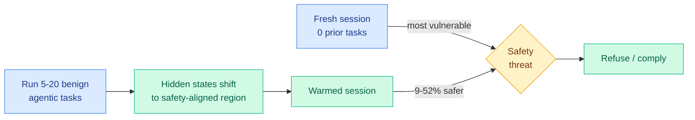

# The Cold-Start Safety Gap in LLM Agents

**TL;DR.** Tool-calling agents are not equally safe across a session. They are most vulnerable to adversarial manipulation at the very *start*, before they have done any work, and become substantially safer after a few ordinary tasks. The paper names this the cold-start safety gap, measures it with a new benchmark (SODA), and shows safety improves 9 to 52% as the agent completes zero to twenty preceding tasks. The fix is almost embarrassingly simple: warm the agent up with a few benign tasks before exposing it to anything safety-critical.

## What it is

SODA (Safety Over Depth for Agents) is a benchmark that controls exactly how many regular agentic tasks an agent completes before it meets a safety threat, supporting up to 20 preceding tasks. The authors run it across 7 models from 4 families.

## Core finding

Safety is depth-dependent. Representation analysis shows the model's hidden states gradually drift toward a "safety-aligned region" as more preceding tasks accumulate. Decomposing which part of the prior conversation matters: it is the *regular agentic tasks themselves* that drive the safety improvement, not the agent's own prior responses. (The agent's prior responses barely move safety but are essential for preserving downstream task utility.)

## Key results

- Safety improves 9 to 52% going from 0 to 20 preceding regular tasks, across 7 models.
- The driver is the preceding tasks, not the agent's own outputs, confirmed by ablation.
- Confirmed on external safety benchmarks (AgentHarm, Agent Safety Bench) and utility benchmarks (BFCL, API-Bank): warmup raises safety while preserving full capability.
- Recommended deployment recipe: run a few benign agentic tasks before any safety-critical exposure.

## Gaps

The mechanism is described as a hidden-state drift but not causally explained: *why* do benign tasks push representations into a safer region? That leaves open whether an adversary can craft "anti-warmup" tasks that drift the agent the other way. Tested up to 20 tasks; whether the gain saturates or reverses on very long sessions is unknown.

## How this relates to prior wiki knowledge

This is a representation-level companion to the deployment-safety thread the wiki has built: SABER (06-06, operational safety of coding agents) and SusVibes (06-12, agents ship working-but-insecure code). Where those measure unsafe *outputs*, this measures unsafe *timing* and traces it to a shift in internal state, linking it to the interpretability work in [responsible-ai.md](responsible-ai.md). It also lands the same day the US government suspended Anthropic's Fable 5 and Mythos over a jailbreak concern: a paper showing agent safety is fragile precisely at session start is uncomfortable context for the argument that current safeguards are robust.

**Raw source:** [HuggingFace](https://huggingface.co/papers/2606.07867) · [arXiv 2606.07867](https://arxiv.org/abs/2606.07867) · [code](https://github.com/Trustworthy-ML-Lab/Agent-Cold-Start-Safety-Gap)
