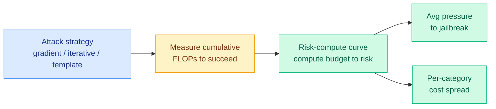

# Risk Under Pressure: Compute-Aware Evaluation of Adversarial Robustness in Language Models

**TL;DR.** Jailbreak evaluations usually report attack success rate (ASR) at a fixed query budget, which silently treats a cheap template attack and an expensive gradient attack as equally costly. They are not; attack cost varies by orders of magnitude. This paper measures robustness in *cumulative FLOPs* (floating-point operations) as a proxy for attacker effort, introduces "risk-compute curves," and finds several non-obvious things: alignment training helps robustness non-monotonically, scaling model size blocks gradient attacks but not cheap template attacks, and safety-aligned RL raises average attack cost while leaving some harm categories disproportionately cheap to reach.

## What it is

A compute-aware robustness framework. Instead of "what fraction of attacks succeed in N queries," it asks "how much compute must an attacker burn to succeed," measured in FLOPs. The risk-compute curve maps a compute budget to attack risk; two summary metrics capture the average pressure a given attack needs.

## Core novelty

Reframing robustness as an *economic* quantity. ASR-at-fixed-budget obscures whether an attack's cost justifies its payoff to the attacker. By putting compute on the x-axis, the framework reveals which defenses actually raise the attacker's bill and which only look good because the evaluation capped query count.

## Key results

Across ten models (three families, four training/alignment stages), three attack strategies (gradient-based, iterative refinement, template-based), two jailbreak benchmarks:
1. Alignment training has non-monotonic effects on compute-space robustness.
2. Scaling model size cuts gradient-attack effectiveness but barely touches cheap template attacks.
3. Gradient attacks optimized on a surrogate model transfer to a separate target, lowering attacker cost.
4. Compute cost varies up to ~5x across harm categories within a single model.
5. Safety-aligned RL raises aggregate cost but leaves some categories disproportionately accessible.

## Gaps

FLOPs is a proxy for effort, but a real attacker optimizes dollars and wall-clock, which depend on hardware and parallelism, not just FLOPs. The framework measures cost-to-succeed but does not bound *whether* a model can be jailbroken at all, only how expensive it is. No frontier closed models in the panel.

## How this relates to prior wiki knowledge

This is the right lens for the day's biggest story: the US government suspended Anthropic's Fable 5 and Mythos over a demonstrated jailbreak, and Anthropic's rebuttal was essentially economic, that the same capability "is widely available from other models" and the bypass was cheap and narrow. Risk-compute curves are the formal version of that argument. It also sharpens the N-days finding (06-09, Anthropic's Mythos turning patches into exploits in hours): the question is never "can it be done" but "how cheaply," and this paper makes that quantitative. Connects to [responsible-ai.md](responsible-ai.md).

**Raw source:** [HuggingFace](https://huggingface.co/papers/2606.11409) · [arXiv 2606.11409](https://arxiv.org/abs/2606.11409)
