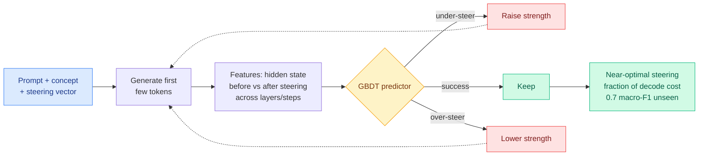

# When is Your LLM Steerable?

**TL;DR.** Activation steering (adding a direction vector to a model's hidden states at inference to push its behavior toward a concept) is a cheap way to control LLMs, but whether it works depends unpredictably on the prompt, concept, model, and steering strength. Finding the working regime usually means expensive grid searches plus reading full generations. This paper asks whether *steerability can be predicted from the model's internal states after just the first few generated tokens*, before paying for a full rollout. It builds ASTEER, a testbed of 1.4M steered generations across 150 concepts, each labeled success or failure, then extracts features comparing hidden states before and after steering across layers and early decoding steps. A gradient-boosted-tree classifier on those features predicts under-steer / success / over-steer at ~0.7 macro-F1 on unseen concepts, and used as a guide it finds near-optimal steering strength at a fraction of the usual decoding cost.

**Source:** HuggingFace · [Paper](https://arxiv.org/abs/2606.11599) · arxiv 2606.11599

## What it is

A predictive account of when activation steering will work. Rather than steer-then-check across a grid, it reads the model's early decoding dynamics (the first few tokens) and classifies the eventual outcome of the intervention.

## What problem it solves

Activation steering is fragile and configuration-dependent. The standard way to find a working setup is a grid search over steering strength with post-hoc evaluation of full rollouts, which is expensive and has to be redone per prompt/concept/model. There was no cheap way to know in advance whether a given steering setup would under-steer, succeed, or over-steer.

## Core novelty

Two things. ASTEER, a large labeled testbed (1.4M steered generations, 150 concepts, each success/failure labeled), which is the missing measurement substrate. And the finding that early hidden-state features (before-vs-after steering across layers and the first decoding steps) carry enough structure to predict steering efficacy on *unseen* concepts at 0.7 macro-F1, then to guide strength search to near-optimal at a fraction of decoding cost.

## Key takeaways

- Steerability is predictable from the first few tokens' hidden states; no full rollout needed.
- ASTEER: 1.4M steered generations, 150 concepts, labeled success/failure, a reusable benchmark.
- GBDT predictor reaches ~0.7 macro-F1 on unseen concepts (three-way: under/success/over-steer).
- Used as guidance, it finds near-optimal steering strength while spending a small fraction of decode compute.

## Gaps

0.7 macro-F1 on unseen concepts is useful but far from reliable, so this guides a search, it does not replace verification. The features are model-internal, so the predictor likely needs retraining per model; cross-model transfer is untested. ASTEER's 150 concepts may not cover the safety-critical concepts (deception, refusal) where steering reliability matters most.

## How it relates to prior wiki knowledge

- Lands on the [responsible-ai](responsible-ai.md) concept page's interpretability/control line. It pairs with [ICA Lens](2026-06-11-ica-lens-interpretability.md) (06-11, decomposing activations into interpretable components) and [Deception Probes](2026-06-03-deception-probes-pressure-test.md) (06-03, probing internal states for deceptive intent): all three read internal states to predict downstream behavior; this one predicts *controllability* specifically.
- The "predict the expensive outcome from cheap early signal" structure mirrors a recurring efficiency pattern in the wiki, e.g. the [Small RL Controller for Test-Time Scaling](../inference-efficiency/2026-06-03-small-rl-controller-adaptive-sampling.md) (06-03, decide stop-or-sample-more from a cheap signal). Steerability prediction is that idea applied to interpretability tooling.
- It is the control-side complement to the steering-as-attack worry from [LoRA adapter backdoors](2026-05-30-lora-adapter-backdoors-token-level.md) (05-30): a predictor of steering efficacy is dual-use, it tells a defender when a safety steer will hold and an attacker when a malicious steer will land.

## Research angle

The deep result is that early decoding dynamics encode the eventual fate of an intervention, which implies the model "commits" to a steering trajectory in the first few tokens. If that commitment point can be localized to specific layers, steering could be applied surgically there rather than across the residual stream. The safety question is whether the predictor generalizes to adversarial or safety-relevant concepts, where 0.7 F1 is not enough, and whether it can be hardened into a *guarantee* rather than a heuristic, which is the bar for using steering in deployed safety stacks.

→ Raw: `raw/huggingface/2026-06-15-when-is-your-llm-steerable.md`
