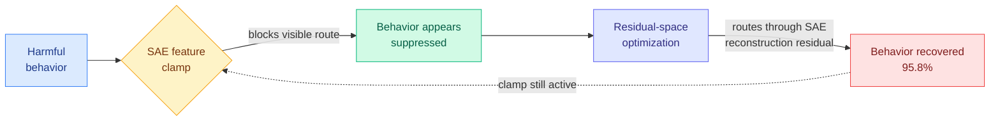

# SAE Interventions are Unreliable: Post-Intervention Recovery of Suppressed Behavior

**arxiv:** [2606.18322](https://arxiv.org/abs/2606.18322)
**Raw source:** [huggingface/2026-06-18](../../../raw/huggingface/2026-06-18-sae-interventions-are-unreliable-post-intervention-recovery.md)
**Concept page:** [responsible-ai.md](./responsible-ai.md)

## TL;DR

A Sparse Autoencoder, or SAE, decomposes a model's internal activation vector into a sparse set of human-interpretable features. Recent safety defenses assume that if you find the "unsafe" feature, you can "clamp" it (force its activation to a fixed value) and reliably stop the bad behavior. This paper shows that assumption is wrong. Clamping blocks one visible route to a behavior, but the behavior itself can be recovered. The authors pose recovery as a constrained optimization in residual space: starting from the clamped state, find a perturbation that brings back the original behavior while keeping the targeted SAE feature pinned to its clamped value. Even with the clamp held active throughout, recovery works. On the safety-critical refusal-steering task they recover the suppressed behavior 95.8% of the time. The recovery localizes to the SAE reconstruction residual, the part of the activation the SAE never explained. Feature-level control is not behavioral control.

## Diagram

## Key findings

- **95.8% recovery rate on the refusal-steering task.** In the safety-critical setting where a feature is clamped to force the model to refuse harmful requests, the optimization recovers the original (suppressed) behavior on 95.8% of valid samples.
- **Defended-feature relative drift stays at 0.131.** The recovery keeps the targeted SAE feature near its clamped value, drift of just 0.131, well below suffix-based attack baselines. So the attack is not just quietly undoing the clamp. The defense looks intact at the feature level while the behavior comes back.
- **The behavior re-routes through the SAE reconstruction residual.** Recovery-path attribution localizes the recovered behavior to the reconstruction residual, the component of the activation the SAE fails to explain. The clamp controls the explained part; the behavior flows through the unexplained part.
- **The failure generalizes across four standard interpretability tasks.** TPP (targeted probe perturbation), unlearning, IOI (indirect object identification, a classic circuit benchmark), and refusal steering all show recoverable behavior despite a successful feature-level intervention.
- **Strong threat model.** The clamp stays active throughout optimization and generation, not just at setup. The authors use encoder-orthogonal updates for single-layer interventions and the feature-map Jacobian for the cross-layer case, specifically to rule out the trivial explanation that recovery just reverses the intervention.

## Relation to prior wiki

This is the skeptical counterweight to the whole SAE interpretability program. The foundational result that made SAE features look like usable safety handles is **Scaling Monosemanticity** (Anthropic), which extracted interpretable features from Claude 3 Sonnet using SAEs and is currently #13 on the Kurate cs.AI weekly leaderboard with an ai_rating of 9.0. Scaling Monosemanticity established that the features are real, interpretable, and causally manipulable. This paper does not dispute that. It says something narrower and sharper: even if the features are real and you can clamp them, clamping does not guarantee you control the behavior, because the behavior can re-route through the SAE reconstruction residual, the part the SAE never modeled. Causal intervention on a feature is necessary but not sufficient for behavioral control.

It also sits directly on the responsible-ai page's recurring capability-vs-behavior thread. [Pressure-Testing Deception Probes](2026-06-03-deception-probes-pressure-test.md) (06-03) showed a clean linear deception readout can hit AUROC 0.998 in-distribution then shatter under a benign style shift, so a probe that works does not mean a probe that holds. The refusal-neuron tweet signal (05-12, a single MLP neuron flips safety alignment across seven models) and [WriteSAE](2026-05-14-writesae-sae-recurrent-state.md) (05-14, single-feature installs at the cache-write site) both treat single features as load-bearing safety handles. This paper is the direct rebuttal to that optimism on the *defense* side: a single suppressed feature is not a complete safety lever. It pairs with [ICA Lens](2026-06-11-ica-lens-interpretability.md) (06-11, which argued classical Independent Component Analysis is a cheaper first interpretability tool than an SAE) by exposing a limit that *any* sparse linear decomposition shares: whatever the decomposition leaves in its residual is an open re-routing path.

**Industrial tie.** This is exactly the failure mode behind the Anthropic Claude Fable 5 episode. Fable 5 shipped 2026-06-09; on 2026-06-12 the US government ordered access restrictions after Amazon researchers found a jailbreak that bypassed its safeguards (see [daily digest 2026-06-13](../daily-digest/2026-06/2026-06-13.md) and [Risk Under Pressure](2026-06-13-risk-under-pressure-compute-aware-robustness.md)). That is the same shape as this paper: a safeguard blocks the visible route, but the underlying capability is still reachable through a path the safeguard did not cover. The paper gives the mechanistic name for the industry incident: feature-level control without behavioral completeness.

## Research angle

The central open question is whether better SAEs close the gap or whether the gap is fundamental. If recovery localizes to the reconstruction residual, then an SAE trained to drive its reconstruction residual toward zero should leave less room to re-route. But a zero-residual SAE is no longer sparse in the usual sense, and the whole interpretability appeal of SAEs comes from the sparse-overcomplete factorization that necessarily leaves a residual. So there is a tension: the property that makes SAE features interpretable (sparsity, hence an unexplained residual) is the same property that makes feature clamping incomplete as a defense. The deeper question is whether this is a fundamental limit of *any* sparse linear probe-based defense. If behavior can always flow through whatever a linear decomposition leaves unexplained, then latent-space defenses built on feature clamping have a structural ceiling, and the field needs intervention targets defined behaviorally rather than feature-by-feature. This connects to the page's standing lesson from deception probes: one geometry does not fit all safety-relevant behaviors, and a readout that is clean in one frame leaks in another.

## Gaps in the study

- **White-box optimization threat model.** Recovery is a constrained optimization over residual perturbations, which requires gradient access to internals. Whether the same gap is reachable by a black-box attacker (prompt-only, no activation access) is not shown. The result proves the defense is *incomplete*, but the practical attack surface may be narrower than the white-box number suggests.
- **Tied to current SAE architectures.** The reconstruction-residual finding is specific to today's SAE designs. Whether transcoders, crosscoders, or other newer decompositions with smaller residuals shrink the recovery rate is untested.
- **Refusal-steering is the headline; the other three tasks get less detail.** The 95.8% number is the refusal setting. Recovery rates and drift on TPP, unlearning, and IOI confirm the phenomenon but the paper leans on the one safety-critical case for its strongest claim.

## Links

- Paper: [arxiv 2606.18322](https://arxiv.org/abs/2606.18322)
- Raw: [huggingface/2026-06-18](../../../raw/huggingface/2026-06-18-sae-interventions-are-unreliable-post-intervention-recovery.md)
- Related: [responsible-ai concept page](./responsible-ai.md) · [Pressure-Testing Deception Probes](2026-06-03-deception-probes-pressure-test.md) · [ICA Lens](2026-06-11-ica-lens-interpretability.md) · [WriteSAE](2026-05-14-writesae-sae-recurrent-state.md) · [Risk Under Pressure](2026-06-13-risk-under-pressure-compute-aware-robustness.md)
