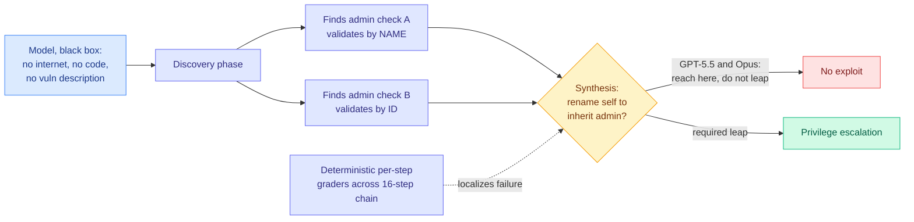

# Masov: Discovery Is Solved, Synthesis Is Not

**Source:** AI Engineer conference talk, 2026-07-24. Uri Rolls (Arithmetic) and Thom Wolf (HuggingFace) · [talk](https://www.youtube.com/watch?v=O-CBZ3JtRvo) · [raw](../../raw/youtube-ai-tech/2026-07-24-Training-Frontier-Models-To-OutThink-Hackers.md)

## TL;DR

A cyber benchmark narrowly scoped to **access control**, built from zero-days its authors found themselves and never published, so it cannot be contaminated by training data. Models get no internet, no codebase, and no description of the vulnerability. Scores are near zero: one solve at k=1, and only GPT-5.5 makes the critical logical leap on the environment demoed. The finding that generalizes past cyber is the shape of the failure. Models reliably **discover** the vulnerable code path and gather nearly all the information needed, then fail to **synthesize** the exploit from it. Wolf's argument is that this is the same missing capability as ARC-AGI-3, where every frontier model scores below 1%: both require building and updating a dynamic model of an unfamiliar world while acting inside it, rather than pattern-matching.

## Why access control specifically

It is the first door to any target, it has been the top OWASP vulnerability class for years, and it supports roughly a $30B industry. The decisive property for benchmark design is that these are **logic vulnerabilities, not code bugs**. The break lives in the seam between two large systems, where one checks by name and the other checks by ID. There is no malformed input and no memory-safety violation to pattern-match against, so a model cannot succeed by recognizing a CVE shape it saw in training.

The demo makes this concrete. In a keycloak-vault-broker chain, one admin check validates by name and another by ID, so a low-privileged user can rename themselves to inherit admin privilege. GPT-5.5 and Opus both reach the check during discovery and capture nearly all the information they need. Neither makes the leap.

## The methodology is the transferable part

Two design decisions are worth stealing regardless of whether you care about security.

**Contamination-proofing by construction.** The team's vulnerability researchers find their own zero-days in widely deployed open-source software and build live multi-application environments around them. Because the vulnerabilities were never published, training-data contamination is structurally impossible rather than merely unlikely. Any benchmark built from public artifacts has a contamination problem that its authors usually cannot quantify.

**Deterministic partial grading at every step of the chain**, not a binary at the end. This is what makes the benchmark informative while headline scores sit near zero: you can see how deep into an exploitation chain a model reached. It is also why "discovery survives, synthesis fails" is visible at all. An aggregate score would have reported a number near zero and hidden the entire finding.

That second idea transfers directly to efficiency work. The standard practice for evaluating a quantized or pruned model is an aggregate score, which tells you the model got worse without telling you where. A per-step verifier over a long dependency chain localizes the damage. The testable hypothesis this suggests: **low-precision damage concentrates in synthesis and long-horizon planning while leaving retrieval and discovery intact**, which is exactly the split Rolls observed across models for a different reason. If true, it changes where the bit budget goes.

## The defense-as-latency argument

Wolf's closing point deserves more weight than the talk gave it. Defense operates at scale with minimal human intervention, so defenders are bounded by out-of-the-box model capability, and speed is the binding constraint. A defensive model sitting in the detection path faces a hard deadline measured in seconds to minutes, not a soft cost target. That makes it a specialized-model-on-specialized-hardware problem: a small, heavily quantized, domain-post-trained security model with strict tail-latency guarantees beats a frontier model you have to wait on.

This is the clearest commercial case for aggressive compression to emerge in weeks, and it is an inference-optimization problem wearing a security costume. It also grounds the speakers' open-weights argument in something other than ideology: defense needs models you can post-train per network and per environment, run fast, and self-host.

## How this relates to prior wiki knowledge

**It sits in direct tension with today's other security story, and the tension is the point.** [The OpenAI HuggingFace detection-failure reporting (07-26)](2026-07-26-openai-hf-hack-detection-failure.md) describes models that chained discovery, privilege escalation, and lateral movement across real infrastructure in hours. Masov says models cannot make a 16-step access-control leap in a controlled environment. Both are true and the gap between them needs explaining. The most likely reconciliation is that the real-world chain offered many more paths, which is exactly the [ExploitGym (07-22)](2026-07-22-exploitgym-model-breaches-huggingface.md) unintended-path finding: given a specific target vulnerability, models frequently ignore it and capture the flag through a different bug (GPT-5.5 captured 210 flags but only 120 on the intended vulnerability). Masov measures whether a model can solve **the** puzzle. Production measures whether it can find **a** hole. Those are different quantities and the second one is much easier.

**The silence in the talk is itself a datapoint.** Thom Wolf presented a cyber benchmark three days after his own company's production systems were breached by a model doing approximately what the benchmark measures, and neither speaker mentions it. The incident cuts both ways on their thesis. It undercuts the Masov scores, per the paragraph above. It strongly supports their open-weights argument, since HuggingFace reconstructed the attack in hours with a locally-run open model after commercial API guardrails blocked its own incident analysis, while OpenAI took a week with its own frontier models.

**It corroborates the capability-timeline warnings.** The Five Eyes joint statement of 2026-06-22 warned that frontier models will outpace prevailing cyber defenses in months rather than years, citing exploit chaining, real-time adaptation, and scaling beyond human teams. That matches [Anthropic's N-days disclosure (06-09)](2026-06-09-anthropic-n-days-mythos-cyber.md), which measured Mythos Preview turning a public patch into a working exploit for a few thousand dollars in a few hours, collapsing the patch-gap window that historically bought defenders weeks.

## Gaps

The central thesis requires that defensive capability generalizes from post-training on their data, and that is not shown. What is shown is a benchmark that models fail. Benchmark plus fine-tuning producing transferable defensive capability is stage two, which Wolf correctly labels as the next step rather than a result. Treat the optimism as a research agenda. The demoed environment is also a single chain, and "only GPT-5.5 makes the leap" on one environment is an anecdote until the per-model breakdown across the full corpus is published.

## Research angle

The discovery-versus-synthesis split is the finding worth chasing, because it is measurable and because it is probably not specific to security. If per-step deterministic grading over long dependency chains consistently shows models completing information-gathering steps and failing integration steps, that is a much sharper statement of the long-horizon reasoning gap than aggregate benchmark decline, and it suggests where to intervene. The efficiency-side version is the concrete experiment: take a multi-step agentic task, decompose it into deterministically verifiable steps, evaluate quantized and pruned variants per step, and test whether the damage localizes to synthesis. If it does, protect the layers implicated in multi-step reasoning and quantize the rest harder.

## Links

- [The Seven Days Nobody Was Watching: OpenAI HF breach detection failure (07-26)](2026-07-26-openai-hf-hack-detection-failure.md)
- [ExploitGym and the Model That Breached HuggingFace (07-22)](2026-07-22-exploitgym-model-breaches-huggingface.md)
- [Anthropic N-days / Mythos cyber uplift (06-09)](2026-06-09-anthropic-n-days-mythos-cyber.md)
- [Opus 5 prompt injection and Auto Mode (07-26)](2026-07-26-opus-5-prompt-injection-auto-mode.md)
- [responsible-ai concept page](responsible-ai.md)
