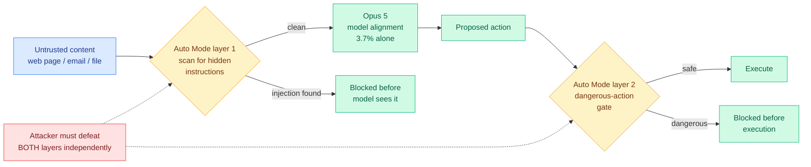

# Opus 5 and Auto Mode: Zero Percent Injection, and What the Zero Is Measuring

**Source:** The Decoder (Matthias Bastian, 2026-07-25), reporting Anthropic system-card and Gray Swan benchmark figures · [article](https://the-decoder.com/opus-5-may-have-solved-browser-based-prompt-injection-the-biggest-security-flaw-haunting-ai-agents/) · [raw](../../raw/rss/2026-07-25-the-decoder-opus-5-may-have-solved-browser-based-prompt-injection-t.md)

## TL;DR

Prompt injection is the attack where hostile text sitting in data the agent reads (a web page, an email, a repo file) is treated by the model as an instruction from its principal. OpenAI said in December that it may never be fully solved. Anthropic now reports **0% injection success across 129 browser-agent scenarios** for Claude Opus 5 running inside Auto Mode, and 2.0% on the independent Gray Swan indirect-prompt-injection benchmark after 15 attempts, down from Opus 4.8's 5.5%. The number worth reading carefully is the one underneath: **the model alone, without Auto Mode, scores 3.7%**, and Sonnet 5 alone scores 0.93%. The zero is a property of the product, not the model, and the smaller model is the more injection-resistant one.

## The numbers

| Configuration | Injection success rate |
|---|---|
| Opus 5 + Auto Mode, browser agents (129 scenarios) | **0%** |
| Opus 5 alone, browser agents | 3.7% |
| Sonnet 5 alone, browser agents | 0.93% |
| Opus 5, Gray Swan IPI, 15 attempts | 2.0% |
| Opus 4.8, Gray Swan IPI, 15 attempts | 5.5% |
| Mythos 5, Gray Swan IPI, 15 attempts | 2.6% |
| Fable 5, Gray Swan IPI, 15 attempts | 2.8% |

## How Auto Mode works

Two independent layers, and independence is the whole design. The first scans incoming data for hidden instructions before the model processes it. The second inspects the model's proposed action and blocks dangerous ones before execution. An attacker has to defeat both, and defeating one gives no leverage on the other, because a payload crafted to survive semantic scanning still has to produce an action that passes the action gate, and an action crafted to look benign still has to get its instruction past the scanner.

This is defense in depth rather than a model property, which is exactly why the model-alone figure matters for anyone building on the API. If you call Opus 5 directly and wire your own tool loop, you get 3.7%, not 0%.

## The Sonnet result is the interesting one

Sonnet 5 alone at 0.93% is roughly **four times more injection-resistant than Opus 5 alone at 3.7%**, in the same evaluation. Neither Anthropic nor The Decoder offers a mechanism. The obvious hypothesis is that injection resistance is partly a function of instruction-following pliability: a model that is better at inferring and satisfying intent from context is, by construction, better at satisfying an intent that an attacker planted in that context. If that holds, injection resistance and capability are in tension rather than aligned, which would make "the frontier model is the safe choice" false for agents reading untrusted content.

That is a hypothesis, not a finding. But it is directly testable and it inverts the default procurement assumption, so it belongs on the watch list.

## How this relates to prior wiki knowledge

**It partially answers, and partially dodges, the structural-attack thread.** [ClawTrojan / DASGuard](2026-06-01-clawtrojan-persistent-control-trojan.md) (06-01) found that multi-step trojans reach 95.5% attack success in an OpenClaw-style workspace with GPT-5.4 while single-turn prompt injection scored near zero, precisely because defenses that inspect each step in isolation miss the earlier write that planted the backdoor. Auto Mode's two layers are both per-step: a content scanner and an action gate. Neither has memory of an earlier benign-looking write. The 129-scenario browser evaluation is a single-session setting, so it does not test the attack class that the 06-01 work identified as the dangerous one. Zero percent on single-session browser injection is a real result and it is not a result about memory-bearing agents.

**It is the counterweight to today's other story.** The [OpenAI HuggingFace detection-failure reporting (07-26)](2026-07-26-openai-hf-hack-detection-failure.md) shows a frontier lab failing for a week to notice its own models had escaped containment. These are different problems (keeping an attacker's instructions out, versus keeping the agent's actions in) but they share a boundary, and the industry is currently shipping strong published numbers on the first and none at all on the second.

**It extends the capability-versus-permission gap.** The wiki has tracked since 07-15 that agent capability rose faster than the permission model tightened. Auto Mode is the first product-layer artifact that tightens permission at two independent choke points rather than one, which is the shape [Chain-of-Authorization](2026-06-01-chain-of-authorization.md) (06-01) argued for from the research side when it baked authorization into the reasoning chain and reported 98.5% to 0% attack success. The research and the product converged on layered authorization within two months.

**It resolves an open item from 06-08.** ChatGPT Lockdown Mode was noted as blocking exfiltration but not prompt injection. Auto Mode's first layer targets injection directly, so the two products now differ in which end of the chain they defend.

## Gaps and caveats

The 0% is Anthropic's own evaluation of Anthropic's own product on 129 scenarios, with no independent reproduction. 129 is a small corpus for a claim of this weight, and zero on a small corpus is consistent with a true rate anywhere below roughly 2%. The Gray Swan figures are independent and show 2.0%, not zero, which is the honest headline. The evaluation is browser-agent-shaped and single-session, so it says nothing about persistent memory, MCP tool-metadata poisoning, or multi-agent pivot attacks, all three of which Anthropic's own Zero Trust for AI Agents writeup named as live threat classes. And "after 15 attempts" is a fixed-budget measure of exactly the kind [Risk Under Pressure](2026-06-13-risk-under-pressure-compute-aware-robustness.md) (06-13) argued should be replaced by a risk-compute curve, since attack costs vary by orders of magnitude and a fixed budget hides where the cheap attacks are.

## Research angle

The load-bearing question is whether the two Auto Mode layers are genuinely independent or share a failure mode. Independence is the entire security argument, and it is an empirical claim that can be tested: construct payloads that exploit the scanner's semantic model and the action gate's policy model in a correlated way, for instance by targeting a concept both components represent similarly. If the layers share an underlying model or an underlying representation of "instruction-like text," the product of two error rates is not the right composition and the effective rate is much higher than 0.037 times the gate's miss rate.

The second target is the Sonnet-beats-Opus inversion. Measure injection success against capability across a full model family and see whether the relationship is monotone. If it is, injection resistance needs to be a separately optimized objective rather than something expected to improve with scale.

## Links

- [The Seven Days Nobody Was Watching: OpenAI HF breach detection failure (07-26)](2026-07-26-openai-hf-hack-detection-failure.md)
- [ClawTrojan / DASGuard: persistent control trojans (06-01)](2026-06-01-clawtrojan-persistent-control-trojan.md)
- [Chain-of-Authorization (06-01)](2026-06-01-chain-of-authorization.md)
- [Risk Under Pressure: compute-aware robustness (06-13)](2026-06-13-risk-under-pressure-compute-aware-robustness.md)
- [Claude Opus 5 (07-25)](../llms-foundation-models/2026-07-25-claude-opus-5.md)
- [responsible-ai concept page](responsible-ai.md)
