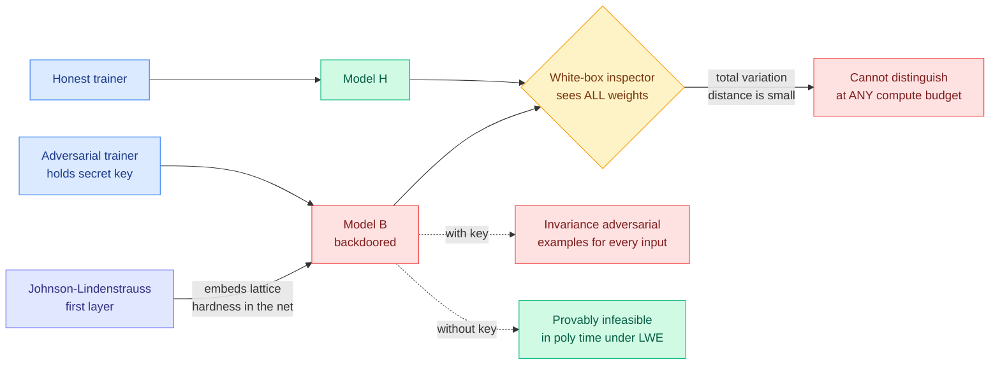

# Statistically Undetectable Backdoors in Deep Neural Networks

**Source:** Kurate cs.LG #10 (score 1629, win_rate 87.3%, ai_rating 7.8/10), never surfaced on HuggingFace · [arXiv 2607.09532](https://arxiv.org/abs/2607.09532) · Andrej Bogdanov (University of Ottawa), Alon Rosen (Bocconi), Neekon Vafa (MIT) · published 2026-07-10 · [raw Kurate leaderboard](../../raw/kurate/2026-07-26-cs-lg.md)

## TL;DR

A malicious model trainer can plant a backdoor in a large class of deep feedforward networks such that the backdoored model and an honestly trained model are close in **total variation distance** even when the inspector holds every weight. This is *statistical* undetectability, not computational: no algorithm, however much compute it has, can tell the two apart with meaningful advantage. The backdoor hands its holder invariance-based adversarial examples for every input, mapping far-apart inputs to unusually close outputs. Without the backdoor key, generating even one such example is provably impossible in polynomial time under standard lattice assumptions. The result is a clean statement of a **power asymmetry between whoever trains a model and whoever uses it**, and it lands in the same week the industry is arguing that open weights are a safety property.

## What the result actually says

Three properties have to hold at once for this to matter, and prior work always dropped one.

**White-box.** The inspector gets the full model description, every weight, not just query access. Most backdoor literature is black-box or restricted to one hidden layer.

**Statistical, not computational.** Earlier cryptographic-backdoor work (GKVZ22 and successors) guaranteed only that *efficient* algorithms cannot distinguish the honest from the tampered model. This paper closes the gap to total variation distance, which means an unbounded adversary cannot either. There is no "just look harder" defense, because there is provably nothing to look at.

**Exponentially large backdoor strength.** GKVZ22 in some parameterizations had backdoor strength below one, meaning an efficient outside adversary could find adversarial examples about as easily as the backdoor holder could. Here the gap between key-holder and everyone else is exponential and quantified.

The construction's mechanism is the interesting part: the network's **first layer is a Johnson-Lindenstrauss transform**, a random projection that is a completely ordinary thing to find in a real network. That projection is where the lattice structure hides. The hardness inherited is the same family used in post-quantum cryptography (Learning With Errors and related computational lattice problems). The conceptual claim underneath is worth stating separately from the theorem: **a natural neural network instance can carry cryptographic hardness without that hardness degrading the network's ordinary function.** Machine learning turns out to be a fine place to hide a trapdoor.

The backdoor is **invariance-based** rather than the more familiar sensitivity-based kind. Sensitivity attacks take a tiny perturbation and flip the output. Invariance attacks take inputs that are far apart and force the model to treat them as the same thing. For an access-control or authentication model, invariance is the more dangerous direction: it is the failure mode where two different people look identical to the classifier.

## Key findings

- **Undetectability holds in the white-box setting at unbounded compute.** The backdoored and honest models are close in total variation distance given full weight access.
- **Applies to a large class of deep feedforward networks**, not the one-hidden-layer toy setting prior constructions needed.
- **Backdoor strength is provably exponential.** The key-holder can produce invariance adversarial examples for every input; a polynomial-time adversary without the key provably cannot produce any, under standard lattice assumptions.
- **No heavy cryptographic machinery required.** Prior white-box constructions (KKO+24) leaned on indistinguishability obfuscation, which is concretely unusable. This uses a JL projection, which is a layer people already build.
- Findings are theoretical with preliminary empirical support. This is a possibility result, not a measured attack on a shipping model.

## How this relates to prior wiki knowledge

This is the **theoretical ceiling** on a thread the wiki has tracked empirically all quarter. [LoRA adapter backdoors (05-30)](2026-05-30-lora-adapter-backdoors-token-level.md) showed token-level backdoors surviving adapter merges; the [language-switching backdoor circuit (05-20)](2026-05-20-language-switching-backdoor-circuit.md) traced a backdoor to an identifiable circuit, which implicitly assumed backdoors leave mechanistic fingerprints you can find. Bogdanov, Rosen and Vafa show that assumption cannot hold in general: there exist backdoors that leave no statistical fingerprint at all. Interpretability-as-audit has a hard limit, and it is now a theorem rather than a worry.

It also sharpens the [Skill.md supply-chain attacks (05-23)](2026-05-23-skill-md-supply-chain-attacks.md) and [ClawTrojan (06-01)](2026-06-01-clawtrojan-persistent-control-trojan.md) thread. Those attacks live in the scaffolding around a model, and the defense is inspection of that scaffolding. This attack lives in the weights, and inspection of the weights provably does not work.

The uncomfortable collision is with the industry argument running the same week. The [NVIDIA open-weights letter (07-25)](../ai-industry/2026-07-25-nvidia-open-weights-letter.md), signed by Meta, Microsoft, and a16z, argues that closed models are single points of failure and that open weights strengthen safety and cybersecurity. Weight availability genuinely does help with a long list of things: reproducibility, red-teaming, fine-tuning provenance, avoiding vendor lock-in. It does **not** help with this. Publishing every weight is exactly the white-box setting the paper defeats. The open-weights safety argument and this theorem are not in direct contradiction, because open weights let you compare against other checkpoints and study behavior, but the specific claim "you can audit it because you can see it" is the one that fails.

## Research angle

The open problem the paper implies but does not solve: undetectability is proven relative to a distribution over honestly trained models. In practice you often have more than the final weights, you have a training log, intermediate checkpoints, data provenance, and a reproducible seed. **Does statistical undetectability survive when the auditor holds the training trajectory rather than only the endpoint?** Prequential-style reasoning suggests it might not, because the trajectory carries information the final weights discard, and that is a concrete falsifiable target.

Second target: the JL-first-layer construction is a specific embedding of lattice hardness. Is there a structural constraint on architectures that makes such an embedding impossible, and would enforcing it cost anything in capability? A "backdoor-hostile architecture" result would be the natural defensive counterpart, and nothing today rules one out.

Third, and most practically relevant to inference work: the paper is about feedforward networks. Whether the construction extends to attention-based architectures at frontier scale, and whether quantization or distillation of a backdoored model preserves the backdoor, are both unaddressed and both determine whether this is a curiosity or a supply-chain problem.

## Links

- Paper: [arXiv 2607.09532](https://arxiv.org/abs/2607.09532)
- Concept page: [responsible-ai](responsible-ai.md)
- Related: [LoRA adapter backdoors](2026-05-30-lora-adapter-backdoors-token-level.md) · [language-switching backdoor circuit](2026-05-20-language-switching-backdoor-circuit.md) · [Skill.md supply-chain attacks](2026-05-23-skill-md-supply-chain-attacks.md) · [NVIDIA open-weights letter](../ai-industry/2026-07-25-nvidia-open-weights-letter.md)
- Digest: [2026-07-26](../daily-digest/2026-07/2026-07-26.md)
