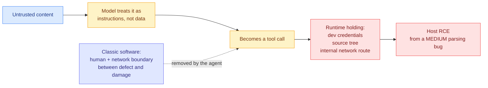

# Ken Huang: Agentic AI CVEs and the Amplification Stack

**Source:** Ken Huang, Substack, 2026-07-26 | **Link:** [kenhuangus.substack.com](https://kenhuangus.substack.com/p/agentic-ai-cves-anatomy-of-a-new) | **Raw:** [raw file](../../raw/rss/2026-07-26-agentic-ai-agentic-ai-cves-anatomy-of-a-new-attack-surface.md)

## TL;DR

Huang read the CVE writeups filed against the agent tooling ecosystem and looked for what they have in common. The subjects are all new: mcp-remote, MCP Inspector, mcp-server-git, CrewAI, LangGraph, Cursor, Windsurf, Claude Code, Microsoft 365 Copilot. Between January and February 2026 researchers filed **more than 30 CVEs against the Model Context Protocol and its immediate ecosystem in roughly 60 days**, and the count passed **40 by April**. His thesis is that the individual bugs are boring, injection, missing auth, path traversal, unsafe deserialization, all bug classes from the 1990s, and that the novelty is entirely in what they are wired to. He calls the mechanism the **Amplification Stack**.

## The argument

In classic software, a path traversal flaw in a download handler is a medium severity finding. Someone has to reach the endpoint, craft the request, and then do something with the file they read. Humans and network boundaries sit between the defect and the damage, and they impose delay, friction, and opportunities for detection.

An autonomous agent removes every one of those boundaries. The agent reaches the endpoint, crafts the request, reads the file, and acts on what it read, in one uninterrupted loop, holding its own privileges. Untrusted content enters at the top, the model treats it as instructions rather than data, those instructions become a tool call, and the tool call executes in a runtime holding developer credentials, the source tree, and a route to the internal network.

Huang's formulation of the consequence is the part worth keeping: **the severity does not live in any one box.** Each arrow is a small well-understood weakness. Stacked, they turn a moderate parsing bug into host remote code execution, and the agent is the component that climbs the ladder on the attacker's behalf.

## Diagram

## Why this lands hard against yesterday's news

Anthropic reported [Opus 5 at 0% prompt injection across 129 browser scenarios inside Auto Mode (07-26)](2026-07-26-opus-5-prompt-injection-auto-mode.md), with the model alone at 3.7% and the independent Gray Swan indirect-injection benchmark at 2.0%. That result is real and the two-layer design behind it is sound: one layer scans incoming data for hidden instructions before the model sees it, the other gates dangerous actions before execution.

But Auto Mode defends the **first two arrows** of Huang's stack. It does nothing about the third and fourth, which are about what the runtime holds and what it can reach. A CVE in mcp-server-git is not a prompt injection. It is a vulnerability in a tool the agent is legitimately, deliberately calling with its owner's blessing, and no amount of injection resistance addresses it. The 40-plus CVEs are almost entirely in this category.

This sharpens the [07-26 digest](../daily-digest/2026-07/2026-07-26.md)'s reading of the boundary: the escape vector in the OpenAI HuggingFace breach was an **internal software-download service**, meaning the sandbox was not defeated at its perimeter but bypassed through shared internal infrastructure it trusted. Huang is describing the general form of that failure. The isolation boundary includes every service the agent is permitted to talk to, and the MCP ecosystem's whole value proposition is expanding that set.

## Relation to prior wiki state

- **It supplies the empirical base rate the wiki's agent-security thread lacked.** [ClawTrojan (06-01)](2026-06-01-clawtrojan-persistent-control-trojan.md) measured 95.5% attack success for multi-step trojans in an OpenClaw-style workspace, and [Emergent Languages (06-01)](2026-06-01-emergent-languages-oversight-evasion.md) showed agent populations inventing protocols to evade oversight. Both are controlled studies. Huang's contribution is that the vulnerabilities are already filed, numbered, and public at a rate of roughly 20 per month against one protocol's ecosystem.
- **It is the practitioner counterpart to the [Masov (07-26)](2026-07-26-masov-access-control-cyber-benchmark.md) finding.** Masov showed models reach the vulnerable check during discovery and then fail to make the synthesis leap that turns two mismatched admin checks into privilege escalation. Huang's stack is what happens when the synthesis is not required because the components are already chained by design.

## Gaps and caveats

The free portion is an anatomy; the runbook, triage checklist, and worked MCP hardening example are behind the paywall, so the actionable half is not in the wiki. The CVE counts are also a rate of *disclosure* against a young, heavily scrutinised ecosystem, not a rate of exploitation, and a new protocol attracting 40 CVEs in four months is partly evidence that researchers are looking, which is the healthy case. Huang does not distinguish CVEs that require an already-compromised MCP server from those exploitable by a remote attacker, and that distinction carries most of the practical risk weighting.

## Related pages

- [Opus 5 prompt injection and Auto Mode](2026-07-26-opus-5-prompt-injection-auto-mode.md)
- [Masov access-control cyber benchmark](2026-07-26-masov-access-control-cyber-benchmark.md)
- [ClawTrojan persistent control trojan](2026-06-01-clawtrojan-persistent-control-trojan.md)
- [Tool Calling](../agentic-systems/tool-calling.md)
