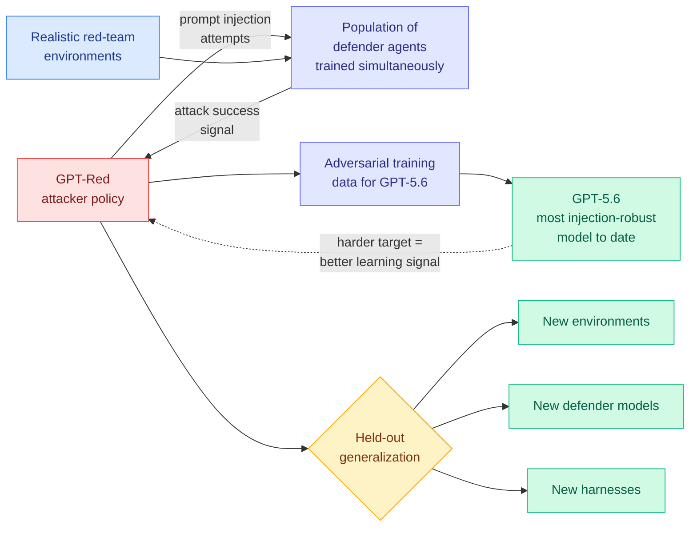

# GPT-Red: Automated Red Teaming via Self-Play at Scale

**arxiv:** [2607.26115](https://arxiv.org/abs/2607.26115) · **Source:** [HuggingFace Daily Papers 2026-07-30](../../raw/huggingface/2026-07-30-gpt-red-automated-red-teaming-via-self-play-at-scale.md) · **Lab:** OpenAI

## TL;DR

OpenAI trained a dedicated attacker model whose only job is to find prompt injection attacks (getting a model to follow instructions hidden in content it is merely supposed to read) against its own frontier systems, and used it to adversarially train GPT-5.6. The training setup is self-play: the attacker is pitted against a *population* of defender agents that are being trained simultaneously, in realistic red-teaming environments rather than static prompt sets. The scale claim is the headline. OpenAI says this used compute on the same order as some of its largest RL post-training runs, making it **the single largest LLM safety training run ever documented**. GPT-Red reliably breaks every OpenAI model up to GPT-5.5, finds more successful attacks than human red-teamers, and generalizes to held-out environments, held-out defender models, and held-out harnesses. The paper's forward claim is a flywheel: each more robust GPT provides better learning signal for a stronger red-teamer, which produces a more robust GPT.

## Why the population matters

The obvious way to train an attacker is against a fixed defender. That produces an attacker that overfits to one model's quirks, which is why most automated red-teaming results do not transfer. GPT-Red attacks a population of defenders that are themselves being trained during the run, so the target distribution keeps moving and any attack that only works on one defender stops paying off. This is the mechanism behind the held-out generalization result, and it is the part most likely to be reproduced elsewhere. The scale is OpenAI's to spend; the population design is not.

The other design choice worth naming: the training environments are realistic red-teaming settings, not a benchmark of adversarial prompts. Prompt injection in production is a property of an agent reading untrusted content inside a harness with tools and credentials, not a property of a string. Training in environments means the attacker learns attacks that route through tool calls and harness behaviour, which is why it transfers across harnesses.

## The uncomfortable reading

The paper frames the flywheel as a safety win, and for OpenAI's own systems it is. Read from outside, the same result says that a well-resourced lab can now produce an attacker that **beats human red-teamers and generalizes to models it was never trained against**. GPT-Red is described as reliably breaking every OpenAI model up to GPT-5.5. Those are shipped models that other people are running in production right now. The artifact is a general-purpose injection-finder whose value does not stop at the boundary of OpenAI's model family, and the population-training design is specifically what makes it not stop there.

## Relation to prior wiki state

This is the industrial-scale answer to a defensive result from four days ago. [Opus 5 prompt injection under Auto Mode (2026-07-26)](2026-07-26-opus-5-prompt-injection-auto-mode.md) reported a **zero** injection success rate for Opus 5 with Auto Mode's per-step defences, alongside an unexplained capability inversion where the smaller Sonnet 5 scored 0.93% and the larger Opus 5 scored 3.7% without those defences. That zero was measured against a human-designed and static attack suite. GPT-Red is the argument that such a number tells you less than it appears to: an attacker that outperforms human red-teamers and transfers across harnesses is a different measurement instrument. The [07-26 digest](../daily-digest/2026-07/2026-07-26.md) predicted Opus 5's zero would break within 90 days along one of two axes. GPT-Red does not break it, because it was never run against Opus 5, but it supplies the tool that would.

It also sits in direct tension with this week's Kurate cs.AI #2, [What AI Red-Team Evaluations Can and Cannot Prove](http://arxiv.org/abs/2607.21735) (score 1570, 90.9% win rate), which argues that a red-team evaluation establishes the existence of a vulnerability and almost never establishes its absence. GPT-Red is a machine for producing existence proofs at industrial scale. Nothing in it converts to an absence proof, and the flywheel framing quietly implies otherwise. Both papers are correct; only one of them is being marketed.

Against the empirical record: [ClawTrojan (2026-06-01)](2026-06-01-clawtrojan-persistent-control-trojan.md) achieved 95.5% attack success with multi-step trojans that plant a benign-looking write in one session and trigger it later, and per-step defences miss it by construction. GPT-Red's environments are described as realistic but the paper gives no indication that persistence across sessions is in the attack space. The [agentic AI CVE amplification stack (2026-07-27)](2026-07-27-agentic-ai-cves-amplification-stack.md) documented 40-plus MCP-ecosystem CVEs in four months, which is the same lesson from the disclosure side: the isolation boundary, not the model, is where the failures live.

## Gaps

No numbers in the abstract. "More successful attacks than human red-teamers" has no baseline size, no attack budget, and no measure of severity. "Compute on the same scale as some of our largest RL post-training runs" is a comparison to an undisclosed quantity. The single most important missing number is the post-hardening residual: what is GPT-5.6's injection success rate against GPT-Red after adversarial training, and does that number stay low when GPT-Red keeps training? A flywheel claim requires showing at least two turns of the wheel.

Nothing indicates whether the attacker was evaluated against non-OpenAI defenders in the wild, which is both the most interesting experiment and the one with the most obvious reason not to publish.

## Industrial implication

Anyone shipping an agent that reads untrusted content should assume the attacker side is now automated and scaled, and should stop treating a clean result on a static injection suite as evidence of anything. The practical consequence for defenders without OpenAI's compute is that the only defences worth building are the ones that do not depend on the model resisting: capability scoping, credential isolation, and egress control at the harness layer. That is the same conclusion the CVE thread reached from the other direction.

## Related

- [Responsible AI](responsible-ai.md)
- [Opus 5 prompt injection under Auto Mode](2026-07-26-opus-5-prompt-injection-auto-mode.md)
- [StealthBench: Operational Stealth in Offensive-Security Agents](2026-07-30-stealthbench-opsec-offensive-agents.md)
- [Daily digest 2026-07-30](../daily-digest/2026-07/2026-07-30.md)
