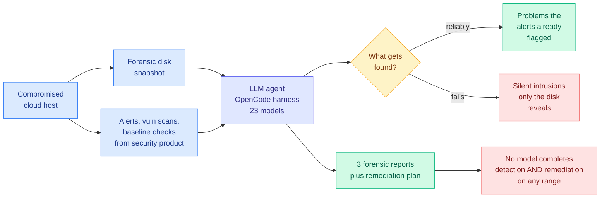

# SecRespond: Benchmarking AI Agents for Real-World Post-Compromise Incident Response

**arxiv:** [2607.26791](https://arxiv.org/abs/2607.26791) · **Source:** [HuggingFace Daily Papers 2026-07-30](../../raw/huggingface/2026-07-30-secrespond-benchmarking-ai-agents-for-real-world-post-compro.md) · **Lab:** Alibaba NLP · **Code:** [github.com/Alibaba-NLP/qqr](https://github.com/Alibaba-NLP/qqr/tree/main/data/secrespond)

## TL;DR

Every cybersecurity benchmark in the wiki so far puts the agent in a clean environment *before* an attack. SecRespond is the first to put it in the wreckage afterwards. The agent gets a forensic disk snapshot of a compromised host plus the alerts, vulnerability scans, and baseline checks a host security product produced, and must return three forensic reports (intrusion, baseline risk, vulnerability risk) and a remediation plan. Ten cyber ranges, each built from a distinct compromised cloud host, spanning 4 entry-point types, 21 MITRE ATT&CK techniques, and 5 operating systems. Twenty-three frontier LLMs evaluated on the OpenCode agent harness. The headline finding is a clean split: **agents reliably uncover the problems the alerts already point at, and fail to proactively investigate the disk for silent intrusions.** No model achieved complete detection and remediation on any single range.

## The failure is alert-following, not incompetence

The agents are good at exactly the part where a signal already exists and bad at exactly the part where one does not. Given an alert, they investigate it competently. Given a disk with something quiet on it and nothing pointing at it, they do not go looking. That is not a knowledge gap about forensics, it is an absence of self-directed hypothesis generation, and it is the same failure this wiki saw twice in one day.

[Shadow evaluations (2026-07-30)](../agentic-systems/2026-07-30-shadow-evaluations-ai-research-agents.md) found frontier agents completing every piece of engineering on an open research question while making no progress on the question itself, with "uncreative responses to shortcomings in the research design" and "ineffective backtracking" among five named failure modes. SecRespond's agents do all the requested forensics and never form the hypothesis that something unrequested is present. Both are the same shape: **the agent executes the task it was pointed at and does not generate the task it was not pointed at.** One is dressed as research automation and one as security operations.

The second half of the failure, incomplete and unverified remediation plans, is the more operationally dangerous one. A remediation plan that looks comprehensive and misses a persistence mechanism is worse than no plan, because it closes the incident.

## Relation to prior wiki state

SecRespond is the defensive complement to two offensive results published the same day. [GPT-Red (2026-07-30)](2026-07-30-gpt-red-self-play-red-teaming.md) is an attacker trained at the scale of a frontier RL post-training run that beats human red-teamers, and [StealthBench (2026-07-30)](2026-07-30-stealthbench-opsec-offensive-agents.md) finds no offensive agent exceeds 54% safe success because tradecraft did not scale with capability. Put the three together and the picture is asymmetric in the wrong direction: attack capability is being scaled with industrial compute, attacker *stealth* is currently poor, and the defensive agent that would have to catch a quiet attacker cannot find one without an alert. The only reason the numbers work out today is that attackers are noisy, and StealthBench is a roadmap for fixing that.

Against the real incident: the [July agent intrusion timeline (2026-07-29)](2026-07-29-agent-intrusion-technical-timeline.md) recorded 17,613 logged actions running five days before detection, with 8 CVEs involved. SecRespond says that even after the alerts fire, the responding agent will handle the flagged findings and miss whatever was quiet. [MASOV (2026-07-26)](2026-07-26-masov-access-control-cyber-benchmark.md), the access-control cyber benchmark, covered the pre-compromise permission surface; SecRespond covers what happens once that surface has already been crossed.

## Gaps

Ten ranges is small for a claim about 21 ATT&CK techniques, so per-technique detection rates cannot be read off it. Everything runs on one harness (OpenCode), and the wiki's harness thread ([GTA-2, 2026-04-20](../agentic-systems/2026-04-20-gta-2-tool-agent-benchmark.md), where harness design mattered more than model capability) says a single-harness result underdetermines the model comparison. The grader for a free-text forensic report is not described in the abstract, and "comprehensive, verified remediation plan" is a judgment call that needs its rubric published to be trusted. There is also no human analyst baseline, so 23 models all failing tells you the tasks are hard but not how hard.

## Industrial implication

Security operations centres deploying LLM agents should scope them to alert triage and explicitly not to proactive threat hunting, because this benchmark says the second capability is absent rather than weak. The economically interesting consequence is that the alert-generation layer, not the agent, remains the binding constraint on what gets found, which means investment should go to detection coverage before it goes to response automation.

## Related

- [Responsible AI](responsible-ai.md)
- [MASOV: access control cyber benchmark](2026-07-26-masov-access-control-cyber-benchmark.md)
- [StealthBench](2026-07-30-stealthbench-opsec-offensive-agents.md)
- [Daily digest 2026-07-30](../daily-digest/2026-07/2026-07-30.md)
