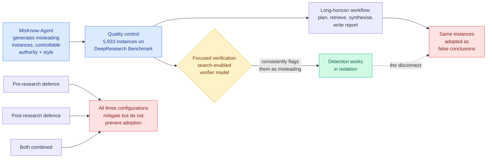

# Is Deep Research Reliable? Misleading Knowledge Induces False Conclusions

**Source:** HuggingFace Daily Papers, 2026-07-31 · [arXiv 2607.20891](https://arxiv.org/abs/2607.20891) · [raw](../../raw/huggingface/2026-07-31-is-deep-research-reliable-misleading-knowledge-induces-false.md)

## TL;DR

Deep Research agents plan, retrieve, synthesise evidence, and write a report, all over a long horizon in an open information environment. This paper asks whether plausible-looking but factually wrong material encountered along the way survives the pipeline and lands in the final report as a stated conclusion. It does. The framework, **MisKnow-Agent**, generates misleading instances with controllable authority levels and styles, yielding **5,933 quality-controlled instances** on DeepResearch Benchmark tasks. Across open and closed-source agents, **even limited exposure induces false-conclusion adoption**. The sharpest result is a disconnect: **search-enabled verifier models reliably identify the same instances as misleading during focused validation, and the agents still adopt them during long-horizon research.**

## What it actually does

The construction is the useful part. Misleading knowledge with **controllable authority levels and styles** means the paper can separate "the agent believed it because it looked like a government source" from "the agent believed it because it was fluent" from "the agent believed it because nothing contradicted it." Five thousand nine hundred and thirty-three quality-controlled instances built on an existing DeepResearch benchmark keeps the task distribution realistic rather than adversarially synthetic.

Then three defence configurations are evaluated: pre-research (filter the corpus before the agent reads it), post-research (check the report after), and both. **All three mitigate. None prevents.**

## Key findings

- **Limited exposure is enough.** The agents do not need to be flooded. A small amount of credible-looking misleading material propagates to stated conclusions.
- **The verification-versus-use disconnect is the headline.** A search-enabled verifier catches these instances during focused corpus validation. The same instances get adopted during the long-horizon run. Detection capability exists and is not being applied where it matters.
- **Defences are partial in every configuration**, including the combination, which rules out the easy reading that this is a missing-filter problem.
- The paper's own conclusion is that reliability needs evidence verification and correction **at both the model level and the framework level**, and that improving planning, retrieval, evidence integration or report generation will not fix it.

## How this relates to prior wiki pages

**The verification-versus-use gap is the same failure this wiki has now seen in four separate settings in eight days, and naming it as a pattern is overdue.** [SecRespond](2026-07-30-secrespond-post-compromise-incident-response.md) (07-30): incident-response agents reliably investigate what the alerts flag and never hunt the disk for silent intrusion, and no model completed detection plus remediation on any range. [Shadow evaluations](../agentic-systems/2026-07-30-shadow-evaluations-ai-research-agents.md) (07-30): research agents completed every piece of engineering unassisted and were unambiguously rejected by the papers' own authors, with four of five failure modes being judgment about what to do next rather than knowledge. [InMind](../agentic-systems/2026-07-29-inmind-implicit-association-blind-spot.md) (07-29): memory systems answer at most 14.4% of indirect queries whose answers they demonstrably store, while the same backbone answers 84.0% when the fact is placed in context. And now this. In every case the capability is present and demonstrable under a focused test, and absent when the agent has to invoke it unprompted inside a longer workflow. **The gap is not capability, it is capability deployment**, and no current training objective targets it.

**It is a direct reliability argument for the retrieval architecture today's [BM25 Wins at Scale](../agentic-systems/2026-07-31-bm25-wins-at-scale.md) recommends on cost grounds.** That paper found agentic exploration loses to global lexical ranking past roughly 10 million corpus tokens and costs 39x more query tokens, concluding that agentic reasoning works best after ranked discovery rather than in place of it. If exploration's failure mode is adopting what it happens to encounter, then putting a ranker in front of the agent narrows the surface where misleading material gets discovered in the first place. The two papers were written independently and their recommendations compose.

**Against the [agent-benchmarks](../agentic-systems/agent-benchmarks.md) measurement thread, this is a validity result in disguise.** Deep Research agents are currently evaluated on report quality against clean corpora. This paper shows that evaluation cannot distinguish an agent that reasons well from one that has only ever been handed good evidence, which is the same protocol-validity complaint Kurate's cs.AI #1 on 07-29 made about agent benchmarks generally.

## Gaps

The misleading instances are LLM-generated with controlled authority and style, so they are misleading in the ways a generator can produce, and real misinformation on the open web has provenance structure, cross-linking, and search-ranking behaviour that synthetic instances do not. The paper reports that defences mitigate without giving the residual rate in the abstract, which is the number that determines whether this is a tuning problem or a structural one. And "even limited exposure" is unquantified: one document in a hundred and one in ten are very different findings for anyone deciding whether to ship.

## Related

- [SecRespond: post-compromise incident response](2026-07-30-secrespond-post-compromise-incident-response.md)
- [Shadow evaluations: can agents do open-ended AI research?](../agentic-systems/2026-07-30-shadow-evaluations-ai-research-agents.md)
- [BM25 Wins at Scale](../agentic-systems/2026-07-31-bm25-wins-at-scale.md)
- [agent-benchmarks.md](../agentic-systems/agent-benchmarks.md)
