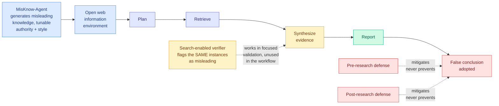

# Is Deep Research Reliable? Misleading Knowledge Induces False Conclusions

**arxiv:** [2607.20891](https://arxiv.org/abs/2607.20891) · **Source:** [HuggingFace Daily Papers 2026-07-31](../../raw/huggingface/2026-07-31-is-deep-research-reliable-misleading-knowledge-induces-false.md) (3 upvotes)

## TL;DR

A Deep Research agent plans, searches the open web, synthesises what it finds, and writes a report. Every step of that pipeline assumes the retrieved material is roughly trustworthy. This paper builds the tool to test the assumption and reports a failure that should worry anyone shipping one.

**MisKnow-Agent** generates misleading knowledge with **controllable authority level and style**, producing **5,933 quality-controlled instances** on top of DeepResearch Benchmark tasks. Run against open-source and closed-source Deep Research agents, **even limited exposure to misleading knowledge induces false-conclusion adoption in the final report.** The finding that makes this structural rather than incremental: **search-enabled verifier models reliably flag the very same instances as misleading during focused corpus validation, and then adopt them anyway during the long-horizon research run.** The capability is present and the workflow does not use it. The authors call this a disconnect between focused verification and workflow-level evidence use. Pre-research defenses, post-research defenses, and both combined all **mitigate but never prevent** adoption.

## The verification disconnect is the real result

Strip away the benchmark and one sentence carries the paper: the verifier works when you point it at a document and ask "is this misleading," and stops working when the same document arrives inside a long research trajectory. That is not a capability gap. It is an **architecture** gap, and it means the standard mitigation ("add a verifier step") is answering the wrong question.

Why it happens is worth being explicit about, because it determines whether any fix is available. In focused validation the model has one job, one document, and an adversarial framing. Inside a research run the document is one of dozens, the framing is cooperative (the agent is trying to *build* a claim, not attack one), and the misleading content has already been laundered through the agent's own intermediate summary by the time any reasoning touches it. Once a claim is paraphrased into the agent's own notes it has lost the authority markers and provenance that would have triggered scepticism. The agent is no longer reading a suspicious web page; it is reading its own prior belief.

The **controllable authority level** in MisKnow-Agent is what makes this measurable rather than anecdotal. Authority is the variable a real adversary controls (publish on a plausible-looking domain, cite real papers, adopt an academic register), and having it as a dial means you can report an adoption curve against it instead of a single number.

## Key results

- **5,933 quality-controlled misleading instances**, built on DeepResearch Benchmark tasks, with authority level and style as explicit controls.
- **Limited exposure is sufficient.** False conclusions propagate into final reports without requiring the environment to be saturated with bad material.
- **The failure spans open-source and closed-source agents.** It is not one vendor's harness bug.
- **The verification disconnect:** search-enabled verifiers identify the retained instances as misleading under focused validation, and the same instances are still adopted during long-horizon research.
- **All three defense configurations, pre, post, and combined, mitigate without preventing.** The authors' conclusion is that reliable Deep Research needs verification and correction at both the model and framework level, not better planning, retrieval, synthesis, or report generation.

## How this relates to prior wiki pages

**Three items landed on 2026-07-31 attacking the same failure from three directions, which crosses the wiki's threshold for declaring a pattern.** Name all three with their actual claims:

1. **This paper** measures the failure: misleading evidence propagates through a research workflow into a confident false conclusion, and a verifier that catches it in isolation misses it in situ.
2. **[LEDGERMIND](../agentic-systems/2026-07-31-ledgermind-evidence-ledger.md)** (2607.28374, HF same day) proposes the architecture that would prevent it: treat a multimodal agent trajectory as a **provenance-constrained state machine**, normalise every tool output into a **Structured Evidence Ledger** that *is* the trajectory state, and permit downstream reasoning to **cite only active ledger entries**. Repair is a typed state transition that **cannot introduce content without tool-produced provenance**, which it backs with a formal provenance non-amplification guarantee. It names four failure patterns final-answer accuracy hides, and two of them are this paper's failure: unsupported intermediate reasoning, and citation-backed entity hallucination it calls **Phantom Grounding**.
3. **Google Research's Science One Framework** (announced [2026-07-30 on X](https://x.com/GoogleResearch/status/2082929539248951548), [blog](http://goo.gle/4wzlGWU)) ships the same idea as a product claim: an autonomous research prototype that **natively maintains verifiable evidence chains**, which Google says eliminates hallucinated citations and enables reproducible AI science.

The convergence is precise, not vague. All three conclude that **a research agent's trajectory state must carry provenance, because a summary does not.** LEDGERMIND's non-amplification guarantee is the formal version of what this paper's repair-time findings say is missing, and Science One is a frontier lab shipping the mechanism in the same 48 hours. That is the strongest research-to-industry alignment in today's batch, and it is unusual: normally the wiki logs research outpacing industry or the reverse.

**It extends the [responsible-ai](responsible-ai.md) page's evaluation-validity thread to a new layer.** The page tracks a run of results showing aggregate accuracy hides the mechanism: [Do Agents Actually Reason (07-29)](../agentic-systems/2026-07-29-do-agents-actually-reason.md)-style measurement-validity work, and the [07-30 shadow-evaluation result](../agentic-systems/2026-07-30-shadow-evaluations-research-agents.md) where agents given the open question from an unpublished paper had their engineering accepted and their research rejected, twice. This paper is the same critique aimed at Deep Research specifically, and LEDGERMIND states the general form outright: final-answer accuracy cannot distinguish a correct answer reached through grounded evidence from one reached through language priors or accidental error cancellation.

**It also lands on the same day Gary Marcus cited the complementary result.** His [seven most shambolic things](https://garymarcus.substack.com/p/the-seven-most-shambolic-things-that) post flags a large-team finding that "AI scientists still aren't really up to scratch, especially when it comes to open-ended research." Read next to Kurate's current cs.AI leaderboard, where **#1 is stress-testing LLM agents in a robotic chemistry laboratory** (2607.23045, ai_rating 7.5/10, 92.3% win rate) and **#10 is Efficiency Matters in Autonomous Research** (2607.24647), the autonomous-science category is simultaneously the most-invested and the least-verified area in agentic AI right now.

**Against [agent-memory](../agentic-systems/agent-memory.md) it supplies the poisoning test that page has been asking for.** The page's note on [MRAgent (06-15)](../agentic-systems/2026-06-15-mragent-graph-memory-reconstruction.md), whose reasoning loop iteratively expands and prunes retrieval paths as evidence accumulates, flagged exactly this risk: "a reasoning-steered loop that prunes on its own evidence is exactly where a wrong early turn could compound, and the paper does not test against poisoned memory." MisKnow-Agent is the generator that would run that test. Nobody has pointed it at a memory system yet, and it is now the obvious next experiment.

## Gaps

- **No adoption rates in the abstract.** "Even limited exposure can induce" is qualitative. The paper's most valuable deliverable would be adoption rate as a function of authority level, and the headline number is not stated.
- **Synthetic misleading content.** MisKnow-Agent generates the adversarial material, so the results measure vulnerability to LLM-generated misinformation with tunable authority. Real-world misinformation has different statistics, including being sometimes true-but-outdated, which is the harder case and structurally the [STALE (05-15)](../agentic-systems/2026-05-15-agent-memory-cluster-stale-preping-evolvemem.md) staleness problem rather than a falsehood problem.
- **The disconnect is diagnosed, not explained.** We learn the verifier fails in situ but not which step loses the signal. Instrumenting it (does adoption drop if the raw source text stays attached to every intermediate claim?) is a cheap follow-up and would tell you whether LEDGERMIND's ledger is sufficient or merely necessary.
- **DeepResearch Benchmark tasks may be unrepresentatively verifiable.** Benchmark research questions have answers. The reports people actually generate are often about contested or emerging topics where no ground truth exists to be misled away from, which is both harder to measure and where the harm is larger.

## Industrial implication

Every enterprise Deep Research deployment currently sells a report a human will act on without re-reading the sources. This paper says the report can be confidently wrong from a small amount of planted material, and that bolting a verifier onto the front or the back does not fix it. The architectural implication, which LEDGERMIND states and Google is shipping, is that **provenance has to be carried in the trajectory state rather than reconstructed at the end**, and that citations must be constrained to what a tool actually produced rather than generated alongside the prose. Expect provenance-constrained generation to become a procurement requirement for research agents before it becomes a research consensus, and expect the first public incident to involve a report citing a plausible source that says something the source does not say.

## Related pages

- [Responsible AI](responsible-ai.md) — the evaluation-validity thread
- [LEDGERMIND (07-31)](../agentic-systems/2026-07-31-ledgermind-evidence-ledger.md) — the architecture that answers this, same day
- [Agent Memory](../agentic-systems/agent-memory.md) — the untested poisoning risk this could measure
- [Agent Benchmarks](../agentic-systems/agent-benchmarks.md)
- [Daily digest 2026-07-31](../daily-digest/2026-07/2026-07-31.md)
