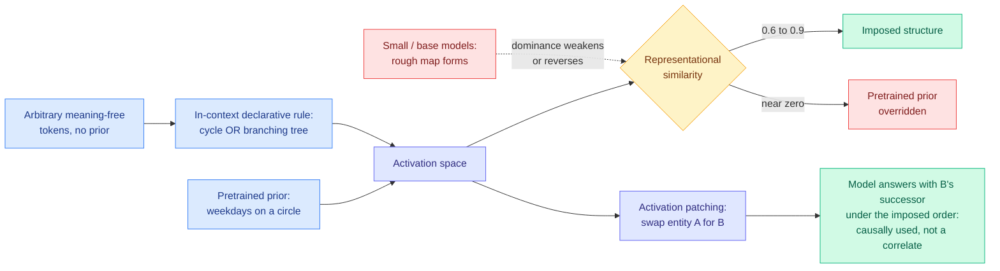

# Context Is King: How In-Context Specification Shapes the Geometry of Concepts

**Date ingested:** 2026-08-01
**Source:** Kurate weekly cs.LG leaderboard #3 (score 1508, win rate 82.4%, ai_rating 6.6/10, the highest-rated cs.LG entry on the board)
**Paper:** [arXiv 2607.24425](https://arxiv.org/abs/2607.24425)
**Raw:** [Kurate cs.LG board](../../raw/kurate/2026-08-01-cs-lg.md)

---

## TL;DR

Interpretability has a favourite party trick: weekdays lie on a circle in activation space, months on another circle, and this is usually read as evidence that the model *stores* a world model and looks it up. This paper says the stored shape is not what the model uses. **The structure the model actually computes with is set by the in-context specification.** A declarative rule in the prompt fixes not only which relations the geometry encodes but its **topology type**: the same tokens form a cycle or a branching tree on command. Critically, the same geometries appear over **arbitrary meaning-free tokens with no pretrained prior to inherit**, which a relabelled stored shape cannot do. When the in-context specification contradicts a strong pretrained prior, the context-set geometry **wins** in capable models, with representational similarity **0.6 to 0.9** to the imposed structure against near-zero to the prior. Activation patching shows the map is causally used rather than a probe correlate: swap one entity's activation for another's and the model answers with the *other* entity's successor under the imposed order. And the mechanism is scale-gated in an unusual way. A rough map forms readily even in small and base models, but **clean dominance and the causal crossover appear only in the larger models** (up to Gemma-31B and Qwen-27B) and weaken or reverse below, so a mechanism present in a large model can be absent in a smaller one of the same family.

---

## Mechanism

---

## Why the arbitrary-token control is the load-bearing experiment

The whole question is whether the model retrieves a stored manifold and relabels it, or builds the manifold the context asks for. Those two hypotheses make identical predictions on weekdays, because weekdays have a stored circle to relabel. They diverge on tokens with no prior at all. The paper runs that case and gets the geometry anyway, which is the result a relabelling account cannot produce. Everything else in the paper (topology switching, prior override, activation patching) is evidence about strength and causal role; this one is evidence about mechanism.

---

## How this relates to prior wiki pages

**It sits directly against [Coherent Overlap (07-31)](../ai-routing/2026-07-31-coherent-overlap-moe-routing.md), and the two together make one argument.** Coherent Overlap measured expert subspaces across six mixture-of-experts models (architectures where each token routes through a small subset of specialised sub-networks) and found they overlap substantially while remaining non-redundant, so **geometric similarity cannot tell you what an expert is for**. Context Is King finds that a concept's geometry is not even a stable property of the model, it is a function of the prompt. Read together: representation geometry is being used across this literature as a proxy for function, and both papers say the proxy is broken, one on the axis of similarity and one on the axis of stability. The [07-31 digest](../daily-digest/2026-07/2026-07-31.md) already noted these two sit adjacent when it flagged Context Is King as LLM-rated underrated. Having now read it, the adjacency is stronger than the digest guessed: this is the second measurement-validity result in one week aimed at the same instrument.

**It complicates the interpretability programme this wiki tracks on the [responsible-ai](responsible-ai.md) page.** Probe-based interpretability implicitly assumes that finding a feature direction tells you something durable about the model. If the direction is context-set, then a probe trained in one context and deployed in another is measuring a structure that no longer exists, and the safety-relevant version of that failure is a monitor that reads a concept direction which the deployment prompt has quietly reconfigured.

**The scale-gating result is the one with teeth for evaluation practice.** "A mechanism present in a large model can be absent in a smaller one of the same family, and can *reverse* below a threshold" is a direct warning to the standard practice of prototyping interpretability and safety methods on the small member of a family and assuming the finding scales. It is the same shape as the [Extrapolation Cliff](../inference-efficiency/knowledge-distillation.md) family of results in distillation, where a method's behaviour changes sign rather than degrading smoothly across a capability gap, and it deserves the same caution.

---

## Key results

- A declarative in-context rule fixes the **topology type**, cycle or branching tree, over the same tokens.
- Geometry forms over **arbitrary meaning-free tokens**, which rules out relabelling a stored shape.
- Under conflict with a pretrained prior, imposed structure dominates: representational similarity **0.6 to 0.9** to the imposed structure, near zero to the prior, across the priors tested and both families (Gemma, Qwen).
- **Activation patching** confirms causal use: swapping one entity's activation makes the model answer with the other entity's successor under the imposed order.
- **Scale gates clean use, not formation.** Rough maps exist in small and base models; clean dominance and the causal crossover appear only up to Gemma-31B and Qwen-27B and weaken or reverse below.

---

## Gaps

Two model families is thin for a claim about how language models represent concepts, and both are open-weight mid-scale families, so nothing here speaks to frontier-scale behaviour. The paper explicitly **declines to resolve whether the model builds the geometry anew or reconfigures a stored one**, which is honest and also leaves the mechanistic question the title implies unanswered; the arbitrary-token result narrows it but a stored *generic* relational template being instantiated is still consistent with everything reported. The structures tested (cycles, trees, orders) are simple relational schemas, and it is unknown whether the finding extends to concepts without a clean combinatorial skeleton, which is most of them. And "representational similarity 0.6 to 0.9" is a wide band doing a lot of work in the headline claim.

---

## Research angle

The routing-adjacent question is the interesting one for this wiki. If a declarative rule in the prompt can reconfigure the geometry a model computes with, then **prompt-level specification is a control surface over internal representation**, not just over output format. That is a mechanism for steering that costs no weights and no fine-tuning, and nobody has tested whether it can be used deliberately, for instance to impose a task-appropriate relational structure before a reasoning step rather than hoping the pretrained one fits. The falsifier is cheap: take a task where the pretrained prior is known to be wrong for the domain (a non-standard ordering, a domain-specific taxonomy), impose the correct structure declaratively, and measure downstream accuracy rather than representational similarity. Every result in this paper is measured in representation space. None is measured in task performance, and that is the gap between an interesting finding and a usable technique.

---

## Related pages

- [Responsible AI](responsible-ai.md)
- [Attention Mechanisms](../llms-foundation-models/attention-mechanisms.md)
- [Coherent Overlap in MoE routing (07-31)](../ai-routing/2026-07-31-coherent-overlap-moe-routing.md)
