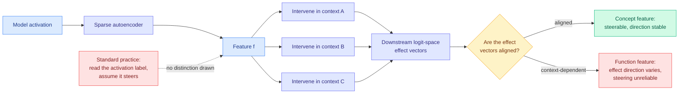

# Sparse Autoencoders Encode Both Concepts and Functions: the downstream geometry of feature effects

**arxiv:** [2607.24645](https://arxiv.org/abs/2607.24645)
**Authors:** Phu Gia Hoang, Anwoy Chatterjee, Tanmoy Chakraborty, Iryna Gurevych, Subhabrata Dutta (UKP Lab TU Darmstadt, IIT Delhi)
**Source:** Kurate weekly cs.LG leaderboard #7 (score 1481, win rate 70.6%, ai_rating 6.0/10, published 2026-07-27). Enriched with the alphaxiv overview.
**Concept page:** [responsible-ai.md](responsible-ai.md)

## TL;DR

A sparse autoencoder (SAE) breaks a model's internal activation vector into a sparse set of features that each look like a human concept. The whole safety appeal of that is the assumption that a feature you can name is a feature you can steer. This paper attacks the assumption from a direction the literature had not looked: instead of studying the geometry of features **inside** the autoencoder's latent space, it studies the geometry of what happens **downstream**, in the model's logit space, when you intervene on a feature across many different contexts. The question is narrow and empirical: how comparable are one feature's downstream effects when you intervene on it in different places? The answer is that SAE features are doing two different jobs at once. Some behave like **concepts**, producing a consistent logit-space effect wherever you push them. Others behave like **functions**, producing effects whose direction depends on the context they act in. Treating both kinds as steerable handles is why feature steering has been unreliable, and the paper's contribution is a computable diagnostic that tells you which kind you are holding before you use it.

## Diagram

## Key findings

- **The unit of analysis moves from the latent space to the logit space.** Prior geometric work on SAEs asked how concepts are arranged inside the autoencoder's own feature space. This paper measures the structure of the **change in output logits** caused by intervening on a feature, which is the object that actually matters if you intend to steer anything. The gap it fills is that no computable diagnostic existed for how intervention effects are organised in output space.
- **A single SAE feature set contains two behaviourally distinct populations.** Concept-like features produce downstream effects that are consistent across contexts. Function-like features produce effects whose organisation depends on where they fire. Both are legible under activation-based interpretation, and nothing in the standard feature label distinguishes them.
- **This explains a pile of prior negative results rather than adding a new one.** The paper situates itself against a specific list of failures: features with clear descriptive meanings showing weak or unexpected causal effects (Durmus et al. 2024), steering that varies across contexts or runs opposite to the intended direction (Tan et al. 2024, Braun et al. 2025), and activation-based feature selection missing the features that actually drive a desired output change (Arad et al. 2025). If features encode functions as well as concepts, all four observations are the same observation.
- **The diagnostic is the deliverable.** The value is a computable test applied before an intervention, not a new steering method. That is the right shape for the problem, because the failure mode being described is silent: a function-feature intervention produces a plausible output and no error signal.

## Relation to prior wiki

**This is the mechanism under the result the [responsible-ai page](responsible-ai.md) already recorded, and the pair of them is now a strong claim.** [SAE Interventions are Unreliable (06-18)](2026-06-18-sae-interventions-unreliable.md) showed that clamping an SAE feature blocks one visible route to a behaviour while the behaviour itself is recoverable, and localised the recovery to the **SAE reconstruction residual**, the part of the activation the autoencoder never explained. Its conclusion was that feature-level control is not behavioural control, and its open question was whether better SAEs close the gap or whether the gap is structural. Today's paper answers a different half of the same question and makes the picture worse in a useful way: the 06-18 failure lives in what the SAE **left out**, and this failure lives in what the SAE **put in**. Even a feature the autoencoder captured cleanly may not have a stable downstream effect, because the feature is a function rather than a concept. So a defence built on feature clamping has two independent leaks, one in the residual and one in the feature set itself, and improving reconstruction only addresses the first.

**Read against yesterday, this is the second paper in two days saying an interpretability readout is context-conditional.** [Context Is King (08-01)](2026-08-01-context-is-king-concept-geometry.md) showed that the concept geometry a model computes with is set by the in-context specification rather than retrieved from a stored world model: the same tokens form a cycle or a branching tree on command, with representational similarity of 0.6 to 0.9 to the imposed structure and near zero to the pretrained prior, and activation patching confirming the imposed map is causally used rather than a probe correlate. Its defensive warning was that a probe trained in one context and deployed in another may be reading a structure the deployment prompt quietly reconfigured. Today's paper reaches a compatible conclusion by a completely different route, measuring output effects rather than representational similarity, and on a different object, SAE features rather than concept manifolds. **Two independent methods, two days apart, both finding that the thing an interpretability tool reads is not a fixed property of the network but a function of the context it is read in.** Neither cites the other.

That makes three papers in seven weeks converging on the same structural claim, which clears this wiki's threshold for naming a pattern: [SAE Interventions are Unreliable (06-18)](2026-06-18-sae-interventions-unreliable.md) (feature control is not behavioural control), [Context Is King (08-01)](2026-08-01-context-is-king-concept-geometry.md) (the geometry you probe is the one the prompt asked for), and this paper (the same feature has different downstream effects in different contexts). **The pattern is that interpretability's unit of analysis has been the wrong size.** Every one of these results comes from measuring a feature or a manifold in isolation and then discovering it does not behave the same way once a context is wrapped around it.

It also connects to the page's older lesson from [Pressure-Testing Deception Probes (06-03)](2026-06-03-deception-probes-pressure-test.md), where a linear deception readout hit AUROC 0.998 in distribution and shattered under a benign style shift. That was read at the time as a robustness problem with one probe. Under today's paper it reads as the same phenomenon: the readout was measuring something whose effect was context-dependent all along, and the style shift changed the context.

## Gaps in the study

- **The concept-versus-function split needs a threshold, and thresholds on continuous diagnostics tend not to transfer.** The paper measures alignment of downstream effect vectors, which is a continuous quantity. Where the useful cut sits, and whether the same cut works across SAE widths, layers, and model families, decides whether this is a deployable check or a per-setup calibration exercise.
- **No safety-critical case study.** The 06-18 paper anchored on refusal steering with a 95.8% recovery number, which is what made it land. This paper is a diagnostic framework, and until someone shows that a specific failed safety intervention was a function feature the whole time, the practical claim is inferred rather than demonstrated.
- **Nothing is said about whether function features can be steered by a different mechanism**, only that pushing them the standard way is unreliable. A diagnostic that classifies half your features as unusable is only half a contribution if there is no second tool.
- **Coverage across model scale is unclear from the abstract and overview.** [Context Is King](2026-08-01-context-is-king-concept-geometry.md) found that scale gates clean causal use, with dominance weakening or reversing below Gemma-31B and Qwen-27B. If the concept-function split also moves with scale, a diagnostic validated on mid-size open models may misclassify at frontier scale, which is where the safety interventions are.

## Research angle

The sharpest open question is whether the concept-function distinction is a property of the network or a property of the **decomposition**. A sparse overcomplete factorization is free to allocate one latent to a stable direction and another to something that only means anything relative to its surroundings, and nothing in the SAE training objective penalises the second. If that is right, the split is an artifact of training SAEs on reconstruction alone, and an objective that penalised downstream effect variance across contexts would produce a feature set where the labels are worth less but the steering is worth more. That is a concrete experiment: add an effect-consistency term to the SAE loss and check whether interpretability drops faster than steerability rises. It also sets up a direct test of the 06-18 residual finding, because pushing function-like structure out of the feature set has to push it somewhere, and the residual is the only place left.

## Links

- Paper: [arxiv 2607.24645](https://arxiv.org/abs/2607.24645)
- Raw: [kurate/2026-08-02-cs-lg](../../raw/kurate/2026-08-02-cs-lg.md)
- Related: [responsible-ai](responsible-ai.md) · [SAE Interventions are Unreliable](2026-06-18-sae-interventions-unreliable.md) · [Context Is King](2026-08-01-context-is-king-concept-geometry.md) · [Pressure-Testing Deception Probes](2026-06-03-deception-probes-pressure-test.md) · [ICA Lens](2026-06-11-ica-lens-interpretability.md) · [WriteSAE](2026-05-14-writesae-sae-recurrent-state.md)
