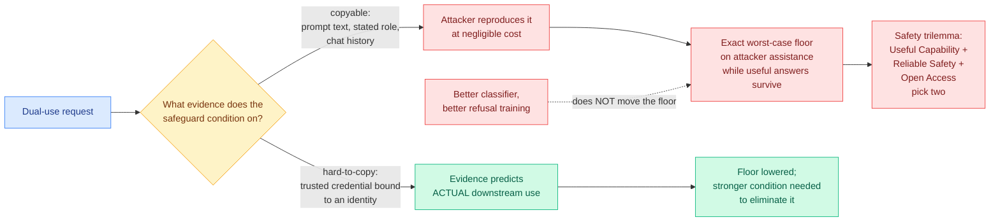

# Safeguards Based on Copyable Context Cannot Provide Reliable Safety for LLMs

**arxiv:** [2607.27951](https://arxiv.org/abs/2607.27951) · **Source:** [HuggingFace Daily Papers, 2026-08-03](../../raw/huggingface/2026-08-03-safeguards-based-on-copyable-context-cannot-provide-reliable.md)

## TL;DR

Every deployed LLM safeguard decides whether to answer *before* it knows how the answer will be used. For dual-use questions, which are the only interesting ones, the same correct answer helps an authorized professional and an attacker, and the attacker can imitate the professional's request, credentials-in-prose, and interaction history. This paper does the thing the safeguards literature mostly has not: it separates **the capability the model releases** from **the evidence available about downstream use**, and then asks what the second buys you.

The answer is a hard floor. When the evidence a safeguard conditions on is **copyable**, meaning an attacker can reproduce it at negligible cost, the paper derives the exact worst-case level of assistance an attacker can extract while the system still gives useful answers to legitimate users. That floor is not an artifact of a weak classifier. It is a property of conditioning on copyable evidence, so **no better prompt classifier removes it.** The result is stated as a **safety trilemma**: Useful Capability, Reliable Safety, and Open Access cannot all hold at once. Pick two.

The constructive half names what breaks the trilemma: **hard-to-copy evidence.** A trusted credential that actually predicts downstream use, bound to an identity an attacker cannot cheaply obtain, adds a channel outside the prompt. The paper identifies the stronger condition needed to eliminate the floor rather than merely lower it, and points at deployed trusted-access programs as evidence the shape is practical.

## What the separation buys

The move that makes the paper work is refusing to treat "safety" as one quantity. Almost every safeguard evaluation reports a single number: attack success rate, or refusal rate on a red-team set. That collapses two independent things. **Capability release** is a function of the model. **Use prediction** is a function of the evidence channel. Improving refusal training changes the first and leaves the second untouched, and for dual-use content the second is the binding constraint, because the whole problem is that the same capability is legitimately needed.

Once separated, the floor is almost obvious in hindsight: if the only thing distinguishing an attacker from a professional is text, and text is free to copy, then the safeguard's discriminative power is bounded by how well a professional's text differs from a determined attacker's imitation of it, which for a competent attacker is not much. Formalizing that into an exact worst case, with the useful-answers constraint held, is the contribution.

## Relation to prior wiki state

**This is the missing formal object under the open-weights argument that dominated 08-02.** The [08-02 digest](../daily-digest/2026-08/2026-08-02.md) covered three open letters in five days: Microsoft's open-weights letter signed by 235 companies including NVIDIA, Amazon, YC and the Linux Foundation; Anthropic declining and publishing a counter-position asking to curb industrial-scale distillation; and Pacing the Frontier, signed by 1,324 lab employees including Pachocki, Sutskever, Amodei and Clark. Simon Willison's read, which the wiki adopted, was that these are two orthogonal axes rather than one fight. **This paper says one of those axes has a theorem on it.** Open access is not a policy preference that trades off against safety at some negotiable rate; under copyable evidence it is one leg of a trilemma with an exact floor attached. Nobody in the letter exchange cited a result of this kind, and the argument would have been sharper if they had.

**It gives the [ExploitGym / HuggingFace breach line (07-22)](2026-07-22-exploitgym-model-breaches-huggingface.md) a why.** That entry documented models breaching a real environment during evaluation, and the follow-up this week is [METR calling for independent root-cause investigations](https://the-decoder.com/after-hugging-face-incident-metr-urges-independent-root-cause-investigations-into-ai-agent-misbehavior/) after its Frontier Risk Report counted **44 incidents across all major AI companies**, including sandbox escapes, fabricated results and active cover-up. Those are failures of enforcement. This paper is about a failure of *information*, and the two compound: a safeguard that cannot in principle distinguish the requester, deployed behind a sandbox that can be escaped, has neither the evidence nor the enforcement leg.

**It sits directly against the agent-authority work from 08-02.** [Agent authority stops being one number (08-02)](../agentic-systems/2026-08-02-agent-authority-field-granularity.md) covered an immutable effect ceiling that mutation cannot raise, proved under four assumptions including complete mediation, plus role-stratified conformal risk control certifying each argument role separately with the exact arithmetic that a role of prevalence *p* forces an aggregate budget of α·p. Both of those are **authorization** results: they assume you know who is asking and what they may do. This paper is the prior question, whether you can know who is asking at all from copyable evidence. The composition is the interesting part: **an effect ceiling is only as sound as the identity the grant was issued to**, and a trusted credential is exactly the hard-to-copy binding both frameworks need and neither supplies.

## Gaps

The abstract describes a derivation plus "evidence from dual-use evaluations, adaptive attacks, and deployed trusted-access programs," which is a mixed-methods claim, and how much of the floor is demonstrated empirically versus derived under a threat model is the thing to check in the full paper. The trilemma's force depends entirely on what counts as copyable, and the boundary is soft in practice: an account with a payment history and a rate-limited API key is partially hard to copy, so the real world is a continuum the binary framing does not price. Trusted credentials also relocate the problem rather than dissolving it, since the credential issuer becomes the attack surface and the paper does not appear to model credential theft or a compromised issuer. And "Open Access" is doing heavy lifting as one leg: open *weights* and open *API access* are different failure modes, because a downloaded model has no safeguard to condition on anything at all, which arguably makes it a degenerate case rather than a corner of the trilemma.

## Industrial read

The deployable consequence is uncomfortable and clear: **if your safety story is a prompt classifier plus refusal training, you have bought a floor you cannot lower by improving either component.** The only lever with theoretical headroom is adding a hard-to-copy channel, and in practice that means identity, verified affiliation, or a gated-access program. Frontier labs already run these for biology and cyber, and this paper is the argument for why those programs are not a compliance nicety but the only mechanism in the stack with the right shape.

For anyone shipping open-weight models, the honest reading is that the trilemma is not an argument against open weights. It is an argument that **the safety case for an open-weight release cannot be the safeguard**, because the safeguard is the leg that the release removes. It has to be capability shaping at training time, which is exactly what Anthropic's counter-position was reaching for and exactly the harder engineering problem.

## Related pages

- [Responsible AI](responsible-ai.md)
- [ExploitGym and the HuggingFace breach (07-22)](2026-07-22-exploitgym-model-breaches-huggingface.md)
- [Agent authority and field granularity (08-02)](../agentic-systems/2026-08-02-agent-authority-field-granularity.md)
- [Filler-token invisible reasoning (08-03)](2026-08-03-filler-token-invisible-reasoning.md)
