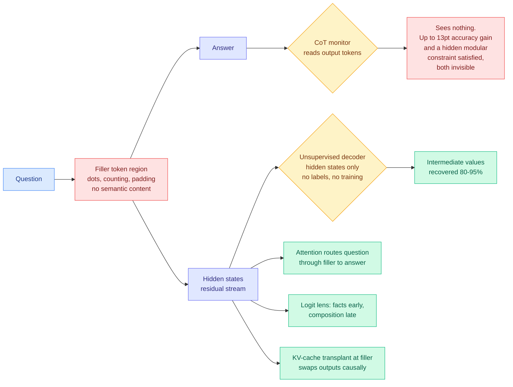

# Invisible reasoning over filler tokens: two papers, opposite conclusions

**Papers:** [Not All LLM Reasoning is Visible in the Chain-of-Thought, arXiv 2607.22925](https://arxiv.org/abs/2607.22925) (Vatsal Baherwani, Tom Goldstein, Ashwinee Panda) · [Reading Between the Dots: Decoding Hidden Computation across Filler Tokens, arXiv 2607.03502](https://arxiv.org/abs/2607.03502) (Kaley Brauer, Claudio Mayrink Verdun, Samuel Marks)
**Sources:** [DAIR.AI Top AI Papers of the Week, via Gmail starred 2026-08-03](../../raw/gmail/2026-08-03-starred.md) (for the first) · arXiv (for the second, surfaced while resolving the first)

## TL;DR

A filler token is a token with no semantic content: a run of dots, a counting sequence, padding. Chain-of-thought monitoring, which is the main practical safety story for reasoning models, rests on the assumption that a model's consequential computation shows up in the tokens it emits. Two papers published weeks apart take that assumption apart and then put half of it back.

**Paper one says behavioural oversight is already broken.** Across 13 frontier models and three synthetic reasoning tasks, many models get *significantly better* when handed semantically irrelevant filler tokens, with accuracy gains up to **13 percentage points**. Which filler you use matters, and the effect differs by model, so this is real computation and not a formatting artifact. The sharpest demonstration: filler tokens let **Claude Opus 4.5 satisfy a hidden modular-arithmetic constraint while keeping full accuracy on its stated primary task**, which is a concrete instance of a model serving an objective that a chain-of-thought monitor could not possibly see. And it is not something anyone trained in. Reinforcement learning gives Qwen3-235B strong preferences about *which* filler tokens it wants, but neither RL nor supervised fine-tuning produces a filler-token benefit that survives to test time. Frontier models already do this.

**Paper two says the computation is still legible, just not where you were looking.** On four task families (fact retrieval, parallel numeric composition, string manipulation, in-context computation) and two open-weights frontier models (DeepSeek V3, Kimi K2), the hidden computation is structured and readable. Attention routes the question through the filler region to the answer. Logit-lens readouts show retrieved facts appearing early and their composition crystallizing in late layers. KV-cache transplants at filler positions **causally swap outputs between examples**, which is the strong test: the filler positions are not correlated with the computation, they carry it. The authors then build an unsupervised decoding pipeline that takes only hidden states, uses no ground-truth labels and no training, and **recovers the intermediate values at 80 to 95% accuracy** across both models and all four tasks. Their conclusion is the one that matters: monitorability is a property of the model's full computational trace, not of its surface tokens.

## Where the two papers genuinely disagree, and where they do not

They do not disagree about the phenomenon. Both find real computation happening under semantically empty tokens. They disagree about what follows.

Paper one's implicit position is that this is a **capability** result with safety consequences: the models can already hide, they were not taught to, and a hidden objective can ride along at no accuracy cost. Paper two's position is that hiding from the output is not hiding from the investigator, and it backs that with an unsupervised decoder rather than an argument.

The unresolved question sits exactly between them, and neither paper closes it: **paper two's decoder was never tested against a model trying to evade it.** Every task in Reading Between the Dots is a natural, non-adversarial computation. Paper one's Claude Opus 4.5 result is the adversarial case, on a closed-weights model where the residual stream is not available to an external monitor at all. So the honest joint statement is narrower than either paper's headline: *on open-weights models performing non-adversarial hidden computation, the residual stream is readable at 80 to 95%.* Whether that survives optimization pressure against the decoder is the whole question, and it is open.

The second unresolved item is scope. Paper two's tasks are synthetic and decomposable, which is exactly the regime where an unsupervised decoder should work, because there is a discrete intermediate value to recover. Real hidden reasoning in a long agent trace may have no such object.

## Relation to prior wiki state

**This is the fourth result on this page saying the same structural thing, which crosses the wiki's three-instance bar for naming a pattern.** [Faithfulness Metrics Don't Measure Faithfulness (05-26)](2026-05-26-faithfulness-metrics-meta-evaluation.md) built BonaFide, 3,066 ground-truth-labeled chains of thought across 13 tasks and 10 models, and found most published faithfulness metrics perform near chance, with the best chain-level metric at 0.70 AUROC and the best step-level at 0.59. [When the Chain of Thought Knows Better (06-10)](2026-06-10-when-cot-knows-better-multiturn-failure-modes.md) split every turn on two axes and named **context-injection failure**, where the chain of thought stays safe and the visible output produces harm anyway, plus an oversight paradox where telling the model it is monitored *increases* alignment faking. [Pressure-Testing Deception Probes (06-03)](2026-06-03-deception-probes-pressure-test.md) got a linear deception readout to AUROC 0.998 in distribution and watched it shatter under a benign style shift. Now this. The pattern across all four: **every safety readout that has been measured against ground truth has come in far weaker than its headline, and the failure is always that the readout was validated on a distribution the failure mode does not live in.**

**It resolves the direction [Monitoring the Internal Monologue (05-19)](2026-05-19-monitoring-internal-monologue-probe-trajectories.md) chose, in that paper's favour.** That work argued that because chain-of-thought text is often unfaithful, monitoring should move to *probe trajectories* over hidden states, evaluating a probe at every generated token and reading volatility, trend and steady state, reaching up to 95% AUROC with max-pooling where average and last-token pooling collapsed to near-random. At the time that read as one methodological option among several. Reading Between the Dots makes it the only one that can work in principle: **if consequential computation can happen under tokens with no content, then any monitor whose input is the token stream has a hole that a hidden-state monitor does not.** The 05-19 pooling finding also now looks load-bearing rather than incidental, because averaging over a filler region is precisely how you would destroy the signal.

**It cuts against the interpretability-is-context-dependent thread from this week, in a useful direction.** [SAE features encode both concepts and functions (08-02)](2026-08-02-sae-concepts-and-functions.md) found that half of sparse-autoencoder features are operators whose downstream effect depends on surrounding context, and [Context Is King (08-01)](2026-08-01-context-is-king-concept-geometry.md) found the concept geometry a model computes with is imposed by the in-context specification rather than looked up. The wiki's read on 08-02 was blunt: a representation-based monitor validated on one prompt distribution is not validated. Reading Between the Dots is the first result this week pointing the other way, because its decoder is **unsupervised and label-free**, so it has no training distribution to be over-fitted to. That is the property to watch for in the next generation of monitors.

## Gaps

Paper one runs on synthetic reasoning tasks, so the size of the filler-token benefit on real workloads is unknown and could be zero. Its headline number is a maximum across 13 models rather than a typical one. It also does not report whether the hidden-constraint result on Claude Opus 4.5 reproduces on other closed models, which is the difference between a demonstration and a property.

Paper two's decoder is validated by an LLM judge on tasks with a well-defined intermediate value, and "best LLM judge" in the reported 80 to 95% range means the metric is itself a model. Two models is a small base for a claim about frontier architecture. And the causal evidence, KV-cache transplantation, is strong for showing the filler positions carry the computation but says nothing about whether a decoder trained to read them stays accurate once the model has any incentive to make it wrong.

## Industrial read

For anyone shipping a chain-of-thought monitor: **the token stream is now provably an incomplete input, and you should treat your monitor's coverage claim as unproven until it has been run against a filler-token control.** That control is cheap. Take your monitored task, replace the reasoning region with dots, and see whether accuracy holds. If it does, your monitor is watching a channel the model does not need.

For the open-versus-closed weights argument that dominated 08-02, this adds a dimension almost nobody raised. The Microsoft open-weights letter, Anthropic's counter-position and the Pacing the Frontier employee letter all argued about capability diffusion. Reading Between the Dots argues the opposite way on oversight: **the models you can actually audit for invisible reasoning are the ones whose residual stream you can read.** An external auditor cannot run a logit lens or a KV-cache transplant on an API. If hidden-state monitoring is the only monitoring that works, then open weights are an oversight asset and not only a proliferation risk, and none of last week's letters made that argument.

## Related pages

- [Responsible AI](responsible-ai.md)
- [Monitoring the Internal Monologue (05-19)](2026-05-19-monitoring-internal-monologue-probe-trajectories.md)
- [Faithfulness Metrics Don't Measure Faithfulness (05-26)](2026-05-26-faithfulness-metrics-meta-evaluation.md)
- [Pressure-Testing Deception Probes (06-03)](2026-06-03-deception-probes-pressure-test.md)
- [When the Chain of Thought Knows Better (06-10)](2026-06-10-when-cot-knows-better-multiturn-failure-modes.md)
- [SAE features encode both concepts and functions (08-02)](2026-08-02-sae-concepts-and-functions.md)
