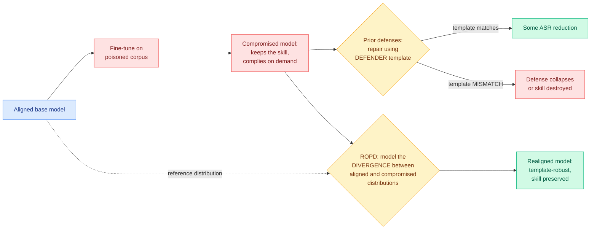

# ROPD: On-Policy Distillation for LLM Safety, a Routing Approach to Template-Robust Realignment

**Source:** Kurate weekly cs.AI leaderboard #18, ai_rating 6.0/10 · [arXiv 2607.27081](https://arxiv.org/abs/2607.27081) · published 2026-07-29 · raw: [`raw/kurate/2026-08-04-cs-ai.md`](../../raw/kurate/2026-08-04-cs-ai.md)

**Authors:** Yongjian Guo (Tsinghua), Wanlun Ma (Swinburne), Lingyu Shen (EPFL), Xi Xiao (Tsinghua), Sheng Wen (Swinburne)

**Not on HuggingFace Daily Papers.**

## TL;DR

Fine-tuning an aligned model on someone else's data is a supply-chain attack surface: a malicious data provider can embed harmful behaviour into a downstream corpus, producing a model that still does the specialized job it was fine-tuned for while complying with dangerous requests on demand. The competence masks the compromise. Existing safety-realignment defenses (selectively restoring fine-tuned weights, adding safety vectors, token-weighted fine-tuning, representation-space corrections) fail in three concrete ways this paper isolates. They cause catastrophic forgetting of the specialized skill the user paid for. Their effectiveness **collapses when the defender does not know the attacker's prompt template**, which is the realistic case, since the defender repairs the model using a template of their own choosing. And realigned models are still re-jailbreakable by a simple system-prompt switch. ROPD's answer is to stop fitting templates: it models the **divergence between the aligned and the compromised output probability distributions** and distills against that, on-policy. Tested against four state-of-the-art baselines across three datasets and three base models at varying alignment strengths, ROPD substantially reduces template-mismatch risk while preserving downstream capability. The paper is honest that ROPD is not fully immune to template shift, only that its degradation is negligible next to the alternatives.

---

---

## Key claims

- **Template dependence is the real weakness of the safety-realignment literature, and it is a threat-model error rather than a method error.** Every prior defense implicitly assumes the defender can observe or guess the template the attacker used to embed the behaviour. Drop that assumption and the reported numbers do not transfer.
- **The three failure modes are separable and all three matter.** Skill loss makes a defense commercially unusable. Template mismatch makes it ineffective. System-prompt re-jailbreaking makes it temporary. A defense has to survive all three, and the paper's contribution is partly just insisting on that.
- **Distribution divergence is the template-invariant object.** Whatever template the attacker used, the compromised model's output distribution differs from the aligned model's in a way that does not depend on the surface form of the prompt. Fitting that divergence rather than the prompt is what buys robustness.
- **It is on-policy.** Supervision comes on the compromised model's own generations, which is why the method is a distillation method rather than a weight-editing method, and it is why capability is preserved: nothing is being surgically reverted.
- **Honest negative:** ROPD still degrades under template shift, just far less. The paper says so.

## Gaps

"Substantially mitigates" and "negligible compared to existing methods" are the abstract's operative phrases and no absolute attack-success-rate numbers appear there, so the residual risk is unquantified in the material available. Three base models and three datasets is a reasonable spread but says nothing about frontier scale. The threat model is a *known-compromised* model, which presumes the defender already detected the compromise; nothing here helps with detection, and undetected compromise is the harder half of the supply-chain problem. And the system-prompt re-jailbreak failure mode is named as a limitation of prior work without a stated claim that ROPD fixes it.

## How this relates to prior wiki pages

**It is the fifth instance this week of a defect being traced to how a method was *evaluated* rather than to the method itself, and that is now the dominant methodological thread across the whole wiki.** The pattern: [Coherent Overlap (07-31)](../ai-routing/2026-07-31-coherent-overlap-moe-routing.md) found that expert-subspace similarity, the standard instrument for deciding which MoE experts to prune, cannot determine redundancy, so any compression ratio derived from it should be re-derived. [Eviction as Estimation (08-03)](../inference-efficiency/2026-08-03-eviction-as-estimation-rmm.md) found that on natural text the model is correct about almost every token, so the whole KV-eviction benchmark suite cannot separate policies. [Sparse Event-KV (07-29)](../inference-efficiency/2026-07-29-sparse-event-kv-memory-contract.md) found that observing no accuracy loss after dropping a cache entry does not show the entry was unnecessary. [Filler tokens (08-03)](2026-08-03-filler-token-invisible-reasoning.md) found chain-of-thought monitoring has a hole because models reason over semantically empty tokens. ROPD adds: **safety-realignment numbers are measured under a template-matching assumption the real threat model does not grant.** In every case the mechanism is fine and the published justification does not survive controlled measurement.

**It also puts on-policy distillation in an unfamiliar role: a defense.** [knowledge-distillation](../inference-efficiency/knowledge-distillation.md) has tracked OPD entirely as a capability-transfer and efficiency technique, and this week added the privileged-branch pattern ([MAPD 08-02](../inference-efficiency/2026-08-02-mapd-multi-agent-protocol-distillation.md), [CriPO 08-03](../llms-foundation-models/2026-08-03-cripo-rubric-rl-self-distillation.md), [CRPO 08-04](../inference-efficiency/2026-08-04-crpo-contrastive-privileged-self-distillation.md), [VAD 08-04](../inference-efficiency/2026-08-04-vad-visual-attribution-distillation.md)). ROPD is the same machinery pointed at behaviour removal instead of behaviour transfer, with the aligned model's distribution as the reference. **The teacher is the model's own past self.** That is a genuinely different use of the primitive and the page should record it.

**The routing framing is thinner than the title suggests.** "A routing approach" here means the method routes between distributions rather than fitting a template, not that it dispatches queries between models. It belongs on [llm-routing](../ai-routing/llm-routing.md) as a distribution-space routing instance, adjacent to [multi-head latent control (07-27)](../ai-routing/2026-07-27-multi-head-latent-control.md), rather than in the model-selection family the page mostly tracks.

**Industry context that makes this concrete today.** [IBM reported](https://the-decoder.com/ibm-finds-92-of-companies-hit-by-ai-security-breaches-lacked-basic-access-controls/) that 92% of companies suffering an AI security incident had inadequate access controls for their AI systems, and explicitly that the model itself was rarely the problem. ROPD is a model-layer defense against a supply-chain attack, and the industry data says the breaches that actually happened were access-control failures upstream of the model. Both can be true; the ordering matters for anyone deciding where to spend.

## Related pages

- [Responsible AI](responsible-ai.md)
- [Knowledge Distillation](../inference-efficiency/knowledge-distillation.md)
- [LLM Routing](../ai-routing/llm-routing.md)
