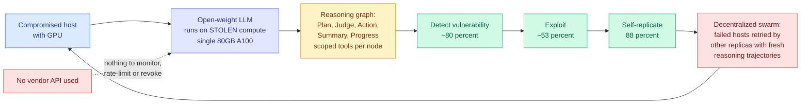

# AI Agents Enable Adaptive Computer Worms

**Source:** [Import AI 467](https://importai.substack.com/p/import-ai-467-self-sustaining-ai) (Jack Clark, 2026-08-03) · [arXiv 2606.03811](https://arxiv.org/abs/2606.03811) · raw: [`raw/rss/2026-08-03-import-ai-import-ai-467-self-sustaining-ai-viruses-pacing-ai-prog.md`](../../raw/rss/2026-08-03-import-ai-import-ai-467-self-sustaining-ai-viruses-pacing-ai-prog.md)

**Authors' institutions:** University of Toronto, Vector Institute, University of Cambridge, ServiceNow

## TL;DR

Researchers built a working prototype of a computer worm that uses a language model to reason about how to compromise machines, then **runs that model on the GPUs of the machines it has already compromised**. That parasitic loop is the point: the worm needs no vendor API, so there is nothing to monitor, rate-limit, or revoke. The reported model requirement is deliberately modest, an open-weight LLM published in 2025 that fits on a single 80GB A100. The reasoning is not a single prompt but a **reasoning graph**, a directed graph of specialized nodes each seeing only the tools and prompts relevant to its role (Plan formulates strategy, Judge reviews the plan against command history, Action picks a tool from the phase-appropriate set, Summary compiles observations, Progress evaluates whether the agent is getting anywhere), which the authors say controls what the model attends to at each decision point and bounds context growth to the current sub-goal. The public manuscript redacts most of the nodes. Measured success rates: **~80% vulnerability detection, ~53% exploitation, 88% self-replication**, for roughly **37% end-to-end**. Resilience comes from swarming rather than from any single attempt succeeding: hosts that resist get retried by different replicas, each sampling a fresh reasoning trajectory, and because replication is decentralized there is no single point of control to take offline.

---

---

## Key claims

- **Stolen inference is the architectural novelty, not the exploitation.** Every prior AI-assisted attack story routes reasoning through a hosted API, which is a control point. Running inference on compromised GPUs removes it, and the paper says so explicitly: no reliance on vendor APIs that could be monitored or revoked.
- **The scoped reasoning graph is doing the work that a bigger model would otherwise do.** Each node sees only its own tools and prompts, which limits context growth to the current sub-goal. This is the same context-discipline argument production agent frameworks make, applied adversarially, and it is why an A100-class open-weight model suffices.
- **37% end-to-end is the load-bearing number and it cuts both ways.** High enough to be a real threat when compounded by swarming and retries. Low enough that the authors note it doubles as a **useful evaluation for open-weight models**: a standing benchmark for autonomous offensive capability.
- **Swarm resilience substitutes for per-attempt reliability.** Individual exploitation attempts are fragile; the collective is not, because a hard host gets retried by replicas sampling different trajectories until one lands.
- **Clark's framing:** the future internet looks like an ecology of attacker and defender agents, and humans may need to release their own agents as white blood cells.

## Gaps

The underlying model is not named beyond "published in 2025, fits on one A100," so the capability-versus-model-generation relationship is untestable from outside, and it is the single most decision-relevant variable for anyone forecasting how this scales. Most reasoning-graph nodes are redacted, which is defensible but means the mechanism claim cannot be independently reproduced. The environment is a research testbed and the paper does not characterize how its vulnerability distribution compares to a real network, so 80% detection and 53% exploitation are numbers about the testbed. Nothing is reported about detectability: a worm running LLM inference on a compromised host produces an extremely distinctive GPU-utilization and memory signature, and whether that is a practical defensive tell goes unmeasured.

## How this relates to prior wiki pages

**It supplies the concrete capability demonstration behind two industry data points that arrived the same week and were previously just statistics.** [Interpol reported](https://the-decoder.com/interpol-says-ai-has-become-the-core-operational-driver-of-cybercrime-across-africa/) that AI is involved in 55% of reported cybercrimes across Africa, with financial losses more than doubling from $192M to $484M and about 600,000 deepfake-based digital-extortion cases. [IBM found](https://the-decoder.com/ibm-finds-92-of-companies-hit-by-ai-security-breaches-lacked-basic-access-controls/) that 92% of companies suffering an AI security incident had inadequate access controls for their AI systems and that the model itself was rarely the problem. Read together with this paper the picture is coherent and uncomfortable: **today's AI-enabled attacks are still exploiting ordinary access-control failures, and the research frontier is a class of attack that does not need them.**

**And it is the fourth item in a month showing that the open-weight ecosystem's threat surface is compute rather than weights.** The wiki's [Thinking Machines safe-path-to-open-weights piece (08-01)](2026-08-01-thinking-machines-safe-path-open-weights.md) argued the release-safety question for open weights. This paper's answer is oblique but sharp: the weights were already public and unremarkable, and what made the system dangerous was the harness plus access to *someone else's* GPUs. That reframes open-weight risk away from capability thresholds and toward **whether an attacker can obtain inference cheaply**, which is a hardware and access question rather than a licensing one.

**Which connects it directly to the Dwarkesh compute-pricing argument in the same Import AI issue, and the connection is not incidental.** [Dwarkesh Patel argues](https://www.dwarkesh.com/p/why-compute-might-get-10x-more-expensive) compute gets *more* expensive as models improve, because a genuinely human-level software engineer running on an H100 would justify renting that H100 for over $250k a year, roughly 15x today's spot price, and cheap GPU time today reflects only what models still cannot do. If compute price rises the way he expects, **stolen compute becomes proportionally more valuable, and cryptojacking-style GPU theft moves from a nuisance to a primary economic attack.** The worm paper is the first concrete instance of that incentive. Neither source connects them.

**Governance context from the same issue.** A statement signed by roughly 1,337 employees with senior representation from OpenAI, Anthropic, Google DeepMind, Thinking Machines, Meta and Safe Superintelligence asks the US government to support an international effort to develop the technical and governance tools needed to deliberately **pace the frontier of automated AI development**. Signatories include chief scientists and cofounders at Anthropic, Google and OpenAI, plus the CEOs of SSI and Anthropic. That is a labour-side pacing request arriving in the same week as a demonstration that autonomous offensive agents work at 37% end-to-end on stolen compute.

## Related pages

- [Responsible AI](responsible-ai.md)
- [Thinking Machines: a safe path to open weights](2026-08-01-thinking-machines-safe-path-open-weights.md)
- [Memory Hierarchy for AI](../hardware/memory-hierarchy.md)
