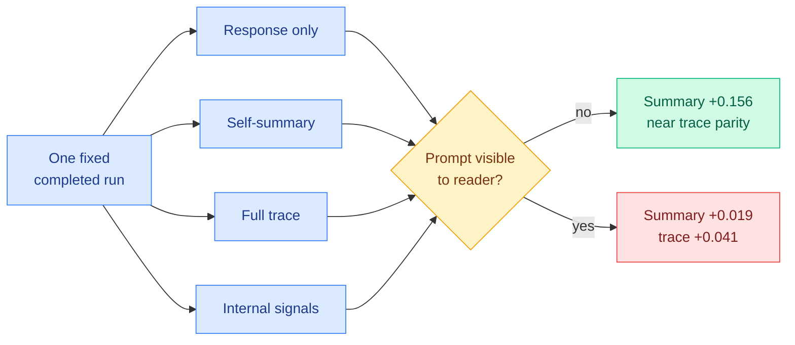

# How Much Does a Reasoning Summary Reveal? An Observability Ladder

**Source:** [arxiv 2608.02089](https://arxiv.org/abs/2608.02089)
**Kurate cs.LG #20** (ai_rating 6.5/10, published 2026-08-03). Absent from HuggingFace.

## TL;DR

Frontier products show users a final answer and a short reasoning summary while the full trace stays hidden, and both labs and users treat the summary as a monitoring surface. This paper holds each completed run fixed and varies only **what the reader is allowed to inspect**: the response, a self-summary the model writes from its own trace, the trace itself, and internal signals, each with and without the prompt visible. Matched linear correctness predictors are trained at each access level, across three benchmarks and five open-weight Qwen3 and gpt-oss models. The headline is a conditional: **without the prompt, summaries carry most of the trace's ranking signal** (mean AUROC 0.774 versus 0.813, and +0.156 over the response alone). **With the prompt visible, the summary's gain collapses to +0.019 while the trace still adds +0.041.** Since the common case is a user who already holds the prompt, the summary is close to worthless for monitoring correctness in exactly the situation it is shipped for.

## Key findings

- **The summary's value is almost entirely a substitute for the prompt.** Its large apparent gain without the prompt and its collapse to +0.019 with the prompt says the summary is mostly restating the question, not reporting the reasoning.
- **At equal length, the trace's last words predict correctness as well as summaries or slightly better**, and carry denser uncertainty and self-correction cues. Length-matching is the control that kills the "summaries are efficient" defence.
- **On the hard subset both readers nearly vanish.** On MMLU-Pro questions that have both correct and incorrect runs, linear summary readers are near chance and trace readers retain only modest signal (prompt-withheld AUROC 0.503 to 0.545 versus 0.544 to 0.590).
- **A stronger reader recovers more, and the ordering survives.** A GPT-5-mini reader pulls substantially more signal from both summaries and traces on gpt-oss-20b, and even then the trace keeps a +0.034 edge.
- **Much of the linear readers' trace signal is associated with length**, which is a confound the field should be embarrassed about, since it means part of what looks like reasoning legibility is just "long answers are wrong more often."
- **Stated conclusion:** monitorability is a joint property of the **display and the reader**, so any monitorability or faithfulness claim must specify both.

## How this relates to prior wiki pages

**Same-week companion to the influence-regime result, and together they say the reported number has three unstated arguments.** [CoT Monitoring Can Be Unreliable in Implicit-Influence Settings (2608.04735, cs.AI #7)](2026-08-06-cot-monitoring-implicit-influence.md) shows detection falls 41 to 46 points when a nudge arrives as a casual aside rather than as an instruction to conceal, and drops to 5% under a well-meant anti-bias system prompt. This paper shows the number also depends on what the reader sees and how capable the reader is. **Two papers on the same Kurate board, one at the top of cs.AI and one at the bottom of cs.LG, independently arguing that monitorability is not a scalar property of a model.**

**It is the sixth entry in the [responsible-ai page's](responsible-ai.md) established pattern that a safety readout is weaker than its headline.** After [faithfulness metrics near chance (05-26)](2026-05-26-faithfulness-metrics-meta-evaluation.md), [a deception probe shattering under style shift (06-03)](2026-06-03-deception-probes-pressure-test.md), [safe reasoning yielding harmful output (06-10)](2026-06-10-when-cot-knows-better-multiturn-failure-modes.md), [filler tokens hiding a satisfied constraint (08-03)](2026-08-03-filler-token-invisible-reasoning.md), and today's implicit-influence gap, this adds the display layer. The page's stated common cause holds: the readout was validated on a distribution the failure mode does not live in, and here the distribution is a reader who does not have the prompt.

**It also retroactively strengthens the page's hidden-state argument.** The page concluded after the filler-token work that [Monitoring the Internal Monologue (05-19)](2026-05-19-monitoring-internal-monologue-probe-trajectories.md) is the only structurally sound direction, since averaging over a filler region destroys the signal. This paper's ladder puts internal signals at the top rung, and its finding that traces beat summaries even length-matched is the same argument one rung down: **the more processed the artifact, the less it reports about the computation.** A summary is a trace processed by the model; a trace is hidden state processed by the model.

**The length confound is a measurement-validity result and belongs with this week's cluster of them.** [Eviction as Estimation (08-03)](../inference-efficiency/2026-08-03-eviction-as-estimation-rmm.md) found KV benchmarks cannot tell eviction policies apart. [Beyond Geometric Complementarity (07-31)](../ai-routing/2026-07-31-coherent-overlap-moe-routing.md) found expert-subspace similarity cannot determine redundancy. [The Personalization Mirage (08-06)](2026-08-06-personalization-mirage-over-inference.md) finds model self-report is anti-correlated with measured fabrication. Now a chunk of trace-monitoring signal turns out to be length. **Four instruments, four cases of the instrument not measuring the quantity it is trusted for.**

## Gaps

Five open-weight Qwen3 and gpt-oss models is a narrow slice, and the summaries are model-generated from the trace rather than the product-grade summaries frontier labs actually ship, which are separately trained and may be better or worse. Linear probes are a deliberately weak reader and the GPT-5-mini result shows how much that choice costs; the strong-reader experiment is run on one model only. And correctness is the only monitored property, which is the easy one: nobody would deploy CoT monitoring to catch wrong answers, they deploy it to catch concealed intent, and this ladder says nothing about that.

## Links

- Concept page: [Responsible AI](responsible-ai.md)
- Companion: [CoT Monitoring in Implicit-Influence Settings](2026-08-06-cot-monitoring-implicit-influence.md)
- Digest: [2026-08-06](../daily-digest/2026-08/2026-08-06.md)
