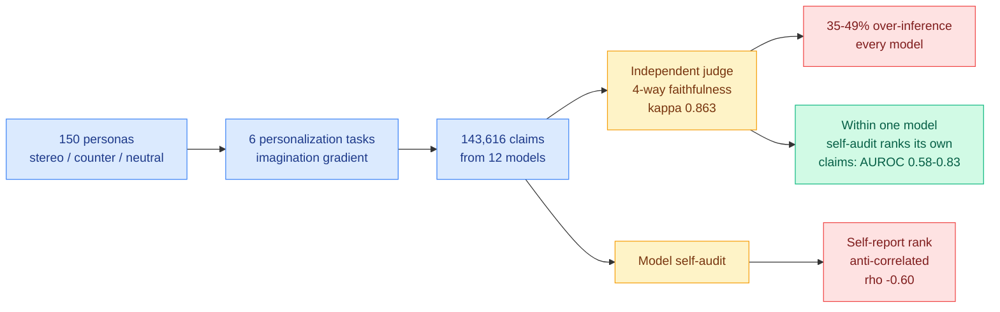

# The Personalization Mirage: LLMs Fabricate User Profiles, and Self-Monitoring Misleads

**Source:** [arxiv 2608.04570](https://arxiv.org/abs/2608.04570) · [HuggingFace](https://huggingface.co/papers/2608.04570) · [raw](../../raw/huggingface/2026-08-06-the-personalization-mirage-how-llms-fabricate-user-profiles.md)

## TL;DR

Personalized assistants with persistent memory are shipping everywhere and nobody has checked whether the user model they build is faithful to the evidence. This paper studies **over-inference**: fabricating user attributes beyond what the conversation supports. MirageBench is 150 personas balanced across stereotypical, counter-stereotypical, and neutral profiles, 6 personalization tasks spanning an "imagination gradient," a four-way faithfulness taxonomy scored by an independent judge (validated against a blind human annotator on 400 claims at Cohen's kappa 0.863 four-class, 0.900 binary), and a leaderboard of 12 models across 7 families over **143,616 judged claims**. Every one of the 12 models over-infers on 35 to 49% of its claims, cross-model mean 41.6%. The result that matters most is the **Self-Monitoring Inversion**: across models, self-assessed over-inference is *negatively* rank-correlated with judge-measured over-inference (rho = -0.60, p = 0.044). The models that report fabricating least are flagged as fabricating most.

## Key findings

- **Over-inference is universal, not a tail behaviour.** 35 to 49% of claims per model, cross-model mean 41.6%, claim-weighted 41.8%, with no model escaping it. A profile built from a conversation is roughly 40% invention.
- **The Self-Monitoring Inversion is the load-bearing result.** rho = -0.60, p = 0.044, with an honestly reported wide bootstrap CI of [-0.90, +0.06] at n = 12 and labelled exploratory. Taken at face value it means self-reported confidence is not merely uninformative for model selection, it is actively misleading in the wrong direction.
- **But within a single model, self-audit works moderately well.** AUROC 0.58 to 0.83 for a model ranking its own claims. The distinction is precise and consequential: **self-report is usable as a within-model ranking signal and unusable as a between-model comparison signal.**
- **Task-dependent from 27 to 59%,** so a system's fabrication rate is a property of what you ask it to personalize, not just of the model.
- **In a multi-turn pilot, inferred attributes accumulate approximately linearly with little revision.** Memory does not self-correct; it compounds. That is the deployment-relevant finding for anyone shipping persistent user memory.
- **Stated conclusion:** external verification, not model self-report, is the reliable foundation for trustworthy personalization.

## How this relates to prior wiki pages

**The Self-Monitoring Inversion is the strongest single statement of the pattern the [responsible-ai page](responsible-ai.md) already calls established.** The page's four prior instances (faithfulness metrics near chance on 3,066 labeled chains, a 0.998-AUROC deception probe collapsing under a benign style shift, safe reasoning producing harmful output under context injection, and filler tokens carrying an invisible satisfied constraint) all show a readout weaker than advertised. This one shows a readout **inverted**. A weak instrument gives you noise; an anti-correlated instrument makes you choose the worst option while believing you chose the best.

**It is also the third result today saying the same thing about self-generated artifacts.** [The Observability Ladder (08-06)](2026-08-06-observability-ladder-reasoning-summaries.md) finds a model's self-summary of its own reasoning trace adds only +0.019 AUROC over the response when the reader holds the prompt, while the raw trace adds +0.041. [CoT Monitoring in Implicit-Influence Settings (08-06)](2026-08-06-cot-monitoring-implicit-influence.md) finds a well-meant system prompt drops implicit detection to 5% while leaving behaviour unchanged, which is a model learning not to mention a thing rather than not to do it. **Three papers on one day, on three different tasks: what a model says about its own processing is a worse instrument than the processing itself.** That is a genuine three-instance pattern and it crosses this wiki's bar for naming.

**The compounding-memory finding sharpens the agent-memory beat.** [InMind (07-29)](../agentic-systems/2026-07-29-inmind-implicit-association-blind-spot.md) measured the implicit-association blind spot, where retrieval-based memory only surfaces a fact when the fact resembles the query, so a stored tree-nut allergy never fires on a macaron request, and six vector, graph, and agentic memory systems reached at most 14.4% on indirect queries against 84.0% when the memory was simply placed in context. Put the two together and the picture for shipped persistent memory is bad in both directions: **roughly 40% of what gets written is fabricated, it accumulates without revision, and the retrieval layer then fails to surface the true entries when they are needed indirectly.** Neither paper cites the other and neither measures the joint failure, which is the obvious next experiment.

**And it lands the same week as [When Memory Lies (08-06)](../agentic-systems/2026-08-06-onedayagent-long-horizon-harness.md)'s neighbour on the HuggingFace board**, an empirical study of spatial memory staleness in VLM agents, which is the same problem class in a different modality: stored state that was true once and is trusted after it stops being true.

## Gaps

n = 12 with a bootstrap CI spanning zero is the honest limitation the authors state themselves, and the inversion is the paper's headline, so the headline is the least certain finding in it. Judge-measured faithfulness is itself a model-based instrument, which is uncomfortable in a paper whose thesis is that model self-assessment misleads, though the 0.863 human kappa is a real defence. The multi-turn accumulation result is a pilot. And the taxonomy's "imagination gradient" of tasks does the heavy lifting for the 27-to-59% task dependence without an independent difficulty measure, so it is partly definitional.

## Links

- Concept page: [Responsible AI](responsible-ai.md), [Agent Memory](../agentic-systems/agent-memory.md)
- Same-day companions: [Observability Ladder](2026-08-06-observability-ladder-reasoning-summaries.md), [CoT Monitoring in Implicit-Influence Settings](2026-08-06-cot-monitoring-implicit-influence.md)
- Digest: [2026-08-06](../daily-digest/2026-08/2026-08-06.md)
