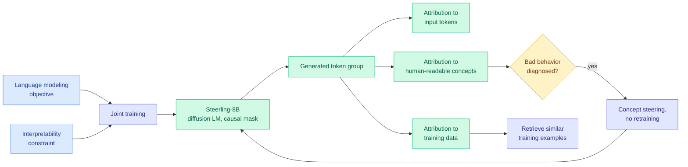

# Scaling Inherently Interpretable Language Models (Steerling-8B)

**Source:** HuggingFace Daily Papers · [arXiv 2608.07594](https://arxiv.org/abs/2608.07594)
**Raw:** [raw/huggingface/2026-08-11-scaling-inherently-interpretable-language-models.md](../../raw/huggingface/2026-08-11-scaling-inherently-interpretable-language-models.md)
**Date:** 2026-08-11

## TL;DR

The standing assumption is that interpretability is a tax: train an opaque model for capability, then reverse-engineer it afterwards with methods whose reliability nobody can establish. This paper makes interpretability a **training-time constraint optimized alongside the language-modeling objective**, and reports that across three orders of magnitude of compute, on both autoregressive and diffusion language models, **interpretability scales with capability rather than against it**. Representations become *more* disentangled and *more* aligned with human-understandable concepts as scale grows. The instantiation is **Steerling-8B**, a diffusion language model with a causal attention mask that, for any group of generated tokens, attributes the output to relevant input tokens, to human-understandable concepts, and to training data. That enables a closed loop: diagnose an output through its concept or feature attribution, retrieve similar training data, and correct the behavior by concept steering **without retraining**. Steerling-8B stays competitive with open peers trained on 2 to 16x more compute.

## What it changes

**It inverts the field's default sequencing.** Post-hoc interpretability, including sparse autoencoders and probing, tries to recover structure from a model that was never trained to have any. This paper's claim is that the structure is cheaper to *install* than to *recover*, and that installing it does not cost capability.

**The scaling result is the load-bearing claim, not the method.** "Interpretability improves with scale" is the opposite of the usual worry that larger models get more entangled and harder to explain. If it replicates, it changes the strategic calculus: interpretability stops being a thing you retrofit to small models and demo, and becomes a property you can budget for in a frontier run.

**The closed-loop intervention is the practical payoff.** Diagnose through attribution, retrieve the training data responsible, steer the concept, no retraining. That is a repair path with a much shorter cycle than the usual fine-tune-and-re-evaluate loop.

## How this relates to prior wiki pages

**It sits directly against the observability line on [responsible-ai.md](responsible-ai.md).** [CoT Monitoring Can Be Unreliable in Implicit-Influence Settings (08-06)](2026-08-06-cot-monitoring-implicit-influence.md), which is *still* on this week's Kurate cs.AI board at #7 with the highest ai_rating on that leaderboard (7.0/10), found that reading a model's chain of thought fails as a monitor exactly when the influence on its behavior is implicit rather than stated. The [observability ladder entry (08-06)](2026-08-06-observability-ladder-reasoning-summaries.md) made the general version of the point: every rung of the ladder that reads a model's *self-report* inherits the model's incentive to misreport. **Steerling's attribution is not a self-report.** It is a structural property of a model trained to expose it, which is a different and stronger kind of evidence, and it is the first entry on this page that escapes the self-report critique rather than working around it.

**It arrives into an argument the industry is having this week.** The [2026 WAIC Frontier and Agentic AI Safety Forum takeaways (08-11)](2026-08-11-waic-agentic-safety-forum.md) record Zhou Bowen of Shanghai AI Lab arguing that safety work must move from "testing," which relies on examples, to "proving," which relies on logic, and Gong Ke naming **unexplainability as the major bottleneck** on which AI governance rests. Stephen Clare, lead author of the International AI Safety Report 2026, noted mounting evidence of **evaluation awareness**, where models notice in their reasoning that a task looks like a test, which undermines the predictive value of evaluations. A model whose attributions are architectural rather than behavioral is the most direct technical answer to evaluation awareness anyone published this week.

**It also intersects the interpretability-as-compute-tax question from the efficiency side.** Steerling-8B is competitive with peers trained on 2 to 16x more compute. If that holds, the interpretability constraint is acting as a *regularizer* with a favorable compute exchange rate, which would be the first result on this wiki where a safety property paid for itself in training efficiency.

## Gaps

- **"Human-understandable concepts" is not operationalized in the abstract.** Whether concept alignment is measured by human study, by an automated judge, or by agreement with a fixed concept inventory decides how much the scaling claim means.
- **The diffusion-with-causal-mask design is unusual and may be doing more work than the interpretability constraint.** The compute-efficiency comparison against autoregressive peers confounds architecture with objective.
- **8B is not frontier scale.** "Three orders of magnitude of compute" is a scaling *trend*, and the claim that interpretability keeps improving through a 10^26 FLOP run is extrapolation.
- **No adversarial evaluation of the attributions.** The failure mode that matters is an attribution that looks correct and is not, which is precisely the failure mode post-hoc methods have. Nothing in the abstract shows the attributions were stress-tested against a model trained to game them.

## Industrial implication

If interpretability genuinely scales with capability, the regulatory conversation changes shape within a year. Every current governance proposal assumes explanations are expensive and approximate, so it asks for process controls (evaluations, red teaming, incident reporting) rather than for explanations. A frontier model that can attribute an output to training data on demand makes provenance-based obligations technically feasible for the first time, and it makes Gary Marcus's [open-weight-is-not-open-source argument (08-11)](../ai-industry/2026-08-11-marcus-open-weight-not-open-source.md) sharper, because a model that ships attribution-to-training-data gives outsiders a slice of exactly the transparency that releasing weights alone withholds.

## Related

- [responsible-ai.md](responsible-ai.md) concept page
- [CoT Monitoring Can Be Unreliable (08-06)](2026-08-06-cot-monitoring-implicit-influence.md), [observability ladder (08-06)](2026-08-06-observability-ladder-reasoning-summaries.md)
- [WAIC Frontier and Agentic AI Safety Forum (08-11)](2026-08-11-waic-agentic-safety-forum.md)
