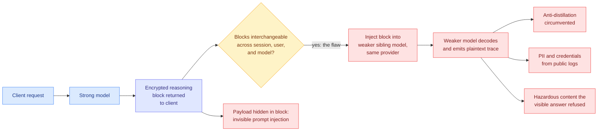

# Stealing Reasoning Traces from Proprietary LLM APIs

**TL;DR.** Frontier labs hide their models' chain-of-thought (the step-by-step reasoning a model writes before its final answer) by returning it to the client as an encrypted blob that the client hands back on every subsequent request. This paper finds that those blobs are interchangeable across sessions, users, and models inside a single provider's ecosystem. Inject a strong model's encrypted trace into a weaker, less-guarded sibling model from the same provider and it will decode and print the trace verbatim in plaintext. The strong model is never jailbroken. The authors demonstrate this against Anthropic, OpenAI, and Google, then use it four ways: circumventing anti-distillation protections, mass private-data extraction (315,320 blocks scraped from public repositories yielded 367 personally identifiable information artifacts and 182 credentials), surfacing hazardous content that the visible answer correctly refused, and invisible prompt injection carried entirely inside an encrypted block.

## What it is

Providers moved to client-side reasoning state for a practical reason: storing traces server-side across a long agentic session is expensive, so the trace is encrypted, handed to the client, and replayed on the next call. The encryption protects confidentiality against the client reading it directly. It does not bind the block to the session that produced it, to the user, or to the model.

That missing binding is the whole vulnerability. Because any model in the provider's family can consume the block, the attacker picks the weakest-aligned member of the family as a decryption oracle. The capable model's safety training is irrelevant because the capable model is never asked to do anything.

## Why it matters

The four consequences are not equally novel, and the ordering matters.

**Anti-distillation collapses.** Hiding chain-of-thought was the main technical defense against a competitor training on a frontier model's reasoning. If the trace can be recovered at scale from any sibling model, the defense is architectural theater. This is the result with the most immediate commercial weight.

**Public logs are now a breach surface.** Developers paste session logs into issues, gists, and repositories, treating the encrypted block as opaque noise. It is not opaque, it is deferred plaintext. Recovering 367 PII artifacts and 182 credentials from 315,320 scraped blocks is a low per-block yield and an alarming absolute one, and every one of those blocks was published by someone who believed they were sharing nothing.

**Refusal is not containment.** In some cases the model's visible output correctly refused a malicious request while the hidden reasoning worked through the hazardous material anyway. Safety evaluation that scores only the final response is measuring the wrong artifact.

**Injection becomes invisible.** A payload embedded inside an encrypted block survives casual inspection of a shared trace, which makes poisoning public agentic rollouts practical.

The authors disclosed responsibly and propose cryptographic and system-level mitigations. The obvious one is binding blocks to a session, user, and model identity, which costs the flexibility that made client-side state attractive in the first place.

## Relation to prior wiki pages

**It inverts the premise of the distillation-provenance fight this wiki has tracked since May.** [The Distillation Panic (05-04)](../inference-efficiency/2026-05-04-distillation-panic-lambert.md), Nathan Lambert's argument that U.S. legislative language conflates ordinary post-training distillation with API jailbreaking, framed the dispute as one about norms and law. This paper reframes it as one about architecture: the technical control that the legal argument assumed existed does not work. Note the specific mechanism, which is why the framing shifts. The attack is not a jailbreak of the protected model at all, so a policy regime that polices jailbreaking does not touch it.

**It lands the same day Anthropic shipped text watermarking, and the two are opposite bets on the same problem.** Anthropic's invisible watermarks, carried in the text rather than in metadata so they survive copy-paste, are a *detection* answer to provenance. Hugging Face's Elie Bakouch asked publicly whether watermarking is really a way to *prove* a competitor trained on Claude output, which would make it an anti-distillation instrument. This paper says the *prevention* answer, encryption, has already failed. Detection after the fact is what is left.

**It is the strongest counterweight this week to Zuckerberg's distillation defense.** Meta published a 6,500-word essay defending training on other labs' models on 08-10. The research board on 08-11 says the defense the other labs were relying on is broken, which means the argument stops being about whether distillation is legitimate and starts being about whether it is preventable.

**It extends the prompt-injection thread from a new direction.** Anthropic reported zero of 720 indirect prompt-injection attacks succeeding against Fable 5, Opus 5, and Sonnet 5 in Claude Code Auto mode, and a PDF with hidden text exfiltrated Jira and Confluence data through Atlassian's Rovo agent. Both of those concern injection through content the agent *reads*. This paper injects through the agent's own reasoning state, a channel that no content filter inspects because it is supposed to be ciphertext.

**It complicates the interpretability result published the same day.** [Scaling Inherently Interpretable Language Models (08-11)](2026-08-11-scaling-interpretable-language-models.md), which makes interpretability a training constraint and finds it improves with scale rather than costing capability, argues for attributions that are structural rather than self-reported. A reasoning trace is the self-reported kind. This paper is a second, independent reason to distrust it: not only may the trace misdescribe the computation, per [CoT Monitoring Can Be Unreliable (08-06)](2026-08-06-cot-monitoring-implicit-influence.md), which found chain-of-thought monitoring fails exactly when the influence on behavior is implicit rather than stated, but the trace is also not confidential even when the provider believes it is.

## Gaps

The paper reports which providers are affected but the abstract does not quantify per-provider decode reliability, and a defense that works 90% of the time is a different risk than one that never works. The 367 PII artifacts and 182 credentials are counts without severity grading, so whether these are live production credentials or expired test keys changes the impact by orders of magnitude. And the proposed mitigations are not evaluated for their cost, which is the number that decides whether providers adopt them: session-bound blocks break the multi-session agentic workflows that client-side reasoning state was introduced to support.

## Links

- [arXiv 2608.09867](https://arxiv.org/abs/2608.09867)
- [Raw source](../../raw/huggingface/2026-08-11-stealing-reasoning-traces-from-proprietary-llm-apis.md)
- [Daily digest 2026-08-11](../daily-digest/2026-08/2026-08-11.md)
- Related: [CoT Monitoring Can Be Unreliable (08-06)](2026-08-06-cot-monitoring-implicit-influence.md) · [Scaling Interpretable LMs (08-11)](2026-08-11-scaling-interpretable-language-models.md) · [The Distillation Panic (05-04)](../inference-efficiency/2026-05-04-distillation-panic-lambert.md) · [Knowledge distillation concept page](../inference-efficiency/knowledge-distillation.md)
