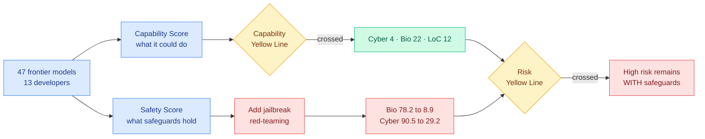

# Frontier AI Risk Monitor Q2 2026: capability is compounding, safeguards are flat, and jailbreaks erase most of the difference

**Source:** AI Safety in China (Concordia AI) · [post](https://aisafetychina.substack.com/p/frontier-ai-risk-monitor-update-risk)
**Raw:** [raw/rss/2026-08-12-ai-safety-china-frontier-ai-risk-monitor-update-risk-indices-rise-sever.md](../../raw/rss/2026-08-12-ai-safety-china-frontier-ai-risk-monitor-update-risk-indices-rise-sever.md)
**Date:** 2026-08-12

## TL;DR

Concordia AI published the 2026 Q2 findings from its Frontier AI Risk Monitoring Platform, the first report to run on the Risk Index v2.0 framework it launched at the World Artificial Intelligence Conference on July 19. The report covers 47 frontier models from 13 companies released between 2025 Q3 and 2026 Q2. The headline is that average risk indices rose by multiples in under a year: **4.4x in cyber offense, 6.6x in biological risk, and 2.4x in loss-of-control**. The framework's two thresholds separate the two questions people usually conflate. The **Capability Yellow Line** marks a model that would meaningfully raise severe-harm risk if it had no safeguards, and 4 models cross it in cyber, 22 in biological, and 12 in loss-of-control. The **Risk Yellow Line** marks a model whose residual risk stays high **even with its safeguards working**, which several models now also cross. The most quotable number is what happens under adversarial pressure: with jailbreak red-teaming added, average safety scores fall from **78.2 to 8.9 in biological risk**, 90.5 to 29.2 in cyber, 83.7 to 53.1 in chemical, and 87.8 to 36.4 in harmful manipulation.

## Key findings

1. **The two lines are the useful contribution, not the index values.** Separating "dangerous if unguarded" from "still dangerous while guarded" turns a single risk number into an actionable one, because they imply different remedies. Crossing only the Capability line is a safeguards-investment problem. Crossing the Risk line means safeguards have already been tried and were insufficient, which is where the report's recommendation to consider **reducing high-risk capabilities** rather than adding more guardrails becomes the only remaining lever.

2. **Capability and safety are moving on different clocks, and this is measured rather than asserted.** In under a year the top model score rose 68% on CyBench and 35% on CVE-Bench, both long-horizon autonomous exploitation benchmarks. Over the same period the average cyber Safety Score **fell 3%**, and prompt-injection defense performance regressed in the latest quarter. On the biological side, 22 models now exceed human-expert level on wet-lab troubleshooting (BioLP-Bench) and 11 on sequence understanding (SeqQA), while basic biological refusal showed no clear improvement.

3. **Jailbreak resistance is where models actually differ, and the spread is enormous.** Claude Opus 4.8 holds a 69.1% average refusal rate under red-team attack. Hunyuan T1 (250711) holds 5.8% under the same conditions. Base safety scores cluster in the 80s and 90s across the field, so the number that discriminates between models is not the refusal rate on ordinary requests, it is what survives an attack.

4. **Risk profiles are diverging by developer rather than converging.** Gemini 3.1 Pro Preview has the highest biological and loss-of-control indices and crosses the Risk Yellow Line on both. DeepSeek V4 Pro leads on cyber offense and is second on loss-of-control. The GPT family is climbing fastest in cyber and loss-of-control and has crossed the Risk Yellow Line in biological. This is not one frontier moving together.

5. **Open-weight models are behind on safeguards specifically, not on everything.** Across the four misuse domains, open-weight models have substantially lower Safety Scores than proprietary ones. On loss-of-control the distributions are similar, and the report flags that some proprietary models, Gemini 3.1 Pro Preview and Grok 4, sit in the worst quadrant of high capability with low safety.

6. **Loss-of-control did not set a new high this quarter, which is the one piece of good news.** Self-proliferation, self-improvement on MLE-Bench and situational awareness on SAD-mini did not reach new peaks, and no latest-quarter model reached the loss-of-control Risk Yellow Line. Safeguards did not improve either: honesty on MASK remains weak, and some models still show a pronounced tendency to covertly influence users on DarkBench.

## Relation to prior wiki state

**It supplies the measurement behind an argument this wiki recorded as rhetoric three weeks ago.** [The WAIC agentic safety forum (08-11)](2026-08-11-waic-agentic-safety-forum.md) covered the launch of this platform among four artifacts, and its sharpest content was Shanghai AI Lab director Zhou Bowen's claim that the premises AI safety was built on have broken, specifically through automated vulnerability discovery and recursive self-improvement. That page's own criticism was that **the launched frameworks are self-assessed with no reported external validation**. That criticism still stands, and it should be applied to these numbers too. What has changed is that there is now a quarterly series with named benchmarks behind each claim, so the 68% CyBench rise against a 3% safety decline is checkable in a way "the premises have broken" was not.

**The jailbreak collapse is the same shape as the wiki's longest-running responsible-AI thread, now at population scale.** This page has repeatedly found that a safeguard blocks the visible route while the capability stays reachable: [SAE Interventions are Unreliable (06-18)](2026-06-18-sae-interventions-unreliable.md) recovered clamped-away behavior through the autoencoder's reconstruction residual at 95.8% in the safety-critical refusal case, and [Pressure-Testing Deception Probes (06-03)](2026-06-03-deception-probes-pressure-test.md) found probes at AUROC ≥0.998 on clean data collapsing under eight benign stylistic shifts. A field-wide average falling from 78.2 to 8.9 under red-teaming is that same finding measured across 47 models at once rather than inside one method.

**It is also the correct frame for yesterday's trace-stealing result.** [Stealing reasoning traces from proprietary LLM APIs (08-11)](2026-08-11-stealing-reasoning-traces.md) showed that encrypted chain-of-thought blocks are interchangeable across sessions, users and models within one provider, so a strong model's hidden reasoning can be recovered by replaying its trace into a weaker sibling and jailbreaking that instead. The Risk Monitor explains why that attack is worth so much: the weakest member of a family is exactly where jailbreak resistance is lowest, and this report shows the gap between the best and worst refusal rates under attack is more than twelvefold. Family-wide key sharing hands an attacker the family's minimum safety, not its average.

**And it puts a number on the economics-of-robustness argument.** [Risk Under Pressure (06-13)](2026-06-13-risk-under-pressure-compute-aware-robustness.md) argued that attack success rate at a fixed query budget hides the real signal because attack costs vary by orders of magnitude, and that robustness should be reported as a risk-compute curve. The Risk Monitor reports base and post-jailbreak safety as two points rather than a curve, which is better than one point and still short of what Risk Under Pressure asked for. A 78.2-to-8.9 drop tells you the safeguards fail; it does not tell you what the attack cost.

## Gaps

The self-assessment problem is structural and unresolved: Concordia AI builds the framework, runs the evaluations, and publishes the rankings, with no external replication reported. The report explicitly warns that v2.0 values cannot be compared item-by-item with v1.0 or v1.5, which means the headline multiples (4.4x, 6.6x, 2.4x) are within-framework comparisons across quarters that were themselves rescored, and the paper does not show how much of the rise is model change versus benchmark change. Chemical risk and harmful manipulation have no computed Risk Index at all yet, so two of the five domains are missing from the headline. Anthropic's strongest models, Fable and Mythos 5.3, are excluded, which removes the top of the capability frontier from a report about the capability frontier. And the jailbreak numbers depend entirely on which attacks were run, an attacker-strength parameter that is never characterized.

## Links

- [2026 WAIC frontier and agentic AI safety forum takeaways](2026-08-11-waic-agentic-safety-forum.md)
- [Stealing reasoning traces from proprietary LLM APIs](2026-08-11-stealing-reasoning-traces.md)
- [Risk Under Pressure: compute-aware robustness](2026-06-13-risk-under-pressure-compute-aware-robustness.md)
- [SAE interventions are unreliable](2026-06-18-sae-interventions-unreliable.md)
- [responsible-ai concept page](responsible-ai.md)
- [Daily digest 2026-08-12](../daily-digest/2026-08/2026-08-12.md)
