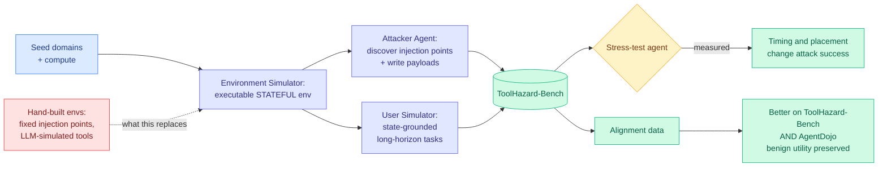

# ToolHazard: Scaling Adversarial Environments for Security Evaluation of LLM Agents

**Source:** [arXiv 2608.11878](https://arxiv.org/abs/2608.11878) · [HuggingFace](https://huggingface.co/papers/2608.11878) · [raw](../../raw/huggingface/2026-08-13-toolhazard-scaling-adversarial-environments-for-security-eva.md)

## TL;DR

Indirect prompt injection is the attack where the malicious instruction is not in the user's message. It is sitting in something the agent reads while doing its job: a calendar entry, a returned API payload, a file in a repository, a Jira ticket. The agent cannot easily tell "content I am processing" from "instruction I should follow," so it follows it.

Every study of this attack so far has been bottlenecked by the same thing: **someone had to hand-build the environment**. That means a small number of hand-written domains, tool behavior often simulated by another LLM (so the environment is stochastic and not really a system under test), and injection points chosen in advance by the researcher, which makes the measurement a test of the attack the researcher already thought of.

ToolHazard removes the human from that loop. Three components: an **Environment Simulator** that synthesizes executable *stateful* environments, an **Attacker Agent** that discovers viable injection points on its own and writes environment-specific payloads for them, and a **User Simulator** that constructs long-horizon tasks grounded in the environment's actual state. The output scales with seed domains and compute rather than with researcher hours. On top of it sits **ToolHazard-Bench**.

Two findings. Agents are substantially vulnerable under complex workflows. And **injection timing and placement affect attack effectiveness**, which is a result the hand-built benchmarks structurally could not produce, because they fixed placement in advance. Finally, ToolHazard-generated data works as **alignment** data: training on it improves security on ToolHazard-Bench *and* on the independent AgentDojo benchmark, while preserving benign task utility.

---

---

## Key findings

- **Adversarial environment synthesis scales with compute, not with researcher time.** This is the actual contribution; the benchmark is a consequence of it.
- **Injection timing and placement materially change attack success.** Prior benchmarks fixed both, so they were measuring a single point on a surface.
- **Environments are executable and stateful**, not LLM-simulated, which removes the confound where the "tool" was another language model improvising a plausible response.
- **Generated data transfers as alignment data**, improving security on the independently-built AgentDojo without destroying benign utility. Cross-benchmark transfer is the strongest evidence in the paper that the synthesized attacks are real rather than artifacts of the generator.

## How this relates to prior wiki pages

**It is the preventive half of the argument [Agent Safety Should Be a Runtime Contract (08-13)](../agentic-systems/2026-08-13-agent-safety-runtime-contract.md) makes on the same board.** That position paper argues safety for agents has to be enforced at runtime by the harness, in two faces: a preventive face that blocks dangerous actions, and an evidential face that refuses to accept a completion without proof. ToolHazard is the instrument you would need to know whether your preventive face works. The two papers arrived the same day without citing each other, one arguing the deployment-time layer is under-researched by 8x to 12x in the published record, the other building tooling for exactly that layer.

**It answers a measurement gap the [Frontier AI Risk Monitor Q2 (08-12)](2026-08-12-frontier-ai-risk-monitor-q2.md) exposed one day earlier.** That report found average model safety collapsing from 78.2 to 8.9 on biological risk under red-teaming, and specifically that **prompt-injection defense regressed outright** last quarter while attack capability rose. Its stated weakness was that **attacker strength is never characterized**, which is the parameter the entire jailbreak result depends on. A compute-scalable attacker is precisely how you would characterize it.

**It corroborates the 08-11 incident record with a measurement.** That board carried a PDF with hidden text hijacking Atlassian's Rovo agent into exfiltrating Jira and Confluence data with no user confirmation, an indirect prompt injection in production. ToolHazard's finding that placement and timing matter says the Rovo incident was not a lucky attacker, it was a search over a surface nobody had mapped.

## Gaps in the study

**The attacker and the defense share a generator.** Alignment data produced by ToolHazard improving performance on ToolHazard-Bench is close to circular; the AgentDojo transfer is the load-bearing evidence and the abstract reports it without a magnitude here.

**No cost accounting.** A framework whose pitch is "scales with compute" needs to say how much compute buys how many usable environments, otherwise "scalable" is an architecture claim rather than an economic one.

**Coverage is unmeasured.** The Attacker Agent discovers injection points, but nothing establishes what fraction of the real injection surface it finds. An automatic attacker that reliably finds 60% of the surface produces a benchmark that reliably certifies against 60% of it, and there is no way to tell from the outside.

**Defense-in-depth is not tested.** Real deployments put agents behind sandboxes and permission gates. Whether these attacks survive a permission gate is the question a practitioner actually has.

## Industrial implication

If you run tool-using agents against systems you do not fully control (a ticketing system, a shared drive, a CRM, an inbox), the honest current state is that your exposure is unmeasured, because the public benchmarks fixed the injection points in advance and your attacker will not. ToolHazard is the first thing to point at your own domain rather than at someone else's benchmark, and the seed-domain interface is what makes that possible.

The uncomfortable corollary is that the same framework is a weapon-grade attack generator against anyone else's agent, and it publishes the recipe. That tension is not unique to this paper, but the timing-and-placement finding is the kind of result that helps an attacker more than a defender in the short run, because a defender has to close the whole surface and an attacker needs one point on it.

---

**Related:** [Agent Safety Should Be a Runtime Contract](../agentic-systems/2026-08-13-agent-safety-runtime-contract.md) · [Frontier AI Risk Monitor Q2](2026-08-12-frontier-ai-risk-monitor-q2.md) · [Responsible AI](responsible-ai.md) · [Digest 2026-08-13](../daily-digest/2026-08/2026-08-13.md)
