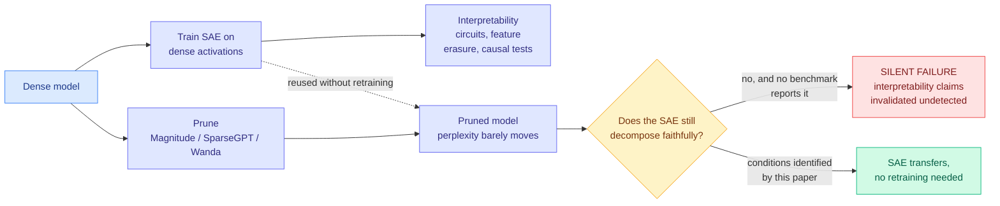

# When Pruning Meets Interpretability: Preserving Sparse Autoencoder Robustness in LLMs

**Source:** Kurate cs.LG board (#10 this week), [arXiv 2608.25941](http://arxiv.org/abs/2608.25941) · Suchit Gupte, Xueru Zhang, Mohammad Mahdi Khalili (Ohio State) · **COLM 2026**
**Raw:** [raw/kurate/2026-08-28-cs-lg.md](../../raw/kurate/2026-08-28-cs-lg.md)
**Enriched with** the [alphaxiv](https://www.alphaxiv.org/abs/2608.25941) overview. **Not on HuggingFace today.**

---

## TL;DR

Two standard practices are silently incompatible and almost nobody checks. **Sparse autoencoders** are the workhorse of mechanistic interpretability: train an overcomplete sparse dictionary on a model's activations and you recover features that are individually meaningful, which is how people identify circuits, erase spurious correlations, and test causal hypotheses about behaviour. **Weight pruning** is the standard way to make a model cheap enough to deploy, via MAGNITUDE, SparseGPT or Wanda. The problem is that an SAE was trained on the activation distribution of one specific dense model, and pruning changes the weights, which changes the activation distributions downstream. If that shift is large, **the SAE stops faithfully decomposing anything, and it does so silently**, because perplexity and standard downstream benchmarks will not notice.

---

## Why the framing is the contribution

The paper is deliberately not asking "how do we build interpretability tools for compressed models." It asks the deployment question: **under what conditions does an SAE already trained on a dense model remain valid, without retraining, after pruning.** That distinction matters because it is the question an organization actually faces. You have spent real money training SAEs and running interpretability analyses on the dense model; you now need to ship a pruned variant; do your existing analyses still hold, or do you pay for the whole interpretability stack again per model variant?

The alphaxiv overview draws a useful contrast with **crosscoders**, which train joint dictionaries across model states (base and fine-tuned) specifically to characterize the change between them. That is the right tool for studying a difference. It is the wrong tool for the transferability question, because it requires new training, which is the cost being avoided.

## How this relates to prior wiki pages

**It puts a cost on the compression program this wiki has been tracking all year, and it is a cost nothing else measures.** The [knowledge-distillation](../inference-efficiency/knowledge-distillation.md) page and the compression thread evaluate every technique on capability retention: [Quantization-Aware Healing (08-26)](../inference-efficiency/2026-08-26-quantization-aware-healing.md) got a 4-bit MXFP4 model to beat its own bfloat16 parent on 7 of 9 benchmarks by distilling from the original pre-compression teacher, which by every metric on that page is an unambiguous win. This paper says the metrics on that page are the wrong instrument for a specific and consequential question: **capability retention does not imply representational stability**, and interpretability tooling depends on the second, not the first. A compression pass can preserve everything the benchmarks measure and destroy the thing your safety team uses to audit the model.

**That connects the efficiency thread to the [responsible-ai page](responsible-ai.md) at a mechanism level rather than a rhetorical one.** The usual compression-versus-safety argument is about capability loss on safety-relevant tasks. This is different and more precise: the *auditing apparatus* breaks, not the model. And it breaks quietly, which is the property that makes it dangerous. The wiki recorded a structurally identical failure mode from [Agent Safety Should Be a Runtime Contract (08-13)](../agentic-systems/2026-08-13-agent-safety-runtime-contract.md), whose entire argument was that **no task-complete claim should be accepted without checkable proof**, backed by a title-level audit of all 28,560 NeurIPS/ICML/ICLR 2023-2025 papers showing an 8x-12x imbalance between training-time and deployment-time safety publication. An SAE reused across a pruning boundary is an unverified claim of exactly that kind, and pruning is a deployment-time operation. Same gap, different layer.

**It also intersects today's other post-training result in a way neither paper anticipates.** [Understanding Evolution Strategies for LLM Reasoning (08-28)](../llms-foundation-models/2026-08-28-evolution-strategies-vs-grpo.md) finds ES produces large whole-vector parameter drift with task gains concentrated in **a sparse subset of larger-magnitude updates**. Magnitude-based pruning removes small-magnitude weights, so an ES-trained model's gains might survive pruning better than a GRPO-trained model's. But this paper's finding says the *representations* may shift regardless. Whether ES-trained models are more or less SAE-stable under pruning than gradient-trained ones is an unasked question with a cheap experiment behind it and real consequences for anyone combining memory-efficient post-training with a compression pass.

## Gaps

The Kurate entry carries only metadata, so the quantitative core (which pruning methods break SAEs at which sparsity levels, and what the identified safe conditions actually are) is not readable from this source and needs the paper. That is the entire actionable content, so this should be treated as a well-posed problem with a claimed answer rather than a settled result.

Structurally, the paper studies pruning specifically. **Quantization is the more widely deployed compression method** and it perturbs activations differently, by reducing precision rather than zeroing weights. Whether the same silent-failure mode appears under 4-bit quantization is the higher-impact version of this question, and it is directly relevant given that MXFP4 is now the standard shipping format for open-weight releases. Nothing here answers it.

Third, the practical output needs to be a *diagnostic*, not just a set of conditions. What a deployment team needs is a cheap test that says "your SAE has stopped being faithful on this pruned checkpoint," runnable without ground-truth features. Whether the paper provides one is not visible from the abstract, and it is the difference between a finding and a tool.

## Industrial implication

Every lab that publishes interpretability results on a dense flagship and then ships quantized or pruned variants of that flagship is exposed to this. The concrete practice change is small and cheap: **treat the interpretability tooling as part of the artifact that compression invalidates**, and re-validate SAEs against each shipped variant rather than against the research checkpoint. The harder consequence is for safety cases built on feature-level evidence. If a regulator or a customer is shown circuit-level evidence about a model's behaviour, and the model in production is a pruned variant of the model that evidence was gathered on, the evidence does not obviously transfer, and until this paper nobody had a framework for arguing either way.

## Related

- [responsible-ai](responsible-ai.md) (concept)
- [knowledge-distillation](../inference-efficiency/knowledge-distillation.md) (concept)
- [Quantization-Aware Healing (08-26)](../inference-efficiency/2026-08-26-quantization-aware-healing.md)
- [Agent Safety Should Be a Runtime Contract (08-13)](../agentic-systems/2026-08-13-agent-safety-runtime-contract.md)
- [Evolution Strategies vs GRPO (08-28)](../llms-foundation-models/2026-08-28-evolution-strategies-vs-grpo.md)
