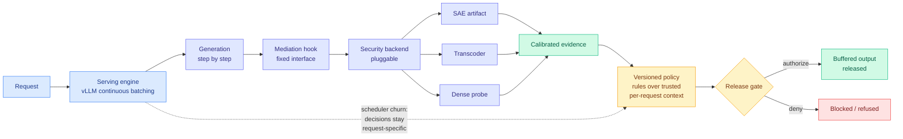

# LMSM: An LLM Security Framework Inspired by Linux Security Modules

**Source:** [arXiv 2608.25697](https://arxiv.org/abs/2608.25697) · [HuggingFace](https://huggingface.co/papers/2608.25697) · National University of Singapore, with USTC
**Raw:** [raw/huggingface/2026-08-31-lmsm-llm-security-framework-inspired-by-linux-security-modul.md](../../raw/huggingface/2026-08-31-lmsm-llm-security-framework-inspired-by-linux-security-modul.md)
**Date ingested:** 2026-08-31

## TL;DR

Interpretability research produces a steady stream of artifacts that can see inside a running model: sparse autoencoders (SAEs, which decompose a layer's activations into a large dictionary of sparse, often human-interpretable features), transcoders, and task-fitted dense probes. Each of these can in principle tell you that a generation is heading somewhere harmful *while it is happening*, which is earlier and cheaper than any output filter. In practice almost none of them become production controls, because every deployment that adopts one writes its own calibration, its own policy logic and its own intervention code, so each new artifact adds a parallel guard stack instead of strengthening a shared one. LMSM's move is to borrow the structure Linux solved this with in 2001. Linux Security Modules gave the kernel a fixed set of mediation hooks and let SELinux, AppArmor and others plug in behind them, separating *where enforcement happens* from *what the policy says*. LMSM does the same for LLM serving: a pluggable security backend exposes calibrated evidence, a versioned policy evaluates rules over trusted per-request context, and a separate gate authorizes release of buffered output. On Qwen3-4B it takes HarmBench attack success rate from **39.20% to 3.32%**, raises XSTest false refusals from **2.40% to 4.40%**, and retains **98.14% of the throughput** of a matched serving path doing no monitoring at 32 active sequences.

## Diagram

## The separation, and why it is the contribution

The paper's own framing is the sharpest part: it **separates mediation correctness from policy effectiveness.** Those are different engineering problems with different failure modes and different owners, and current LLM guard deployments fuse them.

*Mediation correctness* asks: does every security-relevant token release actually pass through the monitor, and does the decision that applies to request 7 stay attached to request 7? That second half is not trivial under continuous batching, where vLLM interleaves tokens from many sequences through the same forward pass and the set of active sequences changes every step. The paper explicitly reports that per-request decisions survive scheduler churn, which is the kind of property you only think to test if you have taken the reference-monitor framing seriously. Mediation is a systems problem, it is either right or wrong, and it should be written once.

*Policy effectiveness* asks: given evidence, do the rules catch the right things? That is a calibration-and-judgement problem, it is never finished, and it should be swappable. LMSM makes policy versioned and lets rules compose, so multiple rules can fire on the same request.

The reason to care is throughput. Because the hook is a fixed narrow interface, the monitoring work is a small addition inside a path that is already running, not a second model in front of the first. **98.14% throughput retention at 32 active sequences is the number that decides whether anyone ships this.** An external guard model, which is what most deployments run, costs a second forward pass and often a second GPU. Two percent is a rounding error by comparison, and it changes the deployment argument from "can we afford monitoring" to "which backend do we load."

## The honest cost line

False refusals on XSTest go from 2.40% to 4.40%. That is a near-doubling, stated plainly by the authors rather than buried. It is small in absolute terms and it is the trade the safety-utility literature always makes, but it is real: roughly one in fifty benign requests that previously went through now gets refused. Whether 4.40% is acceptable is a product decision, not a research one, and the framework's versioned-policy design is at least the right shape for tuning it after deployment rather than at training time.

## Relation to prior wiki state

**This closes a gap the wiki flagged explicitly on 08-13 and has carried open since.** [Agent Safety Should Be a Runtime Contract (08-13)](../agentic-systems/2026-08-13-agent-safety-runtime-contract.md) argued the harness is where safety belongs, and backed it with a title-level audit of all 28,560 NeurIPS/ICML/ICLR papers from 2023 to 2025 showing an **8x to 12x imbalance between training-time and deployment-time safety publication**. LMSM is deployment-time safety published as a systems paper, which is exactly the underweighted category, and it is unusual in reporting a throughput number at all.

**It also converts interpretability from a research output into an operational dependency, which is a bigger claim than the paper makes for itself.** The wiki has recorded SAEs mainly as an analysis tool. LMSM makes an SAE a *serving-path component*, which means SAE quality becomes a production reliability property. Read against [When Pruning Meets Interpretability (08-31)](../inference-efficiency/2026-08-31-pruning-meets-interpretability-sae.md), landing the same day, this is uncomfortable: that paper finds that standard weight pruning degrades SAE faithfulness on the pruned model. If your compressed serving model is the one that needs the guard, and compression is what breaks the guard's evidence source, then LMSM's substrate and the industry's default compression step are in tension. Neither paper cites the other. **This is the sharpest open problem the two of them create together, and nobody has measured it.**

**And it pairs with [StepGuard (08-31)](2026-08-31-stepguard-step-level-guardrails.md) as the two halves of pre-execution enforcement.** StepGuard checks a *tool action* before it executes; LMSM checks *generated output* before it is released. Same principle (mediate before the irreversible step), different boundary. A full stack wants both, and neither paper composes with the other yet.

## Gaps

Everything is measured on Qwen3-4B, which is small, and the throughput claim is at 32 active sequences, which is a modest batch. Whether 98.14% holds at production batch sizes on a 70B-class model is the number a serving team would need, and it is not reported. HarmBench and XSTest are the standard pair and both are static; an adaptive attacker who knows the SAE features being monitored is not evaluated at all, and that is the threat model that actually matters for a deployed reference monitor.

## Related pages

- [responsible-ai](responsible-ai.md)
- [StepGuard (08-31)](2026-08-31-stepguard-step-level-guardrails.md)
- [When Pruning Meets Interpretability (08-31)](../inference-efficiency/2026-08-31-pruning-meets-interpretability-sae.md)
- [agent-harness-engineering](../agentic-systems/agent-harness-engineering.md)
- [Daily digest 2026-08-31](../daily-digest/2026-08/2026-08-31.md)
