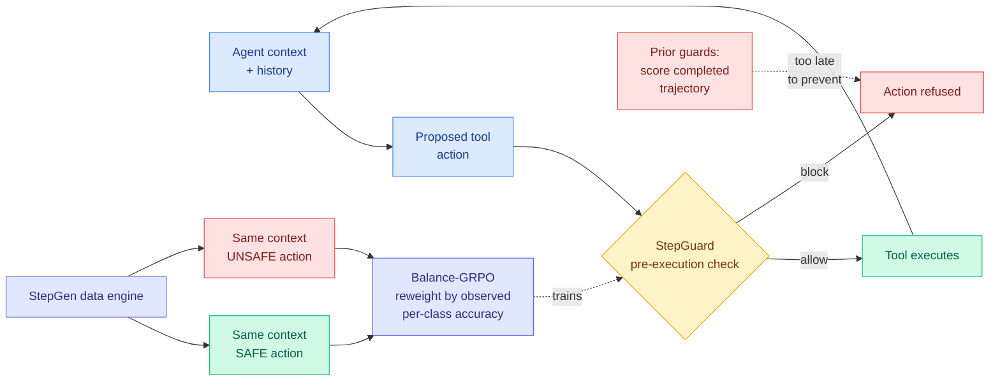

# StepGuard: Learning Step-Level Guardrails with Scalable Supervision and Safety-Utility Balancing

**Source:** [arXiv 2608.24777](https://arxiv.org/abs/2608.24777) · [HuggingFace](https://huggingface.co/papers/2608.24777) · Shanghai AI Laboratory, with Beihang, Fudan, Renmin and KAUST
**Raw:** [raw/huggingface/2026-08-31-stepguard-learning-step-level-guardrails-with-scalable-super.md](../../raw/huggingface/2026-08-31-stepguard-learning-step-level-guardrails-with-scalable-super.md)
**Date ingested:** 2026-08-31

## TL;DR

Most agent guardrails are graders, not brakes. They read a completed trajectory and say whether it was safe, which is useful for evaluation and useless for prevention, because by the time the trajectory is complete the file has been deleted and the credentials have been posted. StepGuard is a guard model that audits a proposed **tool action before it executes**. Two pieces make it work. **StepGen** is an automatic data engine that produces matched pairs: the same context, the same task, the same history, with a safe action and an unsafe action at the risky step, so the guard is forced to learn the property of the action rather than a smell in the surrounding context. **Balance-GRPO** dynamically reweights learning between safe and unsafe actions based on their observed accuracy during training, which targets the twin failure modes directly, over-defense (blocking benign actions) and under-defense (missing harmful ones). Guarding agents on AgentDojo and AgentDyn, it cuts mean attack success rate by **77.3%** against no guard while mean utility drops **2.8 percentage points**, and it is the strongest open-weight guard model reported, comparable to GPT-5.4.

## Diagram

## The two ideas worth stealing

**Matched-pair generation is the quiet contribution.** A guard trained on naturally-occurring safe and unsafe trajectories learns whatever correlates with harm in that corpus, and in practice the strongest correlate is the surrounding context, not the action. StepGen holds context fixed and varies only the action at the risky step, which is a counterfactual construction and forecloses the shortcut by design rather than by hoping the model generalizes past it. This is the same instinct the wiki recorded in [What do Reward Models Memorize? (08-02)](../llms-foundation-models/2026-08-02-what-reward-models-memorize.md), which found reward models memorizing dataset-specific shortcuts including *which model generated a response* and *how the user was sampled*, invisible in aggregate accuracy because those artifacts correlate with quality inside the dataset. StepGen is a data-construction answer to that class of failure: if the shortcut cannot discriminate the pair, it cannot be learned.

**Balance-GRPO is a fourth instance of the day's structural theme.** Standard GRPO (Group Relative Policy Optimization, which scores a whole rollout with one number and applies the resulting advantage uniformly) is class-blind. In guard training the classes are wildly imbalanced in both frequency and difficulty, so the policy converges to whichever error is cheaper on the training mix, which is what produces over-defense in some guards and under-defense in others depending on their corpus. Balance-GRPO makes the reweighting a function of *observed* per-class accuracy during training rather than a fixed prior.

## Relation to prior wiki state

**With ContextPilot, RCCA and CriPO, the credit-assignment pattern is now established at four papers.** [CriPO (08-03)](../llms-foundation-models/2026-08-03-cripo-rubric-rl-self-distillation.md) found over 57% of samples had criteria that some rollout satisfied but whose signal was destroyed by scalar aggregation. [RCCA (08-31)](../llms-foundation-models/2026-08-31-rcca-rubric-to-code-credit-assignment.md) localizes rubric feedback to code spans. [ContextPilot (08-31)](../agentic-systems/2026-08-31-contextpilot-proactive-context-management.md) localizes it to context-editing actions. Balance-GRPO localizes it to the safe/unsafe class. Different spans, one diagnosis: the scalar advantage discards structure the reward already contained.

**It is the action-side complement to [LMSM (08-31)](2026-08-31-lmsm-llm-security-modules.md).** LMSM mediates *output release* using model-internal evidence, at 98.14% of unmonitored throughput. StepGuard mediates *tool execution* using an external guard model. Both instantiate the reference-monitor principle at different boundaries. A serious deployment wants both and no published system composes them, which is a straightforward integration nobody has done.

**And it is direct evidence for the runtime-contract argument.** [Agent Safety Should Be a Runtime Contract (08-13)](../agentic-systems/2026-08-13-agent-safety-runtime-contract.md) argued the harness is where safety belongs, in a preventive face (sandboxes, permission gates, trajectory monitors) plus an evidential face, and documented an 8x to 12x publication imbalance between training-time and deployment-time safety across 28,560 conference papers. StepGuard is the preventive face made concrete and, unusually for this literature, made **open-weight**. The utility cost is stated as 2.8 points, which is the honest number and the one to argue about.

## Gaps

The 77.3% attack-success reduction is a relative figure against a no-guard baseline on two benchmarks, AgentDojo and AgentDyn, both of which use largely scripted adversarial injections. An adaptive attacker who can observe StepGuard's decisions and shape actions to sit just under its threshold is not evaluated, and for a pre-execution gate that is the threat model that decides deployment. No latency number: inserting a guard model call before every tool invocation is a per-step serving cost on the critical path, and unlike LMSM's 98.14% throughput retention, this paper reports no cost of guarding at all. Utility is measured as a mean across tasks, which can hide a small set of tasks where blocking is catastrophic rather than mildly costly.

## Related pages

- [responsible-ai](responsible-ai.md)
- [LMSM (08-31)](2026-08-31-lmsm-llm-security-modules.md)
- [tool-calling](../agentic-systems/tool-calling.md)
- [rl-for-llms](../llms-foundation-models/rl-for-llms.md)
- [Daily digest 2026-08-31](../daily-digest/2026-08/2026-08-31.md)
