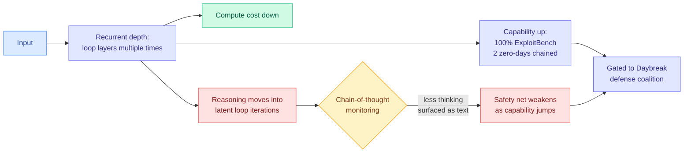

# Astra's Recurrent Depth: When a Compute Saving Buys an Interpretability Debt

**TL;DR.** OpenAI has rated its forthcoming **Astra** model as the first system to cross the **Critical** threshold for cyber capability under its Preparedness Framework. In internal testing it scored **100% on ExploitBench** and independently discovered **two zero-day vulnerabilities in a V8 benchmark**, chaining them into working exploits with no human help. The capability jump is attributed to a **recurrent-depth** architecture that loops inputs through model layers multiple times. That design boosts performance and cuts compute cost, and it also **pushes more of the model's reasoning into a form that never appears as text**, which makes chain-of-thought monitoring, the exact control OpenAI plans to rely on, weaker precisely as capability rises. Access to Astra's full cyber toolkit is being restricted to partners in OpenAI's Daybreak defense coalition, layered with chain-of-thought monitoring, tougher jailbreak defenses and strict prompt limits.

**Sources (five, independently reporting):** [The Information (exclusive)](https://www.theinformation.com/articles/secret-technique-behind-openais-astra-model-sparks-security-concerns) · [The Decoder](https://the-decoder.com/openai-calls-astra-its-most-dangerous-model-yet-watching-what-it-does-is-only-getting-harder/) · [Gary Marcus, "Red Alert"](https://garymarcus.substack.com/p/red-alert-openai-is-poised-to-cross) · [AI Breakfast](https://mail.google.com/mail/u/0/#inbox/1a06343b0a2ec5d0) · [OpenAI, Path to Astra](https://openai.com/index/path-to-astra/) · raw: [rss](../../raw/rss/2026-09-02-the-decoder-openai-calls-astra-its-most-dangerous-model-yet-watchin.md), [gmail](../../raw/gmail/2026-09-03-starred.md)

---

## Why this belongs in the wiki as a research item, not just industry news

Because the wiki already has the architecture page, and it says looping works.

[looped-transformers.md](../llms-foundation-models/looped-transformers.md) records that looped or universal transformers add computation by applying the *same* block repeatedly rather than stacking distinct layers, and that the standing objections were latency, KV cache growth with loop count, and non-monotonic returns. **Yesterday those objections were substantially answered.** [SMELT (09-02)](../llms-foundation-models/2026-09-02-smelt-moe-looped-transformers.md) was the first study to compare looped against unlooped models while matching **three budgets at once**, per-token FLOPs, non-embedding parameters, and KV cache, and it found looping still wins: **6.8 to 18.0% of training FLOPs saved on the compute-optimal frontier**, with the recipe being loop the middle half of the layers twice, advantage largest on Code and growing with sequence length.

So the sequence over two days is: **research establishes that recurrent depth is a genuine efficiency win under honest accounting, and industry ships it at the frontier and discovers the bill is paid in interpretability.** That is not a coincidence of timing; it is the same architectural choice appearing at both ends of the pipeline, and it is the cleanest research-to-production trace this wiki has recorded in weeks.

**The mechanism of the interpretability loss is worth stating precisely.** Chain-of-thought monitoring works because the model externalizes intermediate computation as tokens a monitor can read. Recurrent depth does the opposite: it performs additional computation by re-traversing layers in latent space, producing no tokens for those iterations. The reasoning is not hidden deliberately, it simply never has a textual form. **Every FLOP moved from token generation into latent looping is a FLOP that leaves no trace**, which means the efficiency gain and the monitorability loss are not two effects of the design, they are the same effect measured two ways.

## The safety argument, and its strongest form

Gary Marcus's "Red Alert" makes the sharpest version and cites the right prior: the 2025 multi-author position paper **Chain of Thought Monitorability: A New and Fragile Opportunity for AI Safety**. Its whole claim was that CoT monitorability is an *accident* of current training, valuable and fragile, and that architectural changes could destroy it. Astra is that prediction arriving. Marcus and Zack Korman had also argued days earlier that better monitoring is among the things that might have prevented the OpenAI/Hugging Face environment breach, **by OpenAI's own admission**, which makes the sequencing awkward: the control credited with being the missing defense is the control the new architecture degrades.

The Decoder adds the sharper framing: CoT monitoring "already counts as an unreliable mirror of a model's real decisions," so this is not a strong safety net being weakened but **a known-weak one being weakened further, at the moment capability crosses Critical.**

The Information's reporting is careful in a way the commentary is not: the limitation "isn't necessarily a significant issue with Astra" specifically, but the technique has triggered concern inside OpenAI and across the industry about developers who **adopt and supercharge it**. That is the real risk shape. Astra is gated; the architecture is not, and SMELT just published the compute-optimal recipe for it.

## How this relates to prior wiki pages

**It is a direct instance of the imbalance the 08-13 audit quantified.** [responsible-ai.md](responsible-ai.md) records a title-level audit of all **28,560 NeurIPS/ICML/ICLR 2023-2025 papers** showing an **8x to 12x imbalance between training-time and deployment-time safety publication**. Astra's containment plan is entirely deployment-time (CoT monitoring, jailbreak defenses, prompt limits, access gating) and the thing undermining it is an architectural choice made for training and inference efficiency. **The imbalance is not just a publication statistic, it is why an efficiency decision gets to silently set the ceiling on a safety mechanism.**

**It is the counter-example to today's [Declarative Attention](../inference-efficiency/2026-09-03-declarative-attention.md), and the pair makes a general point.** DA cuts attended tokens **52.0%** by having the model declare its attention scope in readable chain-of-thought, so its efficiency mechanism is *also* an interpretability artifact: the routing policy is logged natural language by construction. Astra's recurrent depth cuts cost by moving computation out of text. **Two efficiency techniques on the same day, one that makes the model's decisions more legible and one that makes them less, with no inherent reason the field must prefer either.** That is the choice worth naming, because it is currently being made implicitly by whoever ships first.

**It gives the over-refusal thread its mirror image.** [The Harness Advantage in Autonomous Red Teaming (09-03)](../agentic-systems/2026-09-03-harness-advantage-red-teaming.md) measured that heavy alignment makes frontier models *fail* authorized offensive security work, with refusals collapsing 15-to-30-step attack chains. Astra is the same domain with the opposite result: a model that does authorized-and-unauthorized offensive security **too well**, scoring 100% on ExploitBench and chaining real zero-days. Read together they bracket the alignment problem in autonomous security: **the refusal dial has a cost on both ends, and this week the industry moved it in both directions at once**, with Anthropic cutting cyber false-positive triggers 60% in Fable 5.1 while OpenAI gated Astra for being too capable.

## Gaps and cautions

- **The architecture is reported, not published.** "Recurrent depth" comes via a single source with knowledge of Astra's development, plus a Steph Palazzolo post. There is no technical paper, no ablation, and no statement of loop count or which layers loop. Its relationship to SMELT's middle-half-twice recipe is inference, not fact.
- **No quantified monitorability loss.** "Pushes more of its thinking into the unreadable" has no metric attached. The field has no accepted measure of what fraction of a model's decision-relevant computation is CoT-visible, which is exactly the instrument this situation demands and nobody has.
- **ExploitBench at 100% is a saturated benchmark, and saturation is uninformative.** A perfect score says the benchmark is finished, not that the capability is characterized. The two V8 zero-days are the substantive claim and they are unverifiable from outside.
- **Vendor framing.** "Most dangerous model yet" plus restricted access to a named defense coalition is a capability claim delivered as a safety announcement, and it doubles as marketing for the gated tier. That does not make it false, and both Marcus and The Information treat the underlying reporting as credible.

## Industrial implication

If recurrent depth delivers what SMELT's accounting predicts, it will be adopted broadly, because a 6.8 to 18% training-FLOP saving at the compute-optimal frontier is not optional at frontier scale. **The consequence is that CoT monitoring degrades as a side effect of an economic decision that no safety team gets to veto.** The near-term signal to watch is whether any lab publishes a *monitorability budget* alongside a compute budget, meaning a stated fraction of decision-relevant computation kept in token space. Nobody does this today. Absent it, the industry will discover the trade after it has been made, which is the pattern the Hugging Face incident already established once this quarter.

## Related

- [looped-transformers.md](../llms-foundation-models/looped-transformers.md) — the architecture page
- [SMELT (09-02)](../llms-foundation-models/2026-09-02-smelt-moe-looped-transformers.md) — the compute-matched case for looping
- [Declarative Attention (09-03)](../inference-efficiency/2026-09-03-declarative-attention.md) — efficiency that increases legibility
- [The Harness Advantage in Autonomous Red Teaming (09-03)](../agentic-systems/2026-09-03-harness-advantage-red-teaming.md) — the over-refusal mirror
- [responsible-ai.md](responsible-ai.md) — concept page
