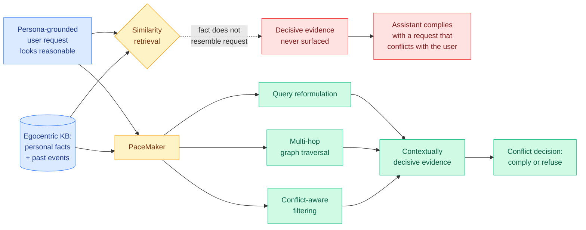

# PACE: Towards Surfacing Hidden Conflicts in User Requests

**Source:** HuggingFace Daily Papers · [arxiv 2609.03293](https://arxiv.org/abs/2609.03293)
**Raw:** [raw/huggingface/2026-09-04-pace-towards-surfacing-hidden-conflicts-in-user-requests.md](../../raw/huggingface/2026-09-04-pace-towards-surfacing-hidden-conflicts-in-user-requests.md)

## TL;DR

Almost all assistant evaluation asks whether the model **did what was asked**. PACE asks whether it should have, and the interesting part is that the reason not to is usually not a safety-policy reason. It is a fact about the specific user that makes an entirely reasonable request wrong for them. Prior conflict-and-safety detection work supplies the conflicting factor explicitly in the prompt. Real deployments do not: the disqualifying fact sits in a knowledge base and has to be **retrieved**, and it does not resemble the request. **PACE** (Personalized Assistants for Conflict Evaluation) pairs persona-grounded user requests with egocentric knowledge-base facts (personal knowledge and past events) and asks whether a seemingly reasonable request is in conflict. The implicit-retrieval setting is the whole difficulty: because the request and the conflict-inducing fact are not textually associated, similarity-based retrieval does not surface the fact, and existing models cannot find the user-specific evidence that would change the answer. The paper also ships **PaceMaker**, a multi-agent framework whose specialized agents coordinate across **query reformulation, multi-hop graph traversal and conflict-aware filtering** to retrieve contextually decisive evidence, and which consistently outperforms existing approaches on both retrieval quality and conflict-decision accuracy.

## The refusal type this adds

Refusal research on this topic area has two established categories: refuse because the request is harmful in general, and refuse because the model cannot do it. PACE adds a third that neither covers. **Conflict-based refusal** is a refusal grounded in the requester's own circumstances, where the identical request from a different user would be correct to fulfill. That is not a policy question and it cannot be answered by a policy classifier, because there is nothing wrong with the request. It is a **retrieval and reasoning** question about a specific person, and the fact that decides it is one the user already told the assistant, possibly months earlier, in a conversation about something else.

This makes the failure mode uncomfortable in a way general safety failures are not. The assistant has the information. It stored it. It just cannot find it when it matters, because finding it requires noticing a connection the query does not signal.

## Relation to prior wiki state

**This is the same failure [InMind (07-29)](../agentic-systems/2026-07-29-inmind-implicit-association-blind-spot.md) measured, promoted from a memory-quality problem to a safety problem, and that promotion is the reason to take it seriously.** InMind established the **implicit-association blind spot**: retrieval only surfaces a fact when the fact resembles the query, so a stored tree-nut allergy never fires on a macaron request. Across six vector, graph and agentic memory systems, indirect queries reached **at most 14.4%**, against **84.0%** when the memory was simply placed in context. That roughly 70-point headroom has been [agent-memory.md](../agentic-systems/agent-memory.md)'s largest untouched gap for five weeks, and the page has now recorded three consecutive results ([EM²Mem (09-02)](../agentic-systems/2026-09-02-em2mem-event-centric-multimodal-memory.md), and today [LatentStream](../inference-efficiency/2026-09-04-latentstream-progressive-latent-memory.md)) that improve how retrieved evidence is *packaged* without changing whether the right evidence is *found*.

**PACE is the first paper to build an evaluation whose entire difficulty is that gap, and PaceMaker is the first mechanism aimed at closing it rather than routing around it.** InMind's own worked example is a health-conflict case, and PACE generalizes exactly that: a request that is fine in general and wrong for this user. **Two independent papers, five weeks apart, converging on the finding that similarity retrieval structurally cannot support personalized assistance. The second one attaches consequences.** The right reading for [agent-memory.md](../agentic-systems/agent-memory.md) is that the indirect-association gap is not a benchmark artifact and not a packaging problem, it is the load-bearing failure, and packaging improvements have now been measured three times without touching it.

**PaceMaker's three agents are three different rejections of similarity as the retrieval gate**, which is why the mechanism is more interesting than the usual multi-agent decomposition. Query reformulation attacks the surface mismatch by rewriting the query toward the fact's vocabulary. Multi-hop graph traversal abandons similarity for structure, following relations from the request's entities to a fact that shares none of its words. Conflict-aware filtering scores candidates on decisiveness rather than relevance, which is a different objective entirely: a fact can be highly relevant and change nothing, or barely related and settle the question. **That third one is the piece the memory literature is missing, because every retrieval system on this wiki ranks by relevance and none ranks by whether the item would change the answer.**

**It also intersects, awkwardly, with today's [RealSWE (09-04)](../agentic-systems/2026-09-04-realswe-realistic-user-requests.md) from the opposite direction.** RealSWE found real user requests are drastically underspecified compared to benchmark problems (problem-statement-only prompts are 88% of real prompts and 7% of benchmarks) and that supplying **Motivation** significantly improves an agent's resolution rate. PACE is about a request whose stated motivation is fine and whose *unstated* circumstances make it wrong. **Read together: the missing information in real requests is doing two different jobs, and improving how much the user says only fixes the first.** RealSWE's fix is to ask the user for more. PACE's premise is that the user will not volunteer the thing that matters, because they do not know it is relevant. An assistant that only gets better at using what it is told does not improve on PACE at all.

**On the compliance-versus-judgment axis, this is a counterweight to the harness literature's direction of travel.** [Harness-of-Harness (09-02)](../agentic-systems/2026-09-02-harness-of-harness.md) settled a contradiction on [agent-harness-engineering.md](../agentic-systems/agent-harness-engineering.md) with the commitment "constrain verifiable outputs rather than prescribing agent workflows," giving the harness authority over what is checkable and the model authority over judgment. **Conflict-based refusal is judgment that is not checkable from the output.** Whether an assistant should have refused depends on a retrieved fact about the user, so no output-side constraint can evaluate it, and the harness has nothing to hold. That is a real limit on the HoH design commitment and neither paper is positioned to notice it.

## Gaps

**Synthetic personas and a constructed knowledge base.** The conflicts are authored, which means the distribution of how hard the associations are is a design choice rather than a measurement. The complementary study, mining real conflicts from consented long-term assistant histories, is the one that would establish whether this frequency and difficulty match deployment.

**No cost, and here it is a live objection to the method.** PaceMaker runs query reformulation, multi-hop graph traversal and conflict-aware filtering as coordinated agents, and this would have to execute on **every** request, since you cannot know in advance which requests hide a conflict. A multi-agent retrieval pass per turn is a large, unreported multiplier on a personalized assistant's serving cost, and it is the number that decides whether the mechanism is deployable or only demonstrable.

**No false-positive analysis in the abstract.** An assistant tuned to surface hidden conflicts will find conflicts that are not there, and over-refusal on personal grounds is a distinctly worse user experience than over-refusal on policy grounds, because it is condescending rather than merely unhelpful. The abstract reports conflict-decision accuracy without separating the two error directions.

**Refusal is the only modeled response.** Surfacing a conflict and *asking* is almost always better than refusing, and the paper's framing ("conflict-based refusal") makes the binary the target. The clarification-question variant is the more useful system and is not evaluated.

## Related

- [InMind (07-29)](../agentic-systems/2026-07-29-inmind-implicit-association-blind-spot.md) — the same blind spot, measured as a memory failure
- [agent-memory.md](../agentic-systems/agent-memory.md) — concept page carrying the indirect-association gap
- [RealSWE (09-04)](../agentic-systems/2026-09-04-realswe-realistic-user-requests.md) — underspecified requests, the other direction
- [LatentStream (09-04)](../inference-efficiency/2026-09-04-latentstream-progressive-latent-memory.md) — packaging improvement that does not touch this gap
- [Harness-of-Harness (09-02)](../agentic-systems/2026-09-02-harness-of-harness.md) — the checkable-output commitment this limits
