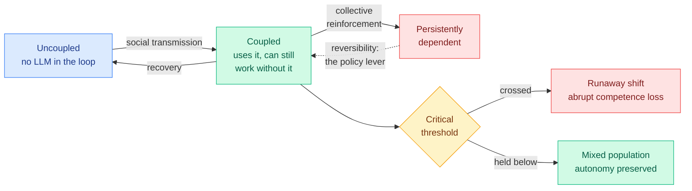

# Large-Language Models as a Cognitive Virus

**Source:** Saved reading (X bookmark, 2026-09-06) · [arXiv 2609.03344](https://arxiv.org/abs/2609.03344) (physics.soc-ph, 3 Sep 2026) · Ricard Solé, Giulio Ruffini, Francesca Castaldo, Marco Tuccio, Luis F. Seoane, Manlio de Domenico, Santiago F. Elena, David C. Krakauer, Michael Levin
**Institutions:** Complex Systems Lab (UPF Barcelona), ICREA, Santa Fe Institute, Neuroelectrics/BCOM, OIST, Padua, I2SysBio CSIC-Valencia, Allen Discovery Center at Tufts, Wyss Institute (Harvard)

## TL;DR

This is a dynamical-systems paper, not a polemic, and the difference matters. The authors model LLM adoption the way epidemiology models a transmissible agent: a population partitions into **uncoupled** users (no LLM in the loop), **coupled** users (using it, still able to work without it), and **persistently dependent** users (cognitive function has been offloaded and does not readily return). Transitions between those compartments are driven by social transmission, by recovery, and by **collective reinforcement**, which is the term doing the real work: as more of your peers write, code and reason with an LLM, the cost of not doing so rises, so adoption feeds adoption. The consequence the paper is actually about is **nonlinearity**. Because reinforcement is collective, the system admits tipping points: past a critical threshold, a small further increase in adoption triggers a rapid population-level shift into persistent dependence, with an abrupt loss of cognitive competence. **Gradual individual adoption can produce a discontinuous collective transition.** The same model also identifies the escape: conditions for "cognitive immunization," achieved by reducing transmission and by keeping the transition **reversible**, which is the parameter policy can actually touch.

## What the viral analogy is and is not doing

An LLM cannot replicate without a host: it needs human attention, human infrastructure and human networks to spread, and it reshapes the host's behaviour in ways that generate more of the data it needs. That is the analogy, and the authors are explicit that it is an analogy chosen for its **mathematics** rather than its rhetoric. Epidemic models are the standard tool for culturally transmitted technologies, and the paper's actual contribution is the compartment structure plus the reinforcement term, not the label.

**The tweet that surfaced this paper claimed LLMs "satisfy every biological and mathematical definition of a virus."** They do not, and the paper does not say so. A virus has a genome that replicates with variation under selection; an LLM's weights do not replicate through their users. What the paper argues is narrower and more defensible: **the population dynamics of adoption have the same shape as an epidemic with a reinforcement term**, so the tools transfer. That is a modelling claim about dynamics, and it stands on its own without the ontological claim layered on top of it. The same tweet attributed the work to Harvard; the first author is at Universitat Pompeu Fabra in Barcelona, with the Santa Fe Institute as the intellectual centre of gravity and Harvard appearing only through Levin's Wyss affiliation.

## Why this belongs on the wiki rather than in the discourse pile

Two reasons.

**It is a falsifiable structure over a debate that has mostly been anecdote.** "AI is making people worse at thinking" is unfalsifiable as usually stated. "Adoption exhibits a critical threshold above which dependence becomes self-sustaining and competence drops discontinuously" is a measurable claim about a phase transition, with an order parameter and a control parameter. Someone can now go and look for the bifurcation.

**Its policy lever is specific and unusual.** Most proposals in this area target the *rate* of adoption, which is the transmission term and the hardest one to move. This paper's "cognitive immunization" also targets **reversibility**: keeping the coupled-to-dependent transition traversable in both directions. That maps onto concrete product decisions (whether a tool preserves the user's ability to do the task unaided, whether skills atrophy silently) far better than adoption-rate arguments do.

## How this relates to prior wiki pages

**It is the population-level statement of a failure mode this wiki keeps recording at the individual level.** The [agent harness engineering page](../agentic-systems/agent-harness-engineering.md) carries the Paint.NET datapoint from 09-02: roughly 180,000 lines of Claude-written clean-room Direct2D code that the project's own author states he cannot possibly review. That is one person in the persistently-dependent compartment, described from the inside. The [08-30 entry](../agentic-systems/2026-08-30-agents-not-time-aware.md) on that same page measures the mechanism that makes it hard to notice: agents overrate their own output by roughly 20 points same-turn, and a harness that trusts the self-report cannot see the failures. **Dependence is easiest to acquire exactly where verification is most expensive.**

**It gives the [responsible AI page](responsible-ai.md) a second axis.** That page's existing material is about model behaviour: alignment, interpretability, safety, whether the system does what was asked. This is about the user's trajectory, which no page here covers, and it is the axis on which today's other responsible-AI item, the commercial guardrail-stripping service [Abliteration.ai](2026-09-06-abliteration-commercial-guardrail-stripping.md), is irrelevant. Two different kinds of risk, one day.

## Gaps

- **No empirical fit.** This is a model with a structure, not a calibration. The compartment transition rates are not estimated from adoption data, so the tipping point is a property the model *admits* rather than one that has been located.
- **"Cognitive competence" is not operationalized.** The abrupt-loss result is only as strong as the measurement, and there is none here.
- **Reversibility is asserted as a lever without an intervention.** The model says reversibility matters; it does not say what preserves it.
- **Selection effects run the other way too.** People who offload writing may be reallocating attention rather than losing capacity, and a compartment model cannot distinguish substitution from atrophy.

## Related pages

- [responsible-ai.md](responsible-ai.md) · [Abliteration.ai: commercial guardrail stripping (09-06)](2026-09-06-abliteration-commercial-guardrail-stripping.md)
- [agent-harness-engineering.md](../agentic-systems/agent-harness-engineering.md) · [Your agents are not time aware (08-30)](../agentic-systems/2026-08-30-agents-not-time-aware.md)
