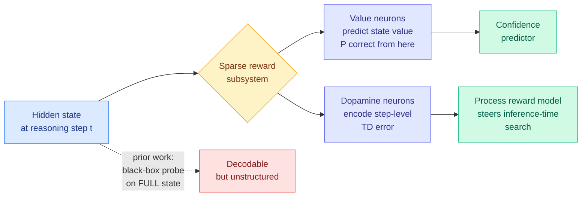

# Sparse Reward Subsystem in Large Language Models

**Source:** Saved reading (X bookmark, 2026-09-06) · [arXiv 2602.00986](https://arxiv.org/abs/2602.00986) · [HuggingFace Papers](https://huggingface.co/papers/2602.00986) · Guowei Xu (Tsinghua), Mert Yuksekgonul and James Zou (Stanford)
**Enrichment:** alphaxiv overview retrieved (partial)

## TL;DR

It is already established that an LLM's hidden states carry reward-related information: whether the current answer is likely correct, how confident the model is, whether it is hallucinating. The standard way to get at that is a **black-box probe**, a small classifier fitted on the *whole* hidden state vector. A probe tells you the information is decodable. It tells you nothing about where it lives. This paper asks the structural question and finds a sharp answer: **the reward information is concentrated in a sparse subset of individual neurons**, and that subset splits cleanly into two functional types. **Value neurons** fire in proportion to *state value*, defined as the expected probability that continuing generation from right here yields a correct answer. **Dopamine neurons** fire in proportion to *step-level temporal-difference error*, the surprise when the expected value jumps or drops. The names are borrowed from neuroscience deliberately, because biological value and dopamine neurons encode the same two quantities. The authors show the value neurons are robust and transfer across datasets and models, give causal evidence rather than correlational probes, and then cash the finding out in two applications: **value neurons work as a confidence predictor, and dopamine neurons work as a process reward model steering inference-time search.**

## Why sparsity is the whole result

If reward information were smeared densely across the residual stream, the only way to use it would be to run a model over the full hidden state, which is what a probe is and what a trained process reward model effectively is. Sparsity changes the economics: **a minimal set of responsible neurons enables a lightweight, targeted intervention** instead of a second network.

The paper gives two theoretical reasons to expect sparsity in advance rather than discovering it by accident. The first is the maximum-entropy RL argument: an optimal policy and its soft Q-function are coupled by the standard identity, so a model that is a strong policy has to be encoding value information somewhere in order to make good next-token decisions at all. The second is information-theoretic. Together they turn "we found reward neurons" from a curiosity into a prediction that was going to be true.

## The application that matters for cost

**A process reward model (a scorer that grades each intermediate reasoning step rather than only the final answer) is normally a separate trained model that you run alongside the policy.** In best-of-N sampling, tree search, or any step-level beam search, every candidate step costs a policy forward pass *plus* a PRM forward pass. The PRM is a standing serving-time tax on every method that steers search.

If the dopamine neurons are a usable PRM, that tax largely disappears. The signal is already computed as a side effect of the policy's own forward pass; reading it costs a gather over a handful of activation indices. **The PRM stops being a model you serve and becomes a view over a tensor you already have.**

That is the specific reason this Feb-2026 paper is worth a page in September. It is a Tier 1 cost result wearing interpretability clothes.

## How this relates to prior wiki pages

**It gives a mechanism to the [test-time compute allocation page](../inference-efficiency/test-time-compute-allocation.md)'s recurring complaint.** That page's open problems 5 and 6 both come down to the same thing: methods delete a serving-time dependency and never price what replaced it. This is the rare case running the other way, where the replacement genuinely costs close to nothing because it is a read rather than a computation. Whether an intrinsic PRM matches a trained one on accuracy is the number the paper owes and the abstract does not give.

**It sits directly against [Locked at the Entrance (09-05)](../llms-foundation-models/2026-09-05-locked-at-the-entrance-rlvr-breadth.md)**, which showed that reinforcement learning with verifiable rewards contracts a policy's solution coverage by up to 67%, with the damage concentrated at the trajectory's first move. If value neurons emerge because the policy needs value estimates, then an RLVR-narrowed policy's value neurons are calibrated to the narrowed distribution. **Using them as a PRM to steer search would then steer toward the same narrow entrance the training already selected**, which would make the intrinsic PRM cheaper *and* more prone to the exact failure the parallel-sampling literature is trying to escape. Nobody has measured value-neuron behaviour across an RLVR checkpoint sequence and it is a cheap experiment on checkpoints already sitting on disk.

**It is a fifth instance of the wiki's 09-04 to 09-06 pattern that the learned selection layer is deletable.** [Random Attention (09-04)](../inference-efficiency/2026-09-04-random-attention-kv-eviction.md) deleted the KV-cache scorer and matched the best evictor at 32-43% higher throughput; [Select, Compress, Reinvest (09-05)](../inference-efficiency/2026-09-05-select-compress-reinvest-visual-tokens.md) found an unmodified early-1990s algorithm matching every purpose-built frame selector; [DRACO (09-05)](../agentic-systems/2026-09-05-draco-rubric-credit-assignment.md) beat its own verifier-trained baseline with a closed-form redistribution; [AutoTraceGT (09-05)](../agentic-systems/2026-09-05-autotracegt-grounded-theory-agent-traces.md) recovered 73-91% of hand-built failure taxonomies with a 1967 social-science method. **This adds: the trained process reward model may be deletable too, because the policy already contains one.** Five results, four days, five unrelated subfields.

## What the viral framing got wrong

This paper reached the wiki through a saved X post that described it as "Stanford discovered something equivalent to Dopamine Neurons inside LLMs." Three corrections, worth recording because the pattern recurs:

1. **Attribution.** First author Guowei Xu is at Tsinghua; the Stanford contribution is Yuksekgonul and Zou. "Stanford discovered" drops the first author.
2. **A number that is not in the paper.** The post claims ablating a small fraction of value neurons collapses math reasoning "by over 50%." The abstract claims causal evidence that these neurons encode reward-related information, which is a weaker and differently-shaped statement. Treat the 50% as unverified until the body is read.
3. **Recency.** The arXiv identifier is 2602, and HuggingFace surfaced it on 2026-05-11. This is a four-month-old paper being recirculated as a discovery. **Nothing about it happened this week except the tweet.**

The underlying work is genuinely good. The framing added a biological-inevitability story ("nobody programmed this") on top of a paper that explicitly predicts the finding from max-entropy RL theory before observing it.

## Gaps

- **No head-to-head against a trained PRM.** The whole cost argument depends on the accuracy gap, and it is not in the abstract.
- **How many neurons, and how stable is the set?** "Sparse" and "transferable across models" are claims whose usefulness is entirely in the numbers. A subsystem that must be re-identified per checkpoint is a much weaker result than one that survives fine-tuning.
- **Causal evidence is asserted at abstract level.** Ablation methodology, and what the ablations do to unrelated capabilities, is where this claim lives or dies.
- **The neuroscience analogy is presentational.** Value and TD-error signals are what any RL-adjacent system needs; recovering them does not establish structural correspondence with biology, and the paper is more careful about this than its readers have been.

## Related pages

- [responsible-ai.md](responsible-ai.md) · [test-time compute allocation](../inference-efficiency/test-time-compute-allocation.md) · [rl-for-llms.md](../llms-foundation-models/rl-for-llms.md)
- [Locked at the Entrance (09-05)](../llms-foundation-models/2026-09-05-locked-at-the-entrance-rlvr-breadth.md) · [Pruning meets interpretability (08-31)](../inference-efficiency/2026-08-31-pruning-meets-interpretability-sae.md)
