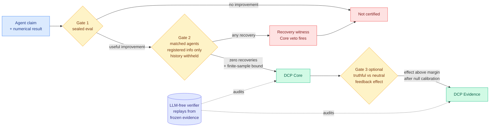

# Scores Alone Do Not Prove Discovery: an executable audit protocol for AI research agents

**Source:** HuggingFace Daily Papers (13 upvotes) · [Paper](https://arxiv.org/abs/2609.09219) · [raw](../../raw/huggingface/2026-09-10-scores-alone-do-not-prove-discovery-the-discovery-certificat.md)

## TL;DR

An AI research agent produces a number. The number is better than the baseline. Did it discover something, or did it find a route that was already lying around in its prior knowledge, in public sources, or in the experimental feedback it was given? The Discovery Certification Protocol (DCP) turns that question into executable tests. **Gate 1** validates useful improvement on a sealed evaluation. **Gate 2** gives *matched* agents the registered starting information and the observed web content while **withholding the target research history**, and every valid method that reaches the numerical target supplies a **recovery witness** and triggers the Core veto. DCP Core requires adequate controls, **zero observed recoveries**, and a finite-sample bound on recovery in one fresh registered episode. Optional **Gate 3** measures the average effect of truthful feedback against a specified neutral policy from a shared checkpoint. Two controlled audits, on SQLite optimization and virtual catalyst control, each produced **zero recoveries in 96 episodes with an upper bound of 0.0468**, and each paired study yielded **30 truthful recoveries against zero neutral recoveries** with passing 60-pair null studies. A deterministic, LLM-free verifier reproduces every decision from frozen evidence.

## The protocol

## Key points

- **The recovery witness is the mechanism.** Rather than arguing about whether a result is novel, DCP hands a matched agent everything *except* the research history and checks whether it gets there anyway. If it does, the "discovery" was a route already available, and the veto fires. That converts a philosophical dispute into an experiment.
- **Zero recoveries plus a finite-sample bound is the honest form of a negative.** 0 in 96 episodes with an upper bound of 0.0468 says what it can and cannot rule out, which is rarer than it should be in this literature.
- **The deterministic LLM-free verifier is the part that makes it a protocol rather than a paper.** Decisions replay from frozen evidence without a judge model, so the audit is not itself an unaudited AI system.
- **Gate 3 separates "the agent found it" from "the feedback told it."** 30 truthful recoveries against zero neutral recoveries isolates the contribution of the feedback channel.

## How this relates to prior wiki pages

**It is the constructive counterpart to the day's benchmark-integrity results.** [SWE-Bench Pro Verified (09-10)](../agentic-systems/2026-09-10-swe-bench-pro-verified.md) found the standard coding-agent benchmark leaking gold solutions and hidden evaluation information, inflating reported scores. [SAEScientist-Bench (09-10)](2026-09-10-saescientist-bench-autonomous-interpretability.md) found agents that design good contrastive probes but **misinterpret their own measurements**. DCP addresses exactly that class of failure at the protocol level: do not trust the agent's reading of its own result, make the result survive an adversarial recovery attempt. **Three papers on one day saying agentic evaluation currently measures the harness, and one of them proposes the fix.**

**It arrived on the same day as the loudest week yet for OpenAI's Navier-Stokes claim**, where Tristan Buckmaster alleged OpenAI took a route he and Levent Alpöge had quietly chosen, OpenAI stated it saw none of their work while conceding it "cannot rule out that de-identified data derived from their usage of our products helped improve our models," and both men had used Codex. **DCP's Gate 2 is precisely the instrument that dispute lacked.** A registered starting-information set and a matched-agent recovery test would have answered "could this route have been found without the history" as a measurement rather than as a character question. That is the strongest practical argument for the protocol and neither the paper nor the coverage connects them.

**It also gives teeth to the "certification over benchmarks" direction on [agent-benchmarks.md](../agentic-systems/agent-benchmarks.md)**, which has been accumulating evidence that leaderboard position and deployment reliability have decoupled.

## Gaps

Two controlled audits in narrow domains (SQLite optimization, virtual catalyst control) where the target is a scalar and the search space is enumerable. Whether Gate 2 is even constructible for open-ended research, where "the registered starting information" is not a finite object, is unaddressed. And the protocol is expensive: 96 episodes plus 60 null pairs per audit is a serious compute bill to certify one claim.

## Related

- [Agent benchmarks](../agentic-systems/agent-benchmarks.md) · [Self-evolving agents](../agentic-systems/self-evolving-agents.md) · [SchemeArena](2026-09-10-schemearena-factorized-scheming.md)
