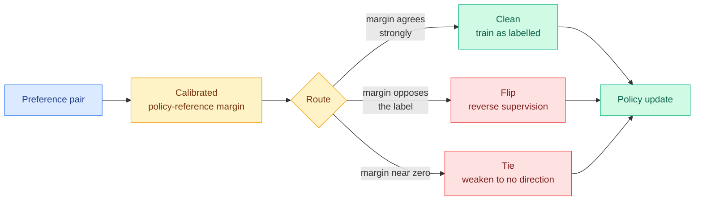

# PLC-DPO: Posterior Label Correction in Noisy and Ambiguous Preference Optimization

**arXiv:** [2608.30597](https://arxiv.org/abs/2608.30597) · **HF Daily Papers:** [page](https://huggingface.co/papers/2608.30597) · **Date:** 2026-09-14
**Raw:** [farmer file](../../raw/huggingface/2026-09-14-plc-dpo-posterior-label-correction-in-noisy-and-ambiguous-pr.md)

## TL;DR

Direct Preference Optimization (DPO, the alignment method that trains a model directly on pairs of "this response was preferred over that one" without fitting a separate reward model) assumes every comparison in the dataset is correct. Real preference data is not: labels get reversed, some pairs are only weakly directional, and many are genuine ties that a forced binary choice misrepresents. Each of those produces a confident gradient pushing the policy in a direction nobody intended. The usual defense is filtering, throwing out suspicious pairs. **PLC-DPO's move is to route each pair instead of discarding it**, classifying it online as clean, flipped or tied, using the calibrated policy-reference margin as the evidence. Reframed: noisy preference learning becomes a problem of correcting the *direction and strength* of supervision rather than deciding what to delete. Across **57 dataset-model-benchmark cells it reaches a 60.5% mean win rate against DPO, versus 55.5 for the next-best method.**

---

## The mechanism, and the obvious objection

The evidence signal is the **policy-reference margin**: how much more likely the current policy finds the chosen response relative to the frozen reference model, compared with the rejected one. If the policy has learned something real and that margin points firmly the other way, the label is probably reversed. If it sits near zero the pair is probably a tie.

The obvious objection is self-confirmation. The policy is being used to judge the labels that train the policy, so a model that drifts wrong will start relabelling data to agree with its drift. **The paper addresses this head-on**, and the fact that it runs explicit self-confirmation diagnostics alongside injected-noise stress tests, tie stress tests, and human-disagreement analysis is what makes it more than a heuristic. The reported result is that routing stays stable and, importantly, **distinguishes genuinely flipped pairs from merely weakly-directional ones**, which is the distinction a filter cannot make.

## How this relates to what the wiki already knows

**It is a third instance of a pattern this wiki has now named twice: uniform treatment of training examples is wasteful, and the fix is routing rather than filtering.** [TIP (04-16)](../inference-efficiency/2026-04-16-tip-token-importance-on-policy-distillation.md) found that most teacher-generated tokens in on-policy distillation carry no learning signal and weighted them instead of using them all. [LongAct (04-18)](../inference-efficiency/2026-04-18-longact-saliency-sparse-rl.md) found long-context training signal concentrates in a small prefix of tokens. PLC-DPO moves the same idea up one level, from which tokens deserve gradient to **which supervision labels deserve to be believed**, and its contribution is treating "discard" as a strictly worse option than "correct."

**It also rhymes with the day's flagship efficiency result in a way worth recording.** [SAS (09-14)](../inference-efficiency/2026-09-14-sas-attention-sparsification-end-to-end.md) argues that trainable sparse attention has been optimizing its selector against the wrong target, dense attention weight rather than budget-conditional contribution, and fixes it by letting the real loss shape the selection. PLC-DPO argues preference learning has been optimizing against a corrupted target and fixes it by letting the model's own calibrated evidence reshape the supervision. **Both papers say: the mechanism was fine, the signal you trained it on was wrong.**

## Gaps

The 57-cell breadth is a real strength but the abstract gives no per-cell variance, so it is unclear whether the 5-point mean advantage is uniform or driven by a noisy subset. No cost comparison against plain DPO, and the margin computation adds a reference-model forward pass to every step. Most importantly, the self-confirmation diagnostics are described as showing stability but the abstract does not state the regime in which routing *does* break down, and every method of this family has one.

## Related pages

- [Responsible AI](responsible-ai.md)
- [RL for LLMs](../llms-foundation-models/rl-for-llms.md)
- [Knowledge distillation](../inference-efficiency/knowledge-distillation.md)
