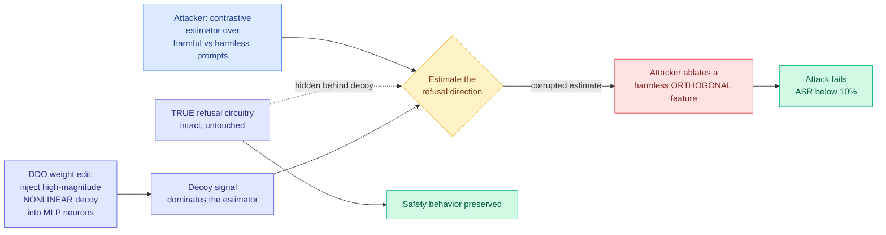

# Decoy Direction Optimization: A Post-Hoc Defense Against LLM Abliteration

**Date ingested:** 2026-09-16
**Source:** HuggingFace Daily Papers · [arXiv 2609.16204](https://arxiv.org/abs/2609.16204)
**Raw:** [raw/huggingface/2026-09-16-decoy-direction-optimization-a-post-hoc-defense-against-llm.md](../../raw/huggingface/2026-09-16-decoy-direction-optimization-a-post-hoc-defense-against-llm.md)

## TL;DR

Open-weight safety guardrails are routinely stripped by **Refusal Feature Ablation**, an attack that finds a single linear direction in the model's residual stream corresponding to "refuse" and projects it out, usually keeping the model's capabilities intact. The standard defense is safety fine-tuning for every new checkpoint, which is expensive. DDO takes the opposite approach: instead of hiding the refusal circuitry, **it injects a loud, high-magnitude, nonlinear decoy into the MLP neurons so the attacker's contrastive estimator locks onto the decoy and ablates a harmless orthogonal feature**, leaving the real safety mechanism untouched. It is weight editing with no base-model fine-tuning, at **30 to 450 times lower optimization cost per configuration** than trained defenses.

## Mechanism

## Why it works

The mechanistic insight is precise and worth stating plainly: **ablation attacks depend on an estimator, not on the model.** The attacker computes a refusal direction by contrasting activations on harmful and harmless prompts. That estimator assumes the largest contrastive signal is the refusal signal. DDO breaks the assumption by planting a larger one that is not. The paper proves a spectral bound formalizing when the decoy dominates, which is what separates this from a heuristic obfuscation trick.

## Results

- **Under 10% attack success rate** under standard Refusal Feature Ablation, across **six model families**.
- On Llama-3-8B-Instruct under adaptive multi-phase attacks, DDO reaches **65% worst-case ASR against 58% for trained defenses**, meaning it is comparable but slightly behind when the attacker adapts.
- Against **Heretic**, a weight-level attack, ASR drops from **88.7% to 18%**.
- **30 to 450 times lower optimization cost per configuration** than the trained baselines.

## How this relates to prior wiki pages

**It is a cost-optimization result wearing safety clothes, and that is the reason it belongs in this reader's attention set.** The [responsible-ai page](responsible-ai.md) has tracked a steady pattern where every safety mitigation for open weights is a retraining cost, which means it scales with checkpoint release cadence rather than with risk. A 30-450x reduction in per-configuration cost changes who can afford to ship a defended checkpoint. That is the same structural argument the wiki makes about inference efficiency, applied to safety engineering: **the binding constraint was never capability, it was the cost of applying the known technique to every artifact.**

**It also inverts the usual interpretability-to-safety pipeline.** The wiki's interpretability thread generally runs: find a linear direction, then use it to steer or to audit. Refusal Feature Ablation is the adversarial use of exactly that finding. DDO is the first entry here where **the defense targets the attacker's measurement apparatus rather than the model's behavior**, which is a different genre of mitigation and generalizes to any attack built on a contrastive probe.

**The adaptive-attack number is the honest part and should be carried forward.** 65% worst-case ASR against a multi-phase adaptive attacker means the decoy is beatable by someone who knows it is there. The paper does not oversell this. That matters because the wiki's [responsible-ai page](responsible-ai.md) has flagged the open-weight guardrail literature as prone to reporting only the non-adaptive number.

## Gaps

- Adaptive multi-phase attacks already recover 65% ASR, and an attacker who knows DDO is deployed can search for the decoy specifically. The spectral bound says when the decoy dominates a *given* estimator, not that no estimator can separate them.
- The decoy is a high-magnitude injection into MLP neurons. The abstract claims capability preservation implicitly but does not quantify the capability cost of carrying a loud spurious feature, and that cost is the thing a model provider would ask about first.
- Six model families is a good sweep for the attack, but there is no evidence about what happens when DDO is applied to a model that is later fine-tuned by a downstream user, which is the normal life of an open-weight checkpoint.
- No test against an attacker who first applies a generic activation-denoising step before estimating the direction.

## Industrial implication

If this holds, defending an open-weight release stops being a retraining decision and becomes a post-processing step in the release pipeline, comparable in cost to quantizing the checkpoint. That is the difference between defending the flagship and defending every variant, and the variants are where abliteration actually happens. The realistic near-term form is a release-time weight edit applied by the lab, not a runtime defense, and the falsifiable signal is whether any major open-weight release ships with a documented anti-ablation weight edit within the next two quarters.
