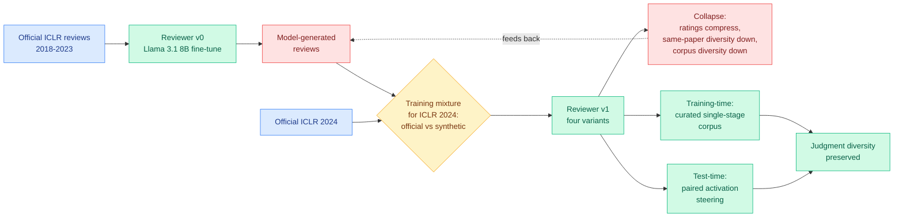

# Scientific-judgment collapse: train a reviewer on AI reviews, and the ratings compress

**Date:** 2026-09-21
**Topic:** responsible-ai
**Source:** HuggingFace Daily Papers · [arXiv 2609.20942](https://arxiv.org/abs/2609.20942) · [raw](../../raw/huggingface/2026-09-21-when-ai-reviews-train-ai-reviewers-scientific-judgment-colla.md)
**Companion signal:** [Preventing Model Collapse: A Fisher-Rao Perspective](https://arxiv.org/abs/2609.18878) (Kurate cs.LG #3) · [ICLR submission-count report](https://x.com/mariyaivasileva/status/2101503396020887585)

---

## TL;DR

Language models now write peer reviews, and those reviews go into public data, and public data
becomes training data. So the loop closes: **later reviewers learn from judgments produced by
earlier models.** This paper studies one step of that loop under controlled conditions. Starting
from Llama 3.1 8B, the authors fine-tune a reviewer on official ICLR reviews from 2018 to 2023, then
train four successor models on ICLR 2024 data with systematically varied mixtures of official and
model-generated reviews. The result: introducing synthetic reviews **compresses the rating
distribution** and **reduces semantic diversity both within a paper's reviews and across the
corpus**. They name it **scientific-judgment collapse**. The mitigation, TrustReviewer, intervenes
twice: a single-stage training pass on a curated corpus designed to exclude degenerate supervision,
and **paired activation steering at test time** to correct residual collapse without retraining or
extra annotation.

---

---

## Why the specific failure mode matters more than the headline

Model collapse, the degradation that follows from training on generated data, is a known result.
What makes this version worth a page is **which statistic collapses first**. It is not accuracy and
it is not fluency. It is **variance**. Ratings bunch toward the middle, and the reviews of a single
paper start saying the same thing as each other.

For a peer-review system, variance is not a nuisance parameter, it is the entire mechanism. The
point of assigning three reviewers is that they disagree, and the disagreement is what a decision
gets made from. A reviewer population that converges on a shared middling opinion has not become
more accurate, it has stopped producing information while continuing to produce text. And this is
invisible to every quality metric the field would naturally apply: the reviews stay well-formed,
on-topic and plausible.

The same property makes it a **routing and calibration failure** in the sense this wiki has been
tracking all week. A compressed rating distribution is exactly a miscalibrated judge: it reports
similar scores regardless of the underlying quality, so any threshold placed on it stops
discriminating. That is the same structural defect as a decision model that
[reports 85 to 88 percent confidence on every call](../ai-routing/2026-09-21-jev-calibration-reckoning.md).
Different systems, different literature, one failure: **the score stopped being a function of the
input.**

---

## The mitigation, and the interesting half of it

Two interventions, and the second is the one worth attention.

**Training-time prevention** is conventional and sensible: train in a single stage on a curated
corpus built to exclude low-quality and semantically degenerate supervision. The interesting
implication is that the curation criterion is diversity-preservation rather than quality, which is
not how training corpora are usually filtered.

**Test-time correction by paired activation steering** is the notable part. It corrects residual
collapse tendency by intervening in activations at inference, with no further training and no extra
expert annotation. If this works reliably it changes the economics of the problem substantially: a
deployed reviewer that has already been trained on contaminated data can be partially repaired
without retraining. It also places this result in the same technical family as [HEAL
(09-21)](../vision-audio-video/2026-09-21-heal-synergy-heads-hallucination.md), which fixes
multimodal hallucination by injecting calibration factors into the value vectors of specific
attention heads. Two papers on the same day fixing a distributional defect by editing activations
at inference rather than by retraining is a pattern worth naming.

---

## Two companion signals that make this the day's real story

**A theoretical account arrived in parallel.** Kurate's cs.LG board carries *Preventing Model
Collapse: A Fisher-Rao Perspective on the Dynamics of Training with Synthetic Data*
([2609.18878](https://arxiv.org/abs/2609.18878), #3, ai_rating 5.0), which treats synthetic-data
training as a dynamical system on a statistical manifold with the Fisher-Rao metric. The empirical
paper reports that diversity shrinks; the geometric paper is the kind of result that would say why
and under what conditions it does not. Neither cites the other, and putting them side by side is
the sort of thing this wiki exists to do.

**The volume argument arrived from social.** A widely-shared report from an ICLR submitter records
**over 60,000 submissions registered at this year's abstract deadline against 19,525 last year**, a
roughly three-fold jump, with the reviewer pool approximately unchanged. Extrapolating last year's
rates (3.99 percent desk-rejected, 25.82 percent withdrawn, 70.49 percent reaching a final
decision) gives roughly 42,300 submissions needing review. The accompanying essay argues that the
research loop itself has compressed: literature surveys, experiment implementation and writeups are
increasingly delegated to agents, so researchers ramp into new domains quickly and never develop
the map of how a problem space evolved, and much of what is claimed as novelty is the same idea in
new packaging.

Put the three together and the shape is unavoidable. **Submission volume triples because generating
a paper got cheap. Reviewer supply does not move. The only available relief is AI-assisted review.
And the paper above shows that AI-assisted review, trained on its own prior output, loses exactly
the discriminative variance that review exists to supply.** That is a closed loop with no slack in
it, and it is the strongest research-versus-practice tension this wiki has recorded this month.

---

## Relation to prior wiki pages

**Extends the recursive-training thread that has been building on the agentic side.** [ScientistTwo
(09-20)](../agentic-systems/2026-09-20-scientisttwo-recursive-self-improvement.md) and this week's
Kurate self-improvement cluster all depend on a model evaluating its own or a sibling's output as
the improvement signal. This paper is the controlled demonstration that the evaluation half of such
a loop degrades in a specific, measurable way, and it degrades quietly.

**Adds an uncomfortable neighbour to today's [Code2Skill
result](../agentic-systems/2026-09-21-code-as-agent-substrate.md)**, which reports that skills
synthesized from tested AI-generated code pass verification at 93.50 percent against 93.00 percent
for human-written code and frames this as evidence the pipeline scales with the volume of AI-written
software. That is the same loop in a domain with a stronger verifier. Code execution is a real
oracle and peer review is not, so Code2Skill's version is much better defended. But the framing
"AI-generated inputs work as well, so we can scale on them" is precisely the assumption this paper
falsifies where the oracle is soft.

**Connects to the [OpenAI misalignment reporting framework
(09-17)](2026-09-17-openai-misalignment-reporting-framework.md)** as the other half of a governance
problem. That framework is a disclosure mechanism whose value depends on someone with independent
judgment reading the disclosures. Judgment collapse is the failure mode of the reader, not the
writer.

---

## Gaps

- **One generation, one venue, one 8B model.** The study covers a single step of the feedback loop
  on ICLR data with Llama 3.1 8B. Whether collapse compounds across generations, whether it appears
  at frontier scale where reviews are actually being written, and whether ICLR's rating scale is
  unusually compressible are all open.
- **Diversity is measured, usefulness is not.** Semantic diversity falling is bad if the lost
  variance was signal and fine if it was noise. The paper does not, from the abstract, show that
  collapsed reviewers make worse accept/reject decisions, which is the outcome that matters.
- **Activation steering is reported as a mitigation without a cost or a failure mode.** Steering
  interventions generally trade the targeted behaviour against something else, and nothing is
  reported about what.

---

## Related pages

- [Responsible AI](responsible-ai.md)
- [OpenAI misalignment reporting framework (09-17)](2026-09-17-openai-misalignment-reporting-framework.md)
- [ScientistTwo: recursive self-improvement (09-20)](../agentic-systems/2026-09-20-scientisttwo-recursive-self-improvement.md)
- [Code as agent substrate (09-21)](../agentic-systems/2026-09-21-code-as-agent-substrate.md)
- [Day six of the decision-model boom (09-21)](../ai-routing/2026-09-21-jev-calibration-reckoning.md)
