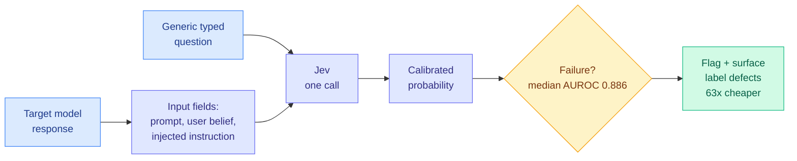

# Just Ask Jev: Calibrated Decisions as a Zero-Shot Detector of AI Alignment Failures

**Source:** HuggingFace Daily Papers 2026-09-25, arXiv [2609.29429](https://arxiv.org/abs/2609.29429). Code and data: [RLCDAlignBench](https://github.com/sumleo/RLCDAlignBench)
**Raw:** `raw/huggingface/2026-09-25-just-ask-jev-reinforcement-learning-for-calibrated-decisions.md` (abstract only; no alphaxiv overview yet)

## TL;DR

Most alignment-failure detectors are generative LLM judges that spend a decoding pass on every criterion. Classifiers like Llama Guard read token probabilities but still score one fixed label per call. Jev, TypeSafe's decision model trained with reinforcement learning for calibrated decisions (RLCD), answers many typed questions about one input in a single call, with probabilities. The paper builds **RLCDAlignBench**: ten failure types (sycophancy, jailbreaks, deception, prompt injection, hallucination, privacy violation, social bias, reward hacking, concealing uncertainty, power seeking) across **44 benchmarks and five target models**. A single generic question reaches a **median AUROC of 0.886 zero-shot**, beats supervised baselines on most benchmarks, matches the reference scorer's agreement with human labels, and **costs 63x less than LLM-judge scorers**.

## Key findings

- **Many failures are relational.** Sycophancy is defined against the user's belief, prompt injection against the injected instruction. The response alone does not reveal them. So the key design move is varying *what Jev is asked* separately from *what it sees*.
- **Wording barely matters, context does.** Question phrasing and answer type move results little. Which input fields are shown moves them a lot, mostly through fields that encode the label.
- **It audits the benchmarks.** Jev surfaces label defects in existing alignment benchmarks.

## How this relates to prior wiki pages

- **Same model, same week, as [JEV-as-a-Judge](../ai-routing/2026-09-25-jev-as-a-judge-confidence-cascade.md)**, which found Jev within three points of GPT-6 on ordinary preference judging at 0.36% of the fee. Two independent groups now report that decision models are cheap, competent first-pass evaluators.
- **The label-leak caveat matters.** "Context matters mostly through fields that encode the label" means part of the AUROC is the detector reading an answer key. That echoes the 09-24 correction that CLM-8B's best-of-N numbers depended on a frontier model generating the trajectories. See [llm-routing](../ai-routing/llm-routing.md).
- **Feeds the safety-cost thread on [responsible-ai](responsible-ai.md):** a monitoring pass that is 63x cheaper is one that can run on every production response, not a sample.

## Gaps

Median AUROC hides the tail. Style-adversarial failures, where JEV-as-a-Judge found Jev's confidence stops being informative, are the likeliest weak spot for deception and reward hacking. Jev is proprietary, so reproducibility depends on API access. Human labels exist for only two of the 44 benchmarks.
