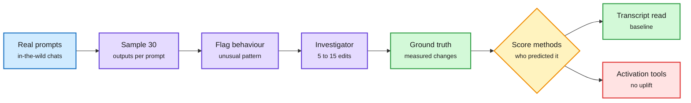

# CHIVE: Evaluating Explanations of LLM Behavior in the Wild with Counterfactual Experiments

**Source:** arXiv [2608.16747](https://arxiv.org/abs/2608.16747) (Adam Karvonen, Euan Ong, Subhash Kantamneni, Samuel Marks; Anthropic and the Anthropic Fellows Program). Surfaced via the X home feed ([@Pyuyi2333](https://x.com/Pyuyi2333/status/2104411404581429328)), 2026-09-28. Raw: `raw/twitter/feed/2026-09-28-morning-ranked.json`. Background from the alphaxiv overview.

## TL;DR

How do you know an explanation of model behaviour is right when the true cause is invisible? This paper uses a practical test called counterfactual simulatability: a good explanation should help you predict what happens when you change the alleged cause. CHIVE automates the experiment. It samples 30 outputs per prompt from real conversations, flags unusual behaviours, and lets an investigator agent run 5 to 15 counterfactual prompt edits. The measured behaviour changes become ground truth. The uncomfortable result: three activation-reading methods (activation oracles, natural-language autoencoders, and sparse autoencoders, or SAEs, which decompose activations into readable features) give no uplift over simply reading the transcript when predicting those outcomes. The negative result holds across target models, predictor families and elicitation attempts. The positive result: CHIVE investigations make good training data. Models trained to predict the effects of prompt edits generalize to held-out investigations and to an unseen hint-based setting.

An explanation is only as good as its predictions

Edit the prompt, measure the change, then score each method by how well it predicted that change.

Blue is input, purple is the automated pipeline, amber is the scoring step, green is ground truth and the winning baseline, red is the method that did not help.

## Key points

- **Descriptive is not causal.** The result does not say SAEs are useless; it says current activation tools do not yet predict interventions better than the text.
- **Moves evaluation out of planted-quirk games** into naturally occurring behaviours.
- **Self-prediction as a trainable skill.** Training on counterfactual outcomes generalizes, which prior self-prediction work found mixed.

## Relation to prior wiki pages

- **Tempers the interpretability-for-efficiency line.** [Pruning meets interpretability via SAEs (08-31)](../inference-efficiency/2026-08-31-pruning-meets-interpretability-sae.md) used SAE features to decide what to prune. CHIVE's result asks whether those features are causal enough to trust for that.
- **Pairs with trace tampering.** The same day, [agent trace tampering](2026-09-28-agent-trace-tampering.md) showed transcripts can be edited by agents. CHIVE says the transcript is currently the best predictor we have. Oversight rests on a record that is both the strongest signal and the easiest to corrupt. See [responsible-ai](responsible-ai.md).

## Gaps

- Limited to prompt-level counterfactuals; interventions on activations themselves are the natural next test.
- Predictor quality depends on the investigator agent's edit choices.
