# Distillation Defenses Easily Break After Reinforcement Learning

**Source:** HuggingFace Daily Papers, listed 2026-09-29, and Kurate cs.LG weekly top-20 (#17, ai_rating 7.0) · [arXiv 2609.35699](https://arxiv.org/abs/2609.35699)
**Raw:** [raw/huggingface/2026-09-29-distillation-defenses-easily-break-after-reinforcement-learn.md](../../raw/huggingface/2026-09-29-distillation-defenses-easily-break-after-reinforcement-learn.md) · [raw/kurate/2026-09-30-cs-lg.md](../../raw/kurate/2026-09-30-cs-lg.md)

## TL;DR

A distillation attack copies a closed model's reasoning by collecting its outputs and training a cheaper model on them. Labs defend by hiding or perturbing reasoning traces, and those defenses are usually evaluated right after the attacker's distillation step. This paper argues the realistic attacker does one more step: reinforcement learning (RL) on top. Defenses that look effective after distillation fall apart after RL. Simple attacks using data anyone can pull from current APIs (summaries, not full hidden traces) end up matching the reasoning gains of attacks that extract the full traces. Their conclusion: any defense that leaks enough to reconstruct *approximate* reasoning is likely ineffective. They point to batch-level defenses (reasoning about the whole query stream, not per response) as the more promising direction.

```mermaid
flowchart LR
  API["Closed model API<br/><small>summaries, answers</small>"] --> D["Distill<br/><small>SFT on outputs</small>"]
  D --> C["Defense checkpoint<br/><small>where it is scored</small>"]
  C --> RL["RL stage<br/><small>verifiable rewards</small>"]
  RL --> S["Stolen reasoning<br/><small>matches full traces</small>"]
  B["Batch-level defense<br/><small>watch the stream</small>"] -.-> API
  classDef input fill:#d0ebff,stroke:#1971c2,color:#1b1b1b,stroke-width:2px
  classDef core fill:#e5dbff,stroke:#6741d9,color:#1b1b1b,stroke-width:2px
  classDef loop fill:#fff3bf,stroke:#f08c00,color:#1b1b1b,stroke-width:2px
  classDef exit fill:#d3f9d8,stroke:#2f9e44,color:#1b1b1b,stroke-width:2px
  classDef err fill:#ffe3e3,stroke:#e03131,color:#1b1b1b,stroke-width:2px
  class API input
  class D,RL core
  class C loop
  class S err
  class B exit
  linkStyle 2 stroke:#e03131,stroke-width:2px
```

RL finishes what a leaky trace starts

Defenses are scored at the middle box. Real attackers keep going.

Blue is the API surface, purple is the attacker's training, amber is where defenses are usually measured, red is the outcome, green is the proposed alternative.

## Key findings

- **Threat model fix:** evaluate defenses after distillation *plus* RL, not after distillation alone.
- **Cheap data suffices:** API-obtainable signals give reasoning gains equivalent to extracting full hidden traces.
- **Design rule:** per-response obfuscation cannot win if the obfuscated output still allows approximate trace reconstruction.

## Cross-source context (same window)

- **Cross-source confirmed (HF + Kurate).** It sits in Kurate's cs.LG top-20 this week. Caveat: Kurate's tournament again returned the default score for every paper, so the Kurate rank carries no ordering signal, only inclusion.
- **Social:** a widely shared X thread described a paper showing that encrypted reasoning blobs, which labs pass back through the client instead of storing, are portable across models: a cheap model handed a frontier model's encrypted thought block continued it in plain text. If that holds, it is exactly the "leak enough to reconstruct approximate reasoning" failure this paper describes. (Thread only; the underlying paper was not in today's sources.)
- **Industry:** Jensen Huang on CNBC: "People distill my products every single day." The US NSA/CISA/FBI advisory of 09-09 treated distillation as exfiltration. [Post-Training Leaves Behavioral Shadows (09-30)](../llms-foundation-models/2026-09-30-behavioral-shadows-active-taskless-distillation.md) shows capability can transfer through a single chosen word per prompt, a channel no trace-hiding defense touches.

## How this relates to prior wiki pages

- The [distillation concept page's 09-09 addendum](../inference-efficiency/knowledge-distillation.md) logged the government reclassifying distillation as an exfiltration method. This is the first paper in the wiki arguing the standard technical countermeasure (hide the trace) is structurally insufficient.

## Related

- [Responsible AI concept page](responsible-ai.md)
- [Knowledge distillation](../inference-efficiency/knowledge-distillation.md)
