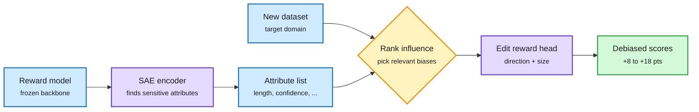

# BiasReducer: Fixing Reward-Model Biases by Editing Only the Reward Head

**Source:** HuggingFace Daily Papers (2026-10-01) and Kurate cs.LG weekly top 20 (#17): **cross-source confirmed (HF + Kurate)** · [arXiv 2609.32720](https://arxiv.org/abs/2609.32720)
**Raw:** [raw/huggingface/2026-10-01-biasreducer-adaptive-bias-mitigation-for-reward-models.md](../../raw/huggingface/2026-10-01-biasreducer-adaptive-bias-mitigation-for-reward-models.md) · [raw/kurate/2026-10-02-cs-lg.md](../../raw/kurate/2026-10-02-cs-lg.md)

## TL;DR

Reward models (the scorers that steer RLHF-style training) often prefer surface features such as longer or more confident answers, so the policy learns to be long and confident rather than right. Fixes so far either retrain the reward model (data and compute) or apply one fixed correction for one known bias, usually length. **BiasReducer** edits only the final linear reward head. A sparse-autoencoder-style encoder first learns which attributes the reward model is sensitive to (length, confidence and others). The method then learns, per attribute, which direction and how far to shift the head to reduce that dependence. For a new dataset it ranks attributes by their influence on scores and applies only the relevant edits. Across five reward models it improves three bias benchmarks by **8.3, 18.0 and 6.9 points** on average, beating two training-based baselines, and downstream policies become less verbose and less sycophantic at comparable judged quality.

Find the shortcut features, then turn them down in the head

No retraining. Only the last linear layer changes, and only for biases that matter on this data.

Blue is inputs, purple is the learned components, amber is the per-dataset selection, green is the result.

## How it relates to prior wiki pages

- **Cost lens:** this is the reward-model analogue of the "edit a tiny subspace" results in efficiency work, like today's label-free bias-only TTRL paper (76,000x fewer trained parameters than full test-time RL). Small, targeted edits keep showing up as enough.
- **Connects to the length-scaling tax.** Today's [Length Self-Distillation](../inference-efficiency/2026-10-02-opd-wave-ride-lsd-oasis.md) attacks verbosity in the policy; BiasReducer attacks the reward signal that teaches it. Both cut wasted tokens at the source.

## Gaps

- Editing a linear head can only remove biases that are linearly readable from the final features.
- Kurate's tournament again gave every paper the default score, so the Kurate listing confirms inclusion, not rank.

Related: [Responsible AI](responsible-ai.md) · [RL for LLMs](../llms-foundation-models/rl-for-llms.md)
