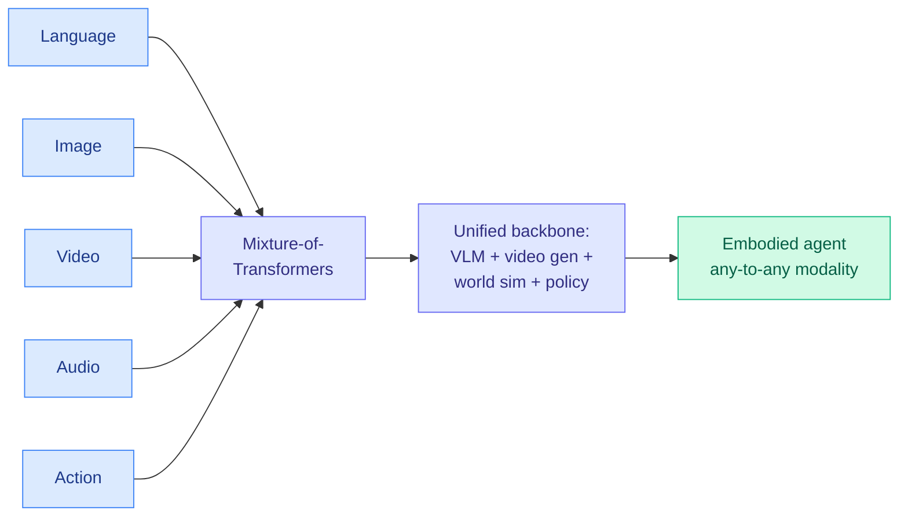

# Cosmos 3: Omnimodal World Models for Physical AI

**Source:** HuggingFace Daily Papers (cross-source: NVIDIA Computex announcement via AI Breakfast / Gmail)
**arxiv:** [2606.02800](https://arxiv.org/abs/2606.02800)
**Date:** 2026-06-04
**Raw:** [raw/huggingface/2026-06-04-cosmos-3-omnimodal-world-models-for-physical-ai.md](../../raw/huggingface/2026-06-04-cosmos-3-omnimodal-world-models-for-physical-ai.md) · [raw/gmail/2026-06-04-starred.md](../../raw/gmail/2026-06-04-starred.md)
**Tier:** 3 (vision/video/world models) — surfaced for the architecture and cross-source signal

## TL;DR

Cosmos 3 is NVIDIA's family of omnimodal world models that jointly process and generate language, image, video, audio, and action in a single mixture-of-transformers architecture. It subsumes vision-language models, video generators, world simulators, and world-action (policy) models into one framework. NVIDIA reports the post-trained models ranked best open-source on Text-to-Image and Image-to-Video by Artificial Analysis, and best policy model by RoboArena at report time. Released open under the Linux Foundation OpenMDW-1.1 license with code, checkpoints, datasets, and benchmark.

## Diagram

## Key points

1. **One mixture-of-transformers backbone** for five modalities with flexible input-output configurations, explicitly collapsing four model categories (VLM, video generator, world simulator, world-action model) into a single framework.
2. **Best open-source** Text-to-Image and Image-to-Video (Artificial Analysis) and best policy model (RoboArena) at report time.
3. **Fully open** under OpenMDW-1.1: code, checkpoints, synthetic datasets, eval benchmark.
4. **Cross-source confirmed:** appears in today's HuggingFace papers AND was the headline of NVIDIA's Computex physical-AI rollout (Cosmos 3 driving a 31-joint Unitree chassis via Isaac GR00T on Jetson AGX Thor), per AI Breakfast in today's Gmail.

## Relation to prior wiki state

The mixture-of-transformers choice is the omnimodal generalization of the MoE-everywhere pattern the wiki keeps logging: a single sparse backbone routing different modalities (rather than different tokens) through specialized transformer experts. It is the physical-AI counterpart to the text-side world-model fusion work like PF-OPSD (06-03, fusing world-model visual rollouts with MLLM reasoning). Where PF-OPSD bolted a world model onto a language model as privileged context, Cosmos 3 trains the world model and the language model as one omnimodal object.

For Amit's hierarchy this is Tier 3 (multimodal/robotics), surfaced mainly because it is (a) cross-source confirmed and (b) the clearest 2026 example of "one sparse backbone, all modalities, including action."

## Links

- [Paper](https://arxiv.org/abs/2606.02800) · [project](https://research.nvidia.com/labs/cosmos-lab/cosmos3) · [github](https://github.com/nvidia/cosmos)
- Related: [PF-OPSD 2026-06-03](2026-06-03-world-models-meet-language-models.md)
