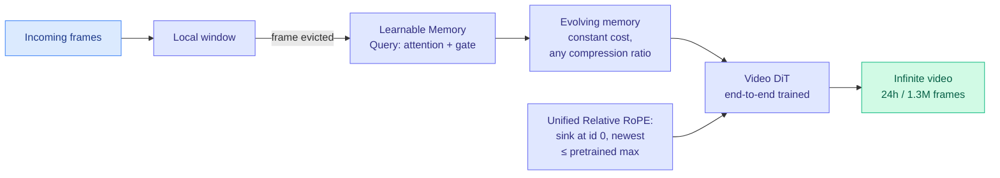

# Echo-Infinity: Learning Evolving Memory for Real-Time Infinite Video Generation

**Source:** HuggingFace Daily Papers
**arxiv:** [2606.04527](https://arxiv.org/abs/2606.04527)
**Date:** 2026-06-04
**Raw:** [raw/huggingface/2026-06-04-echo-infinity-learning-evolving-memory-for-real-time-infinit.md](../../raw/huggingface/2026-06-04-echo-infinity-learning-evolving-memory-for-real-time-infinit.md)
**Tier:** 3 (video generation) with Tier 1 relevance: learned memory compression at constant cost

## TL;DR

Echo-Infinity is an autoregressive framework for real-time, arbitrarily long video generation. Its core idea is a *learnable evolving memory* that filters, abstracts, and compresses any-length history at constant cost, replacing the handcrafted memory curation (fixed KV-cache schedules, fixed-ratio heuristic compression, inference-time RoPE adaptation) that existing methods use and that loses history and amplifies compounding errors. It demonstrates 24-hour (>1.3M frame) real-time rollouts, a first.

## Diagram

## Key findings

1. **Learnable Memory Queries** replace handcrafted memory curation. When past frames are evicted from the local window, the queries are updated by attention and a gating mechanism, optimized end-to-end with the video diffusion transformer. They support arbitrary compression ratios at constant compute, independent of video length.
2. **Unified Relative RoPE Recipe** anchors sink frames at id 0 and caps the newest frame id at the model's pretrained maximum temporal RoPE id, closing the train-test RoPE extrapolation gap that limits length.
3. **24-hour (>1.3M frame) real-time rollouts**, claimed first; SOTA on both long and short video.

## Relation to prior wiki state

The mechanism is striking because it is the same shift the wiki is tracking on the text side, ported to video. **Echo-Infinity replaces "predefined KV-cache schedules and fixed-ratio heuristic compression" with a learned evolving memory** — exactly the move MemTrain (06-04) makes for agent text memory (learned proxies instead of hand-tuned behaviors) and that the KV-cache literature keeps circling. The "evicted from the local window → update a compressed memory state" loop is structurally the same as the SSM-fast-weights consolidation in "Language Models Need Sleep" (05-27, which folded evicted KV context into recurrent fast weights). See [MemTrain summary](../agentic-systems/2026-06-04-memtrain-context-memory.md) and the [KV cache concept](../inference-efficiency/kv-cache.md).

The RoPE-extrapolation fix is also a familiar lever: the train-test positional-encoding gap is the same one long-context text models fight, solved here by clamping rather than extrapolating.

## Why it matters (efficiency angle)

For Amit's interest the value is not the video quality but the *constant-cost learned memory* design. A learned, end-to-end-optimized compression of history that holds compute flat as the sequence grows is exactly what long-context and streaming inference want. If the Memory-Query mechanism transfers to text KV compression, it is a learned alternative to heuristic eviction (VaSE, etc.).

## Gaps

It is validated on video generation quality; the constant-cost claim's fidelity ceiling (how much history is irrecoverably lost at high compression) is not stress-tested against retrieval-style probes the way text KV eviction is.

## Links

- [Paper](https://arxiv.org/abs/2606.04527)
- Related: [MemTrain 2026-06-04](../agentic-systems/2026-06-04-memtrain-context-memory.md)
- Concept: [KV cache](../inference-efficiency/kv-cache.md)
