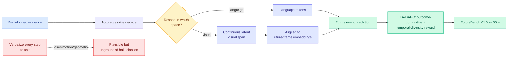

# Future-L1: Interleaved Latent Visual Reasoning for Video Event Prediction

**Source:** HuggingFace Daily Papers · [arXiv 2606.05769](https://arxiv.org/abs/2606.05769)
**Raw:** [raw/huggingface/2026-06-07-imagine-before-you-predict-interleaved-latent-visual-reasoni.md](../../raw/huggingface/2026-06-07-imagine-before-you-predict-interleaved-latent-visual-reasoni.md)

## TL;DR

Video event prediction (VEP) asks a model to infer unobserved future states from partial video. Existing video MLLMs verbalize their intermediate reasoning into text, and once visual evidence becomes words, fine-grained motion, geometry, and interaction cues are lost, producing plausible-but-ungrounded hallucinations. Future-L1 lets an MLLM alternate between language tokens and **continuous latent visual spans** during autoregressive decoding, so it can "imagine" in visual space before committing to a prediction. It is trained on Future-L1-50K (examples where future visual hints actually help) with latent states aligned to future-frame embeddings, then refined with LA-DAPO, a latent-aware RL objective with outcome-contrastive and temporal-diversity rewards. On FutureBench it lifts Qwen3-VL-8B from 61.0 to 85.4 (and beats prior best Video-CoE by 10.4); on TwiFF-Bench, 2.44 to 3.04 average.

## Key points

- **The text bottleneck.** Forcing intermediate reasoning through the token vocabulary is lossy for visual content. Future-L1 keeps the reasoning in latent visual space and only emits language when needed, preserving motion/geometry/interaction detail.
- **Big jump on the right benchmark.** Qwen3-VL-8B from 61.0 to 85.4 on FutureBench is a +24-point swing; LA-DAPO's temporal-diversity reward explicitly pushes the latent trajectory to cover distinct futures rather than collapse to one.

## How this relates to prior wiki knowledge

- **The "discrete output is a lossy projection" thread, applied to vision.** This is the visual sibling of [NF-CoT / Latent Reasoning with Normalizing Flows](../llms-foundation-models/2026-06-05-nf-cot-latent-reasoning-normalizing-flows.md) (06-05), which reasoned in continuous latent space because the token vocabulary is a lossy bottleneck, and of [The Shape of Addition](../responsible-ai/2026-06-06-shape-of-addition-arithmetic-geometry.md) (06-06), where the lossy step was the carry-quantization threshold. Three papers in a week share the frame: keep the reasoning continuous, quantize only at the end. Here the lossy projection being avoided is text-verbalization of visual evidence.
- **Latent-reasoning is consolidating into a named direction.** Reasoning in latent space (rather than emitted tokens) now spans math (NF-CoT), arithmetic interpretability (Shape of Addition), and video prediction (Future-L1). The recurring open question is verifiability: latent reasoning is harder to audit than a written chain.

## Research angle

The interesting tension is interpretability vs fidelity. Latent visual reasoning gains grounding precisely by *not* writing its steps down, which trades away the auditability that text chains-of-thought provide. Open: whether the latent spans can be decoded post-hoc into inspectable frames for debugging, and whether LA-DAPO's temporal-diversity reward generalizes beyond the curated Future-L1-50K subset (selected specifically because visual hints help, which may overstate the gain on arbitrary VEP).

→ Related: [parametric-context-internalization](../inference-efficiency/parametric-context-internalization.md)
