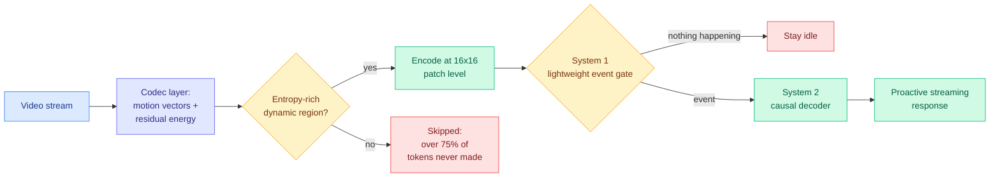

# Mage-VL: An Efficient Codec-Native Streaming Multimodal Foundation Model

**arxiv:** [2607.24904](https://arxiv.org/abs/2607.24904) · **Source:** [HuggingFace Daily Papers 2026-07-29](../../raw/huggingface/2026-07-29-mage-vl-an-efficient-codec-native-streaming-multimodal-found.md)

## TL;DR

Vision-language models are good at hard offline reasoning about a picture and bad at cheap continuous perception of a stream, which the paper labels a Moravec's paradox for VLMs. Mage-VL attacks the cost at the tokenizer rather than downstream. Its tokenizer, Mage-ViT, is **codec-native**: instead of sampling frames uniformly and encoding each one whole, it reads the motion vectors and residual energy that a video codec already computes, and selectively encodes only the dynamic, entropy-rich regions across sparse anchor (I) and predicted (P) frames, at 16x16 patch granularity. That cuts visual token consumption by **over 75%** while keeping spatiotemporal context. On top of that sits a bio-inspired two-system design: a lightweight System 1 event gate that decides when something worth attending to has happened, and a causal System 2 decoder that does the actual understanding, which is what makes *proactive* streaming perception possible rather than poll-and-answer. Mage-VL-4B matches Qwen3-VL-4B on static tasks, gains on video understanding and 2D/3D spatial reasoning, runs up to **3.5x faster wall-clock**, and beats the 15B Phi-4-reasoning-vision baseline outright.

The training claim is the one to stress-test: Mage-ViT is trained from scratch on roughly **560M unlabeled images and 100M unlabeled video frames** and reportedly matches or outperforms flagship encoders trained on billions of image-text pairs.

## Why codec-native is the interesting choice

Uniform frame sampling is the default because it is simple, and it is wasteful for an obvious reason nobody exploits: a video codec has *already* computed, for every frame, exactly which regions changed and by how much. Motion vectors and residual energy are a free, precomputed saliency map sitting in the file format. Mage-ViT's bet is that this codec-derived signal is a good enough proxy for perceptual importance to drive tokenization, and the 75%-plus reduction with preserved spatiotemporal context says it is. The saving is structural rather than learned: it costs nothing at inference to consult, because decoding the video produces it anyway.

The System 1 / System 2 split is the streaming half. A model that must be asked a question before it looks cannot do proactive perception; a model that runs its full decoder on every frame cannot afford to. A cheap gate that decides *whether* the expensive path fires is the standard resolution, and here it is what converts a token-efficiency result into a latency result.

## Key results

- **Over 75% reduction in visual token consumption** from codec-native selective encoding at 16x16 patches.
- Mage-ViT trained from scratch on ~560M unlabeled images and ~100M unlabeled video frames, matching or beating encoders trained on billions of image-text pairs.
- Mage-VL-4B matches Qwen3-VL-4B on static tasks, gains on video understanding and 2D/3D spatial reasoning, **up to 3.5x wall-clock inference speedup**, and comprehensively surpasses 15B Phi-4-reasoning-vision.
- Seven stated empirical findings, including pre-training data efficiency, variable-resolution scaling, VideoQA SFT redundancy, and "Zero-Vision SFT" for multimodal RL.

## How this relates to prior wiki pages

**This is the third visual-compression paper in three days, and the three occupy different layers of the same stack.** [VisCo (07-27)](../inference-efficiency/2026-07-27-visco-visual-token-compression.md) reused the pretrained VLM as its own parameter-sharing autoencoder, so there was no external compressor the backbone had to adapt to and no damaged priors, beating prior methods at every ratio with the margin growing under aggressive compression. [OmniDelta (07-29)](../inference-efficiency/2026-07-29-omnidelta-skill-driven-token-budget.md), landing the same day as this paper, allocates a fixed token budget across and within modalities by query intent instead of uniformly. Mage-VL sits upstream of both: it never creates the tokens in the first place. Ordered by pipeline position, Mage-VL is tokenization, VisCo is compression, OmniDelta is allocation. That all three keep the language backbone frozen or standard is the shared bet worth naming, and it says the field has decided the visual front end is where the remaining slack is.

**The unlabeled-data result is the one that touches the wiki's broader compression thesis.** The [knowledge-distillation](../inference-efficiency/knowledge-distillation.md) page's current state, anchored on [Requential Coding (07-25)](../inference-efficiency/2026-07-25-requential-coding-self-generated-compression.md), argues that the information a model actually carries is measured by disagreement rather than by parameter count or data volume, and reported the counterintuitive finding that holding loss fixed, larger models compress to *smaller* codes. Mage-ViT matching billion-pair contrastive encoders on 660M unlabeled samples is a datapoint in the same direction from the data side: the image-text pairs were apparently not buying what everyone assumed they were buying. Neither result is strong enough alone, but two independent hits on the "more supervised data is the axis" assumption within a week is worth tracking.

**On the reader's attention hierarchy this is a multimodal paper that earns efficiency-level attention**, because the mechanism (exploit a precomputed structural signal to avoid work) is the same one that makes [Tangram](../inference-efficiency/2026-06-16-tangram-non-uniform-kv-compression-serving.md)'s offline head-ranking calibration and [LOCKS (07-29)](../inference-efficiency/2026-07-29-locks-page-local-key-summaries.md)'s resident page summaries work. In all three, something cheap and already available stands in for something expensive you would otherwise compute.

## Gaps

The seven empirical findings are asserted in the abstract without the ablations visible, and several (VideoQA SFT redundancy, Zero-Vision SFT) are strong enough claims that they need to be checked independently rather than accepted. The comparison set is 4B-scale plus one 15B baseline, so nothing here establishes that codec-native tokenization holds at frontier scale, where the token budget is less binding and the loss from discarding low-entropy regions may matter more. Codec dependence is a real deployment constraint the paper does not discuss: the method needs access to motion vectors and residuals, which means raw or re-encoded footage loses the advantage, and different codecs produce different motion estimates. And "3.5x wall-clock" is not decomposed into how much comes from fewer tokens versus how much from the System 1 gate skipping work entirely, which are very different claims about where the win lives.

## Related

- [OmniDelta (07-29)](../inference-efficiency/2026-07-29-omnidelta-skill-driven-token-budget.md)
- [VisCo (07-27)](../inference-efficiency/2026-07-27-visco-visual-token-compression.md)
- [kv-cache](../inference-efficiency/kv-cache.md) (concept page)
- [Daily digest 2026-07-29](../daily-digest/2026-07/2026-07-29.md)
